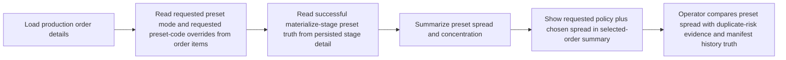
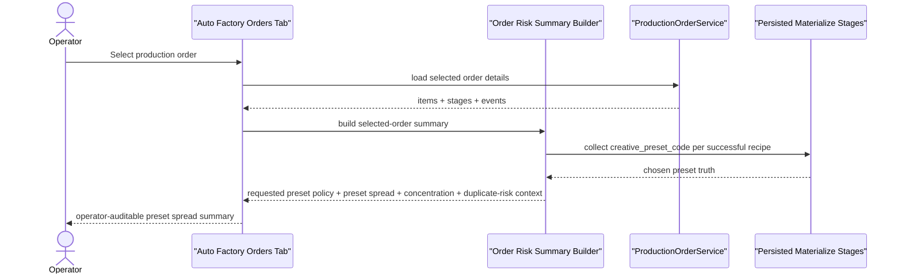

# Auto Factory Preset Spread And Live Product Contract 2026-06-27

This document is the SSOT for the next small-but-real production slice after the creative preset orchestration baseline. It makes preset diversity more operator-visible in `Orders` and binds the baseline to a live product contract instead of leaving it purely test-fixture driven.

It extends [99_Auto_Factory_Creative_Preset_Orchestration_Workflow_2026-06-27.md](/F:/programming/python/MTClipFactory/doc/99_Auto_Factory_Creative_Preset_Orchestration_Workflow_2026-06-27.md), [81_Auto_Factory_Orders_Risk_Emphasis_Workflow_2026-06-21.md](/F:/programming/python/MTClipFactory/doc/81_Auto_Factory_Orders_Risk_Emphasis_Workflow_2026-06-21.md), and [93_Biothentic0001_Live_Auto_Factory_Diversity_Audit_2026-06-26.md](/F:/programming/python/MTClipFactory/doc/93_Biothentic0001_Live_Auto_Factory_Diversity_Audit_2026-06-26.md).

## Purpose

- make preset spread visible in selected-order truth instead of forcing operators to infer it from stage rows
- move one real product from generic caption/tag contracts into a preset-aware live baseline
- keep the anti-duplicate narrative honest by distinguishing:
  - requested preset policy
  - actually chosen preset spread
  - resulting duplicate-risk evidence

## Delivered Direction

- selected-order summary in `Orders` should now show:
  - requested preset mode
  - requested preset-code overrides
  - chosen creative preset spread across successful `materialize` recipes
  - preset concentration summary such as unique preset count and max share
- `Biothentic0001` should now carry a real product-local `creative_presets.toml`
- the same live product should default to `balanced_cycle` preset planning unless the operator overrides it at run time
- live asset metadata should be rich enough that presets can influence real planner scoring instead of being a decorative label only

## Truth Boundary

- chosen `creative_preset_code` is persisted run truth on successful `materialize` stages and may be summarized safely in `Orders`
- requested preset mode and requested preset-code overrides are order-item truth and may be surfaced directly in the same summary
- current preset fields such as `headline_pool_names` and `cta_pool_names` can now affect both planner caption-signature scoring and rendered `hook` / `cta` caption text when the selected preset points to named `caption_pools.*` entries, but they are still not a full caption-runtime override path by themselves
- preset fields such as `caption_density` and `segment_profile` are now wired by the later [106_Auto_Factory_Preset_Density_Profile_And_Presenter_Safe_Caption_Workflow_2026-06-27.md](/F:/programming/python/MTClipFactory/doc/106_Auto_Factory_Preset_Density_Profile_And_Presenter_Safe_Caption_Workflow_2026-06-27.md) slice, so this document should now be read as the live-product contract baseline that precedes that deeper runtime behavior
- operators must not read preset spread as a platform verdict or a `100%` duplicate-prevention guarantee

## Live Product Contract Direction

For the current `Biothentic0001` product:

- default `pipeline.toml [creative].preset_mode` should be `balanced_cycle`
- the product should define multiple enabled presets such as:
  - `presenter_urgency`
  - `benefit_stack_clean`
  - `proof_pack_trust`
  - `daily_cta_reminder`
- foreground and music tag metadata should be tuned so these presets match real asset traits instead of collapsing into the same weighted score every time

## Workflow

## Sequence

## Acceptance Direction

1. The selected-order summary must expose requested preset policy and actual chosen preset spread together.
2. The summary must remain truthful when no successful `materialize` preset truth exists yet, showing `-` instead of guessing.
3. A real product-local preset contract must exist for `Biothentic0001`.
4. The live product baseline should carry enough tag evidence that different presets can win for different asset mixes during planning.
