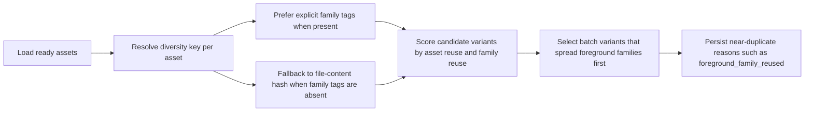
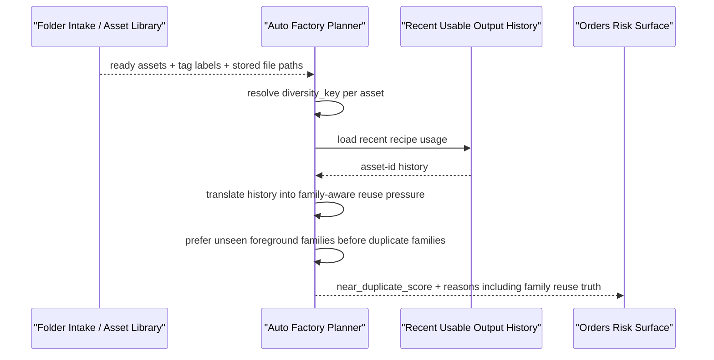

# Auto Factory Foreground Family Diversity Guard 2026-06-27

This document is the SSOT for the planner hardening slice that closes a real live-product gap: different `asset_code` values can still point to the same foreground content or the same presenter family, which overstates diversity and can still produce output batches that look repetitive to human reviewers and short-form platforms.

It extends [84_Auto_Factory_Foreground_And_Music_Diversity_Hardening_Workflow_2026-06-21.md](/F:/programming/python/MTClipFactory/doc/84_Auto_Factory_Foreground_And_Music_Diversity_Hardening_Workflow_2026-06-21.md), [96_Auto_Factory_Pool_Normalized_Duplicate_Scoring_Workflow_2026-06-26.md](/F:/programming/python/MTClipFactory/doc/96_Auto_Factory_Pool_Normalized_Duplicate_Scoring_Workflow_2026-06-26.md), [100_Auto_Factory_Preset_Spread_And_Live_Product_Contract_2026-06-27.md](/F:/programming/python/MTClipFactory/doc/100_Auto_Factory_Preset_Spread_And_Live_Product_Contract_2026-06-27.md), and [101_Biothentic0001_Creative_Preset_Live_Audit_2026-06-27.md](/F:/programming/python/MTClipFactory/doc/101_Biothentic0001_Creative_Preset_Live_Audit_2026-06-27.md).

## Purpose

- stop the planner from treating same-content foreground files under different `asset_code` values as fresh diversity
- let the system use explicit family tags when product owners know multiple clips belong to the same presenter or visual family
- keep duplicate-risk reasons closer to what a human operator actually sees in exported clips

## Delivered Direction

- planner assignments now carry a `diversity_key`
- `diversity_key` resolution prefers explicit family tags such as `duplicate_family:*`, `presenter:*`, `presenter_family:*`, `visual_family:*`, or generic `family:*`
- when no explicit family tag exists, the planner falls back to file-content hashing so exact duplicate files copied under different names still collapse into one diversity identity
- same-batch and recent-history scoring now penalize repeated foreground families more strongly than before
- background families may also use the same identity seam when exact duplicate background content appears under multiple asset codes

## Truth Boundary

- this slice is a planner and audit hardening layer, not a `100%` platform-safe guarantee
- exact duplicate file hashing only proves two files have identical bytes; it does not prove two different files are creatively distinct enough for a platform
- explicit family tags remain the correct contract seam for non-identical but visually similar presenter variants
- if a product truly has only one presenter family available, the system may still produce repeat-looking clips; it should now score that truth more honestly instead of pretending the pool is broader

## Workflow

## Sequence

## Acceptance Direction

1. Two foreground assets with different `asset_code` values but identical file content must not be treated as two fully fresh presenter options.
2. When fresh foreground families still exist, the planner should use them before consuming another asset from an already used family.
3. If only one foreground family is available, the planner should still run but must surface stronger near-duplicate evidence.
4. The implementation must stay compatible with `pytest` fixture-style synthetic assets and real product-local runs.
