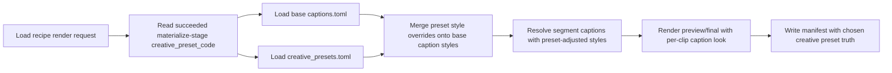
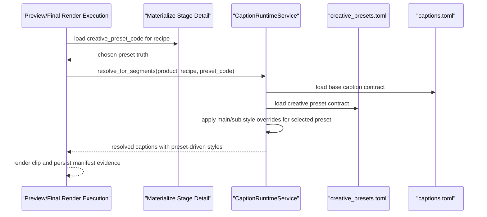

# Auto Factory Preset Driven Caption Rendering 2026-06-27

This document is the SSOT for the next creative-preset slice that turns chosen preset truth into real per-clip caption-style variation during preview and final render.

It extends [99_Auto_Factory_Creative_Preset_Orchestration_Workflow_2026-06-27.md](/F:/programming/python/MTClipFactory/doc/99_Auto_Factory_Creative_Preset_Orchestration_Workflow_2026-06-27.md), [100_Auto_Factory_Preset_Spread_And_Live_Product_Contract_2026-06-27.md](/F:/programming/python/MTClipFactory/doc/100_Auto_Factory_Preset_Spread_And_Live_Product_Contract_2026-06-27.md), and [102_Auto_Factory_Foreground_Family_Diversity_Guard_2026-06-27.md](/F:/programming/python/MTClipFactory/doc/102_Auto_Factory_Foreground_Family_Diversity_Guard_2026-06-27.md).

## Purpose

- make `creative_preset_code` affect rendered caption visuals, not only planner/audit metadata
- let one batch produce visibly different caption treatments per clip when presets differ
- keep the system truthful by separating:
  - base product caption contract
  - per-preset style overrides
  - still-not-yet-implemented preset dimensions

## Delivered Direction

- preview and final render should resolve the chosen materialize-stage `creative_preset_code` before caption rendering
- the preset may override:
  - `main_style_preset`
  - `sub_style_preset`
- the base `captions.toml` remains the starting contract for pools, fonts, sizing, and safety defaults
- preset style overrides should merge on top of the base caption contract instead of replacing the whole caption contract blindly

## Truth Boundary

- this slice makes per-clip caption style variation real when `creative_presets.toml` provides `main_style_preset` and/or `sub_style_preset`
- this slice does not yet make every preset field a live runtime override
- the style-override slice in this document is delivered; the follow-up hook/CTA named-pool routing slice is now documented separately in [104_Auto_Factory_Preset_Driven_Caption_Pool_Routing_2026-06-27.md](/F:/programming/python/MTClipFactory/doc/104_Auto_Factory_Preset_Driven_Caption_Pool_Routing_2026-06-27.md)
- fields such as `caption_density` and `segment_profile` are delivered separately in [106_Auto_Factory_Preset_Density_Profile_And_Presenter_Safe_Caption_Workflow_2026-06-27.md](/F:/programming/python/MTClipFactory/doc/106_Auto_Factory_Preset_Density_Profile_And_Presenter_Safe_Caption_Workflow_2026-06-27.md), so this document should now be read as the style-override slice of the broader preset-runtime path
- operators must not assume that chosen preset codes already imply a fully different motion-graphics template, camera rhythm, or copy structure unless those dimensions are separately implemented

## Workflow

## Sequence

## Acceptance Direction

1. Two clips with different chosen presets and different style overrides must be able to render visibly different caption treatments from the same base product contract.
2. If a chosen preset has no style overrides, render behavior must fall back safely to the base `captions.toml`.
3. Preview and final render must use the same preset-driven caption style logic.
4. The implementation must remain deterministic and testable with `pytest`.
