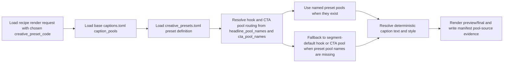
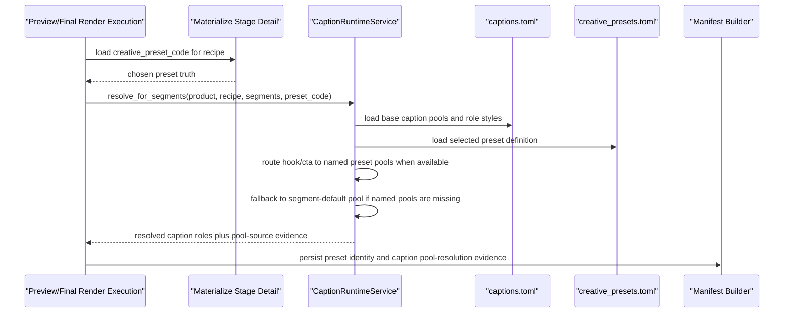

# Auto Factory Preset Driven Caption Pool Routing 2026-06-27

This document is the SSOT for the next creative-preset caption slice that makes chosen presets affect rendered caption text selection, not only caption card styling.

It extends [103_Auto_Factory_Preset_Driven_Caption_Rendering_2026-06-27.md](/F:/programming/python/MTClipFactory/doc/103_Auto_Factory_Preset_Driven_Caption_Rendering_2026-06-27.md) and [43_Product_Caption_Pool_And_Font_Workflow_2026-06-14.md](/F:/programming/python/MTClipFactory/doc/43_Product_Caption_Pool_And_Font_Workflow_2026-06-14.md).

## Purpose

- make chosen `creative_preset_code` affect rendered hook and CTA copy selection when the preset supplies named caption pools
- keep the base `captions.toml` contract backward compatible for products that do not opt into named preset pools
- preserve truthful audit behavior when a preset references named pools that are missing from the current caption contract

## Core Decision

- `captions.toml [caption_pools.*]` remains the one source for caption text pools
- segment-default pools such as `hook`, `benefit`, `proof`, and `cta` remain valid and unchanged
- creative presets may now also reference additional named caption pools that live in the same `caption_pools` namespace
- on this slice:
  - `headline_pool_names` may override the rendered pool used for `hook`
  - `cta_pool_names` may override the rendered pool used for `cta`
- if a preset names one or more pools that are missing, runtime must fall back truthfully to the segment-default pool instead of silently inventing text

## Truth Boundary

- this slice changes rendered caption text selection for `hook` and `cta` when the selected preset points to existing named pools
- this slice does not yet make `caption_density` or `segment_profile` live render-time behavior
- this slice does not yet push preset-specific caption-pool routing back into the current planner duplicate-scoring path unless a later SSOT slice explicitly extends that planner seam
- if a preset references named pools that are absent from `captions.toml`, render should keep running on the segment-default pool and emit manifest-visible fallback evidence

## Contract Direction

Named preset pools use the existing `caption_pools` table shape.

Example:

```toml
[caption_pools.hook]
main = ["Base hook"]
sub = ["Base support"]

[caption_pools.cta]
main = ["Base CTA"]
sub = ["Base CTA support"]

[caption_pools.ugc_hook]
main = ["UGC hook one", "UGC hook two"]
sub = ["UGC support"]

[caption_pools.flash_sale_cta]
main = ["Shop now"]
sub = ["Limited-time CTA support"]
```

Preset example:

```toml
[presets.presenter_urgency]
headline_pool_names = ["ugc_hook"]
cta_pool_names = ["flash_sale_cta"]
main_style_preset = "sale_blast"
sub_style_preset = "dark_lower_third"
```

## Workflow



## Sequence



## Acceptance Direction

1. Two clips that share one base `captions.toml` but use different preset hook or CTA pool names must be able to render different caption text.
2. Products that only define the existing segment-default pools must keep the current behavior unchanged.
3. Missing named preset pools must not cause silent text invention; fallback behavior must stay truthful in manifest evidence.
4. Preview and final render must use the same pool-routing logic.
