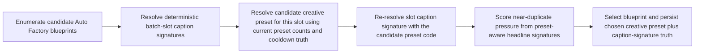
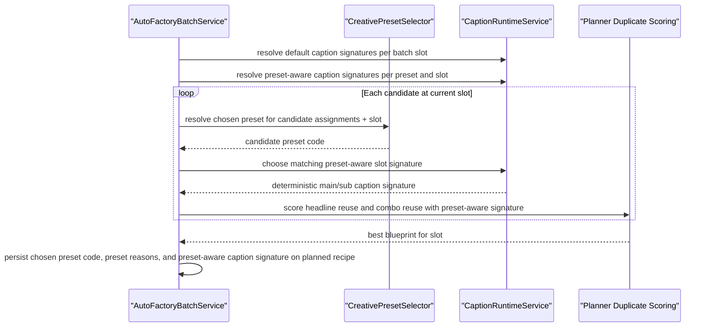

# Auto Factory Preset Aware Caption Signature Planning 2026-06-27

This document is the SSOT for the next creative-preset planner slice that makes preset-driven caption-pool routing affect Auto Factory duplicate scoring before materialization, not only preview/final render output.

It extends [94_Auto_Factory_Caption_Aware_Same_Batch_Diversity_Workflow_2026-06-26.md](/F:/programming/python/MTClipFactory/doc/94_Auto_Factory_Caption_Aware_Same_Batch_Diversity_Workflow_2026-06-26.md), [99_Auto_Factory_Creative_Preset_Orchestration_Workflow_2026-06-27.md](/F:/programming/python/MTClipFactory/doc/99_Auto_Factory_Creative_Preset_Orchestration_Workflow_2026-06-27.md), and [104_Auto_Factory_Preset_Driven_Caption_Pool_Routing_2026-06-27.md](/F:/programming/python/MTClipFactory/doc/104_Auto_Factory_Preset_Driven_Caption_Pool_Routing_2026-06-27.md).

## Purpose

- keep planner duplicate-scoring truth aligned with the same preset-driven hook/CTA caption pools already used at render time
- prevent the planner from scoring two different preset treatments as if they still share one identical default headline path
- preserve deterministic rerun behavior by keeping caption-signature prediction based on persisted recipe code, slot position, and chosen preset truth

## Core Decision

- Auto Factory caption-signature scoring remains deterministic and product-local
- `CaptionRuntimeService.resolve_caption_selection_signature(...)` remains the one seam for predicting caption text selection
- when Auto Factory evaluates one candidate blueprint for one batch slot, it must first resolve the candidate's effective `creative_preset_code` for that slot
- planner caption-signature scoring must then use the signature predicted from that chosen preset's named caption-pool overrides when available
- if no preset is chosen, or if no caption runtime contract exists, planner behavior falls back to the existing non-preset caption-signature path

## Truth Boundary

- this slice makes preset-driven `headline_pool_names` and `cta_pool_names` affect both planner duplicate scoring and preview/final caption selection
- this slice does not yet make `caption_density` live render-time or planner-time behavior
- this slice does not yet make `segment_profile` change timeline construction or caption enablement behavior
- operators must still treat preset identity, planner duplicate scoring, and rendered-history duplicate truth as related but separate audit seams

## Workflow

## Sequence

## Acceptance Direction

1. Two planned recipes that receive different chosen preset codes for the same product/batch may also carry different planner caption signatures when their presets point to different named caption pools.
2. The greedy planner must use those preset-aware caption signatures during near-duplicate scoring instead of deferring the difference until render time only.
3. Products without `creative_presets.toml`, or without preset-named caption pools, must keep the current planner behavior unchanged.
4. Preview/final render and planner caption-signature prediction must continue to share the same `CaptionRuntimeService` seam so caption-pool truth does not fork.
