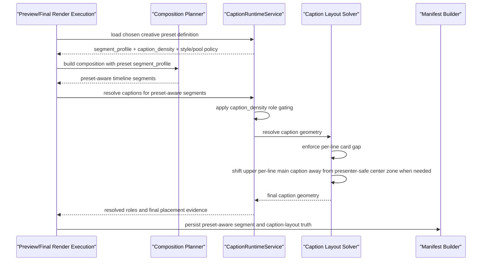

# Auto Factory Preset Density Profile And Presenter Safe Caption Workflow 2026-06-27

This document is the SSOT for the next preset-runtime slice that makes `caption_density` and `segment_profile` affect real planner/render behavior while also correcting top-caption overlap and presenter-face obstruction in live outputs.

It extends [72_Top_Band_Face_Safe_Caption_Clamp_Workflow_2026-06-20.md](/F:/programming/python/MTClipFactory/doc/72_Top_Band_Face_Safe_Caption_Clamp_Workflow_2026-06-20.md), [99_Auto_Factory_Creative_Preset_Orchestration_Workflow_2026-06-27.md](/F:/programming/python/MTClipFactory/doc/99_Auto_Factory_Creative_Preset_Orchestration_Workflow_2026-06-27.md), [104_Auto_Factory_Preset_Driven_Caption_Pool_Routing_2026-06-27.md](/F:/programming/python/MTClipFactory/doc/104_Auto_Factory_Preset_Driven_Caption_Pool_Routing_2026-06-27.md), and [105_Auto_Factory_Preset_Aware_Caption_Signature_Planning_2026-06-27.md](/F:/programming/python/MTClipFactory/doc/105_Auto_Factory_Preset_Aware_Caption_Signature_Planning_2026-06-27.md).

## Purpose

- make `caption_density` change rendered caption-role coverage instead of remaining planner/audit metadata only
- make `segment_profile` change timeline segment structure for preview/final render and planner caption prediction
- enforce a visible vertical gap between per-line promo boxes so stacked cards do not look visually merged
- move top headline cards away from the main presenter-face zone when the initial top-band layout still overlaps the centered upper subject area

## Core Decision

- `caption_density` remains preset-local policy and affects both planner caption-signature prediction and render-time role resolution
- `segment_profile` remains preset-local policy and affects both composition planning and caption-signature prediction
- per-line textbox captions keep a minimum visual card gap during geometry resolution even when the authored line spacing would otherwise make adjacent cards touch
- upper-band per-line `main` caption stacks may be shifted horizontally away from one central presenter-safe zone when their resolved box still overlaps that zone

## Density Semantics

- `dense`
  - keep current behavior: render `main` and `sub` when both roles exist for the segment
- `medium`
  - render `main` on eligible segments
  - suppress `sub` on `hook` and `problem`
  - keep `sub` on `benefit`, `proof`, and `cta`
- `light`
  - render `main` on eligible segments
  - suppress all `sub`

If a preset does not define `caption_density`, runtime keeps the current backward-compatible baseline.

## Segment Profile Semantics

- `hook_benefit_cta`
  - segment order: `hook`, `benefit`, `cta`
- `benefit_proof_cta`
  - segment order: `benefit`, `proof`, `cta`
- `proof_focus`
  - segment order: `proof`, `benefit`, `cta`
- `benefit_cta`
  - segment order: `benefit`, `cta`

These explicit profiles override the current duration-bucket segment formula for preset-driven preview/final composition and for planner caption-signature prediction.

If a preset does not define `segment_profile`, the current duration-bucket composition baseline remains unchanged.

## Presenter Safe Layout Direction

- the current top-band height clamp remains active
- after the normal box geometry is resolved, upper-band per-line `main` caption stacks must also test overlap against one centered presenter-safe zone
- if overlap exists and there is room, runtime should shift the caption box left or right with a small edge margin instead of keeping it centered over the presenter face
- manifest/runtime evidence should remain truthful about the final box position after this presenter-safe adjustment

## Workflow

```mermaid
flowchart LR
    A["Load chosen creative preset"] --> B["Resolve segment_profile and caption_density policy"]
    B --> C["Plan timeline segments from preset profile or default duration formula"]
    C --> D["Predict planner caption signatures with the same preset density/profile rules"]
    D --> E["Resolve runtime caption roles and apply density gating"]
    E --> F["Build caption box geometry with enforced per-line card gap"]
    F --> G["Shift upper per-line main caption away from presenter-safe center zone when needed"]
    G --> H["Render preview/final and persist truthful caption geometry evidence"]
```

## Sequence

## Acceptance Direction

1. Presets with different `segment_profile` values must produce different timeline segment sequences in preview/final composition instead of sharing one duration-only formula.
2. Presets with different `caption_density` values must produce different rendered caption-role coverage and different planner caption signatures when that density changes the visible roles.
3. Per-line promo caption boxes must keep a visible vertical margin between adjacent cards instead of looking merged.
4. An upper per-line main caption that overlaps the presenter-safe center zone must shift horizontally or clamp toward one edge instead of staying centered over the face.
5. Products without these preset fields must keep the current backward-compatible behavior.
