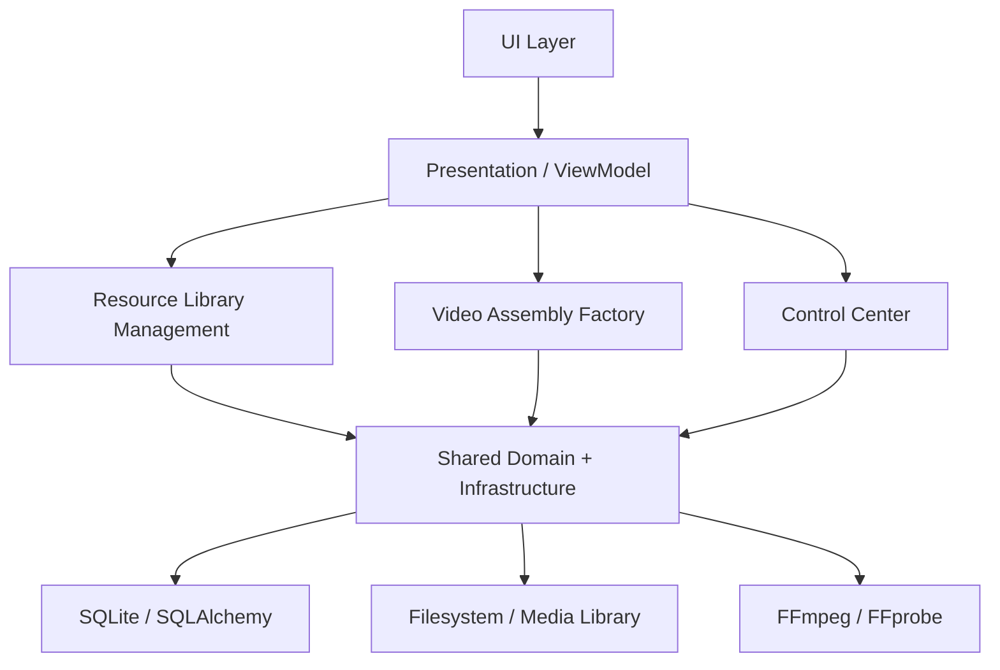
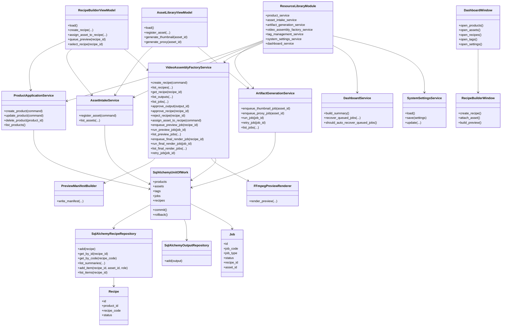
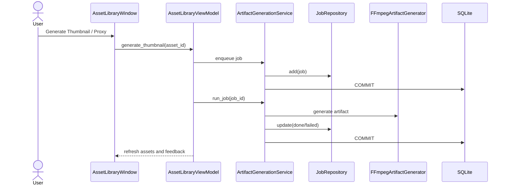
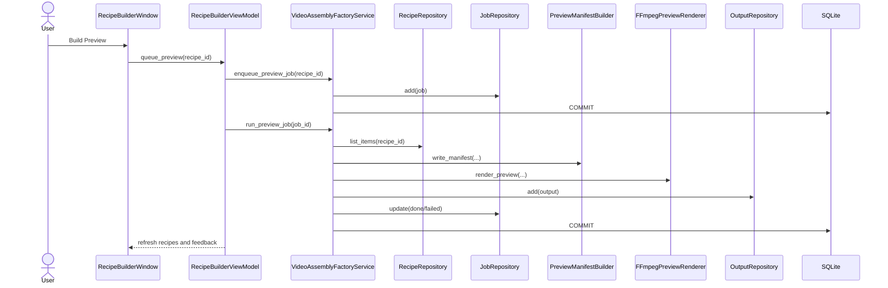
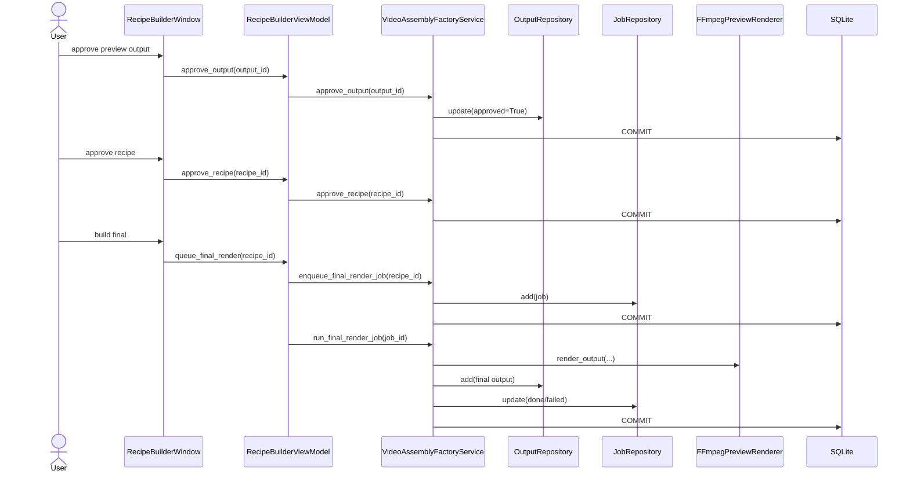
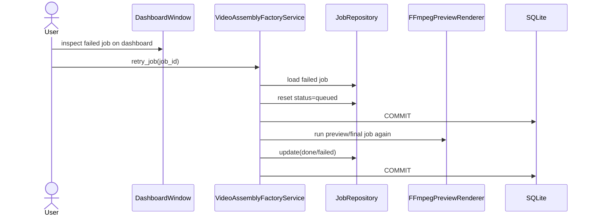
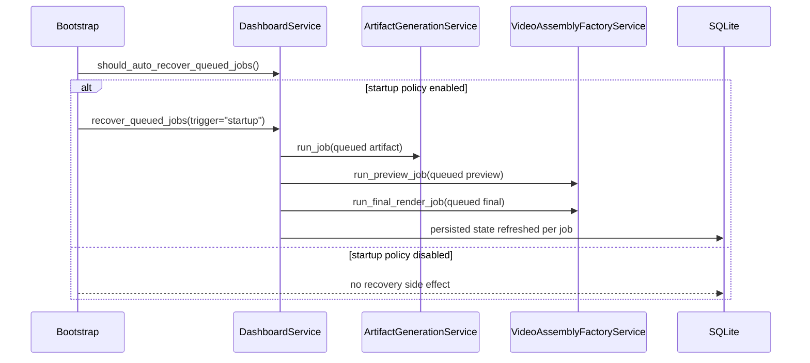
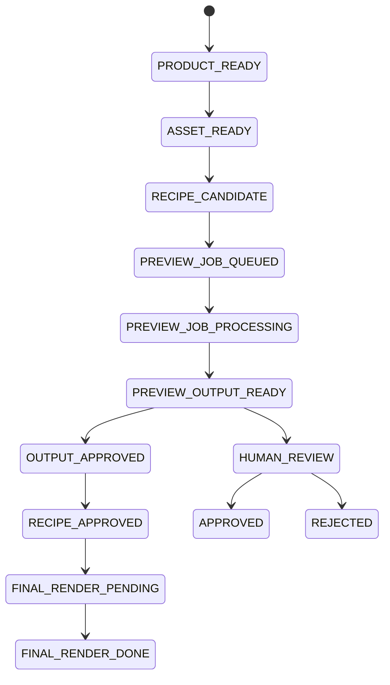

# UML System Overview

This document is the living UML source of truth for the current implementation.

## Package Diagram

## Current Component Map

## Asset Artifact Sequence

## Recipe Preview Sequence

## Review And Final Sequence

## Retry Recovery Sequence

## Queued Recovery Sequence

## Workflow State Direction

