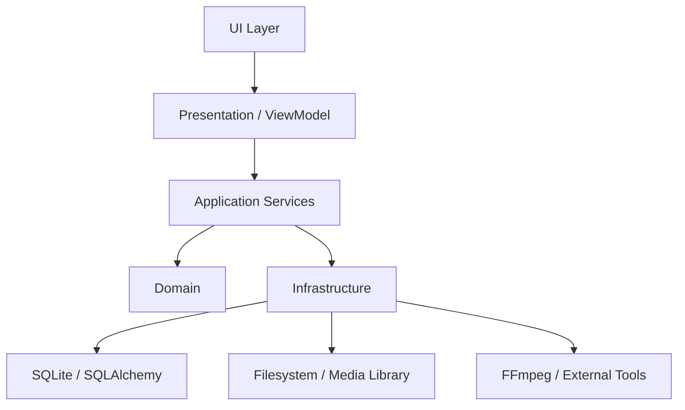
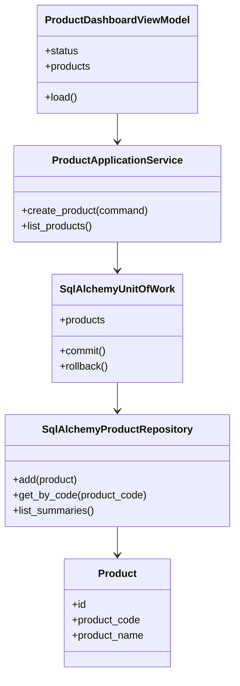
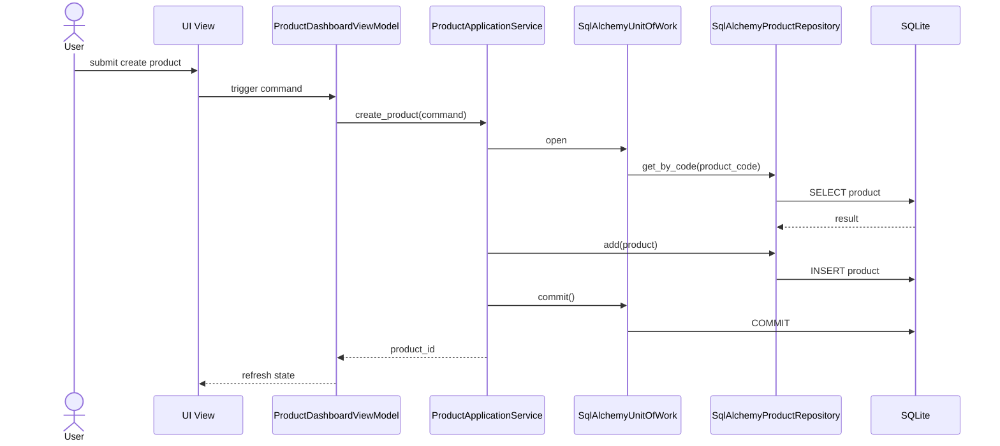
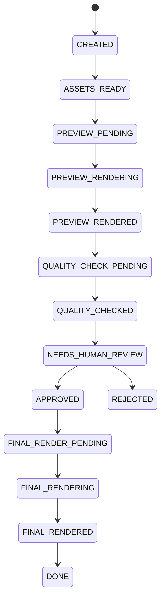

# UML System Overview

เอกสารนี้เป็น UML กลางของระบบสำหรับใช้สื่อสาร architecture กับทีม โดยใช้ Mermaid ใน Markdown เพื่อให้แก้ไขง่ายและเป็นส่วนหนึ่งของ SSOT

## Package Diagram

## Component Responsibilities

## Product Creation Sequence

## Workflow State Direction

