# UML System Overview

This document is the living UML source of truth for the current implementation.

## Package Diagram

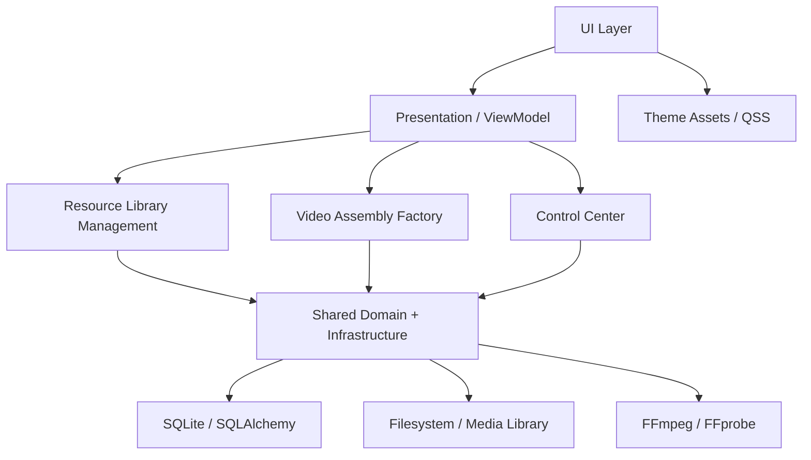
```mermaid
flowchart TB
    UI["UI Layer"] --> VM["Presentation / ViewModel"]
    UI --> THEME["Theme Assets / QSS"]
    VM --> LIB["Resource Library Management"]
    VM --> FAC["Video Assembly Factory"]
    VM --> CC["Control Center"]
    LIB --> CORE["Shared Domain + Infrastructure"]
    FAC --> CORE
    CC --> CORE
    CORE --> DB["SQLite / SQLAlchemy"]
    CORE --> FS["Filesystem / Media Library"]
    CORE --> EXT["FFmpeg / FFprobe"]
```

## Current Component Map

```mermaid
classDiagram
    class ResourceLibraryModule {
        +product_service
        +asset_intake_service
        +artifact_generation_service
        +video_assembly_factory_service
        +auto_factory_service
        +auto_factory_folder_service
        +production_order_service
        +tag_management_service
        +system_settings_service
        +dashboard_service
    }

    class ProductApplicationService {
        +create_product(command)
        +update_product(command)
        +delete_product(product_id)
        +list_products()
    }

    class AssetIntakeService {
        +register_asset(command)
        +update_asset(command)
        +delete_asset(asset_id)
        +retire_asset(asset_id)
        +purge_asset_media(asset_id)
        +describe_asset_references(asset_id)
        +list_replacement_candidates(asset_id)
        +replace_asset_in_recipes(old_asset_id, new_asset_id)
        +list_assets(...)
    }

    class ArtifactGenerationService {
        +enqueue_thumbnail_job(asset_id)
        +enqueue_proxy_job(asset_id)
        +run_job(job_id)
        +retry_job(job_id)
        +list_jobs(...)
    }

    class VideoAssemblyFactoryService {
        +create_recipe(command)
        +list_recipes(...)
        +get_recipe(recipe_id)
        +get_composition_plan(recipe_id)
        +list_outputs(...)
        +list_decision_events(recipe_id)
        +list_jobs(...)
        +approve_output(output_id)
        +approve_recipe(recipe_id)
        +reject_recipe(recipe_id)
        +assign_asset_to_recipe(command)
        +require post-replacement approved output
        +enqueue_preview_job(recipe_id)
        +run_preview_job(job_id)
        +list_preview_jobs(...)
        +enqueue_final_render_job(recipe_id)
        +run_final_render_job(job_id)
        +list_final_render_jobs(...)
        +retry_job(job_id)
    }

    class AutoFactoryBatchService {
        +plan_batch(order)
        +materialize_batch(order)
        +build_previews_for_materialized_batch(materialization)
        +materialize_batch_and_build_previews(order)
        +batch-only uniqueness planning
        +voice-with-bounds duration planning
        +required tag-label filtering by asset type
        +internal recipe generation
        +batch preview orchestration up to review gate
    }

    class AutoFactoryFolderService {
        +run_batch_root(batch_root)
        +run_batch_root(batch_root, scan_depth)
        +audit_batch_root(batch_root, scan_depth)
        +parse product.toml + pipeline.toml
        +parse tags.toml
        +preflight contracts/assets before automation
        +sync captions.toml into runtime metadata cache
        +sync pipeline.toml + context.toml into runtime metadata cache
        +discover product folders up to scan depth
        +create missing products
        +intake deterministic asset codes
        +apply additive folder tag metadata
        +skip existing assets on rerun
        +optional preview automation after materialization
    }

    class ProductAutomationMetadataStore {
        +sync_caption_contract(product_code, source_file)
        +sync_pipeline_contract(product_code, source_file)
        +sync_runtime_context(product_code, source_product_dir, batch_code)
        +load_caption_contract(product_code)
        +load_pipeline_contract(product_code)
        +load_runtime_context(product_code)
        +runtime metadata cache under media_root
    }

    class ProductRunArtifactStore {
        +write_order_snapshot(product_code, batch_code, payload)
        +append_journal_event(product_code, batch_code, ...)
        +resolve_render_artifact_paths(product_code, batch_code, ...)
        +product-local runs/<batch_code> artifact layout
    }

    class ProductAutomationPolicyService {
        +load_fill_policy(product_code)
        +per-asset-type fill policy from pipeline.toml
    }

    class CaptionRuntimeService {
        +resolve_for_segments(product_code, recipe_code, segments)
        +deterministic main/sub selection
        +manual newline preservation
        +font-file resolution from workspace fonts
        +config-driven promo line-advance compression
        +top-band face-safe band clamp
        +support helpers split below 800-line guardrail
        +overflow risk reporting
    }

    class ProductionOrderService {
        +create_order(order,...)
        +run_order(order_id,...)
        +create_and_run_order(order,...)
        +request_pause(order_id)
        +request_stop(order_id)
        +resume_order(order_id)
        +get_order(order_id)
        +list_orders(...)
        +persist order + stage/event truth
    }

    class ReviewGateEvaluator {
        +assess_review_gate(...)
        +apply_review_gate(...)
        +review_gate_manifest_payload(...)
    }

    class RecipeScoringPolicy {
        +assess_recipe_score(...)
        +score_and_persist_recipe(...)
    }

    class CompositionPlan {
        +master_duration
        +duration_source
        +segment_count
    }

    class TimelineSegment {
        +segment_type
        +sequence_index
        +start_sec
        +end_sec
        +target_duration_sec
    }

    class RenderDecisionLog {
        +decision_type
        +asset_role
        +detail
    }

    class FFmpegPreviewRenderer {
        +render_preview(..., target_ratio)
        +render_output(..., segment_clips, target_ratio, output_path)
        +runtime audio mix
        +target-frame normalization
        +layered visual compositing
        +caption overlay rendering
        +visual composite evidence
        +operator-configured exact output resolution
        +configurable duck mode
        +configurable gain staging
        +per-asset-type fill policy
    }

    class VideoFrameNormalization {
        +build_visual_filter(target_ratio)
    }

    class PreviewComposition {
        +segment_clips
        +manifest_payload
        +resolved caption evidence
        +resolved fill-policy evidence
    }

    class DashboardService {
        +build_summary()
        +recover_queued_jobs(...)
        +retry_failed_jobs(...)
        +should_auto_recover_queued_jobs()
        +path_root_status()
        +failed_job_escalation_threshold
        +operator_playbook_lines
        +needs_review_recipe_count
    }

    class ApplicationRuntime {
        +module
        +reload_path_roots()
    }

    class ReloadableServiceProxy {
        +set_target(service)
    }

    class SystemSettingsService {
        +load()
        +save(settings)
        +update(...)
        +path_root_status(...)
        +failed-job escalation threshold
        +visual key policy fields
        +audio policy fields
        +preview/final output resolution fields
        +review threshold fields
        +duck mode tuning fields
        +gain-stage tuning fields
    }

    class PathRootStatus {
        +runtime_paths
        +configured_paths
        +changed_path_roots
        +restart_required
        +reload_policy
    }

    class RecoveryMetadata {
        +retry_count
        +consecutive_failure_count
        +last_retry_at
        +last_failure_at
        +last_success_at
    }

    class ProductionOrder {
        +order_code
        +batch_code
        +source_mode
        +run_mode
        +source_root
        +preview_generation_enabled
        +status
        +lease_owner
        +lease_heartbeat_at
        +lease_expires_at
        +blocking_reason
    }

    class ProductionOrderStage {
        +stage_name
        +stage_scope
        +status
        +job_id
        +recipe_id
        +output_id
    }

    class ProductionOrderEvent {
        +sequence_index
        +event_type
        +status
        +message
        +stage_name
        +worker_id
    }

    class MigrationGuard {
        +ensure_schema_current(...)
    }

    class AssetLibraryViewModel {
        +load()
        +register_asset(...)
        +update_asset(asset_id, asset_code)
        +delete_asset(asset_id)
        +retire_asset(asset_id)
        +purge_asset_media(asset_id)
        +describe_asset_references(asset_id)
        +list_replacement_candidates(asset_id)
        +replace_asset_in_recipes(old_asset_id, new_asset_id)
        +generate_thumbnail(asset_id)
        +generate_proxy(asset_id)
    }

    class RecipeBuilderViewModel {
        +load()
        +create_recipe(...)
        +assign_asset_to_recipe(...)
        +queue_preview(recipe_id)
        +select_recipe(recipe_id)
        +find_output(output_id)
        +composition_plan
    }

    class AutoFactoryControlViewModel {
        +load()
        +run_batch_root(...)
        +refresh_progress()
        +request_pause()
        +request_stop()
        +execute_resume_order(order_id)
        +select_order(production_order_id)
        +recent_orders
        +progress_snapshot
        +run_report
        +selected_order
    }

    class DashboardWindow {
        +open_products()
        +open_assets()
        +open_recipes()
        +open_auto_factory()
        +open_tags()
        +open_settings()
    }

    class ProductLibraryWindow {
        +create_product()
        +update_product()
        +delete_product()
    }

    class AssetLibraryWindow {
        +register_asset()
        +update_asset()
        +delete_asset()
        +retire_asset()
        +purge_asset_media()
        +show_references()
        +replace_in_recipes()
        +generate_thumbnail()
        +generate_proxy()
    }

    class TagDictionaryWindow {
        +create_tag()
        +create and attach to selected assets
        +assign_tag_to_selected_assets()
        +apply_asset_filters()
        +apply_tag_filters()
        +select_assets(asset_ids)
        +filter by asset type
        +show current asset tag labels
        +show primary selected asset details
        +show selected asset count
        +reuse existing tag-group suggestions
    }

    class UIThemeLoader {
        +load_theme_stylesheet(theme_name)
        +apply_theme(widget, theme_name)
    }

    class SettingsWindow {
        +load()
        +save()
        +apply_theme()
    }

    class RecipeBuilderWindow {
        +create_recipe()
        +attach_asset()
        +build_preview()
        +show recipe score/risk summaries
        +show replacement aftercare guidance
        +mark historical-only outputs after replacement
        +show output lineage details
        +show composition/render summaries
        +show review-gate evidence
    }

    class AutoFactoryControlWindow {
        +browse root folder
        +run auto factory
        +pause run
        +stop run
        +resume run
        +select recent order
        +show intake, order, lease, and event truth
    }

    class SqlAlchemyUnitOfWork {
        +products
        +assets
        +tags
        +jobs
        +recipes
        +decision_events
        +composition_plans
        +render_decisions
        +timeline_segments
        +production_orders
        +production_order_items
        +production_order_stages
        +production_order_events
        +commit()
        +rollback()
    }

    class SqlAlchemyRecipeRepository {
        +add(recipe)
        +get_by_id(recipe_id)
        +get_by_code(recipe_code)
        +list_summaries(...)
        +add_item(recipe_id, asset_id, role)
        +list_items(recipe_id)
    }

    class SqlAlchemyOutputRepository {
        +add(output)
    }

    class SqlAlchemyDecisionEventRepository {
        +add(event)
        +list_by_recipe(recipe_id)
    }

    class SqlAlchemyProductionOrderEventRepository {
        +add(event)
        +list_by_order(order_id)
    }

    class SqlAlchemyCompositionPlanRepository {
        +get_by_recipe(recipe_id)
        +upsert(plan)
    }

    class SqlAlchemyRenderDecisionRepository {
        +replace_for_plan(composition_plan_id, decisions)
        +list_by_plan(composition_plan_id)
    }

    class SqlAlchemyTimelineSegmentRepository {
        +replace_for_plan(composition_plan_id, segments)
        +list_by_plan(composition_plan_id)
    }

    class PreviewManifestBuilder {
        +write_manifest(...)
    }

    class Recipe {
        +id
        +product_id
        +recipe_code
        +recipe_score
        +duplicate_risk
        +status
    }

    class Job {
        +id
        +job_code
        +job_type
        +status
        +recipe_id
        +asset_id
        +output_json(payload-backed recovery metadata)
    }

    ResourceLibraryModule --> ProductApplicationService
    ApplicationRuntime --> ResourceLibraryModule
    ApplicationRuntime --> ReloadableServiceProxy
    ResourceLibraryModule --> AssetIntakeService
    ResourceLibraryModule --> ArtifactGenerationService
    ResourceLibraryModule --> VideoAssemblyFactoryService
    ResourceLibraryModule --> AutoFactoryBatchService
    ResourceLibraryModule --> AutoFactoryFolderService
    ResourceLibraryModule --> DashboardService
    ResourceLibraryModule --> SystemSettingsService
    ResourceLibraryModule --> MigrationGuard
    DashboardService --> PathRootStatus
    AssetLibraryViewModel --> AssetIntakeService
    AssetLibraryViewModel --> ArtifactGenerationService
    RecipeBuilderViewModel --> ProductApplicationService
    RecipeBuilderViewModel --> AssetIntakeService
    RecipeBuilderViewModel --> VideoAssemblyFactoryService
    AutoFactoryControlViewModel --> AutoFactoryFolderService
    AutoFactoryControlViewModel --> ProductionOrderService
    DashboardWindow --> RecipeBuilderWindow
    DashboardWindow --> AutoFactoryControlWindow
    DashboardWindow --> SettingsWindow
    DashboardWindow --> UIThemeLoader
    ProductLibraryWindow --> UIThemeLoader
    AssetLibraryWindow --> UIThemeLoader
    TagDictionaryWindow --> UIThemeLoader
    RecipeBuilderWindow --> UIThemeLoader
    AutoFactoryControlWindow --> AutoFactoryControlViewModel
    AutoFactoryControlWindow --> UIThemeLoader
    SettingsWindow --> UIThemeLoader
    VideoAssemblyFactoryService --> PreviewManifestBuilder
    AutoFactoryBatchService --> ProductApplicationService
    AutoFactoryBatchService --> AssetIntakeService
    AutoFactoryBatchService --> VideoAssemblyFactoryService
    AutoFactoryFolderService --> ProductApplicationService
    AutoFactoryFolderService --> AssetIntakeService
    AutoFactoryFolderService --> AutoFactoryBatchService
    AutoFactoryFolderService --> ProductAutomationMetadataStore
    VideoAssemblyFactoryService --> CaptionRuntimeService
    CaptionRuntimeService --> ProductAutomationMetadataStore
    VideoAssemblyFactoryService --> FFmpegPreviewRenderer
    FFmpegPreviewRenderer --> VideoFrameNormalization
    VideoAssemblyFactoryService --> PreviewComposition
    VideoAssemblyFactoryService --> CompositionPlan
    VideoAssemblyFactoryService --> ReviewGateEvaluator
    VideoAssemblyFactoryService --> RecipeScoringPolicy
    Job --> RecoveryMetadata
    CompositionPlan --> TimelineSegment
    CompositionPlan --> RenderDecisionLog
    PreviewComposition --> TimelineSegment
    ProductApplicationService --> SqlAlchemyUnitOfWork
    AssetIntakeService --> SqlAlchemyUnitOfWork
    ArtifactGenerationService --> SqlAlchemyUnitOfWork
    VideoAssemblyFactoryService --> SqlAlchemyUnitOfWork
    SqlAlchemyUnitOfWork --> SqlAlchemyRecipeRepository
    SqlAlchemyUnitOfWork --> SqlAlchemyOutputRepository
    SqlAlchemyUnitOfWork --> SqlAlchemyDecisionEventRepository
    SqlAlchemyUnitOfWork --> SqlAlchemyProductionOrderEventRepository
    SqlAlchemyUnitOfWork --> SqlAlchemyCompositionPlanRepository
    SqlAlchemyUnitOfWork --> SqlAlchemyRenderDecisionRepository
    SqlAlchemyUnitOfWork --> SqlAlchemyTimelineSegmentRepository
    SqlAlchemyRecipeRepository --> Recipe
    SqlAlchemyUnitOfWork --> Job
    ProductionOrder --> ProductionOrderEvent
```

## Asset Artifact Sequence

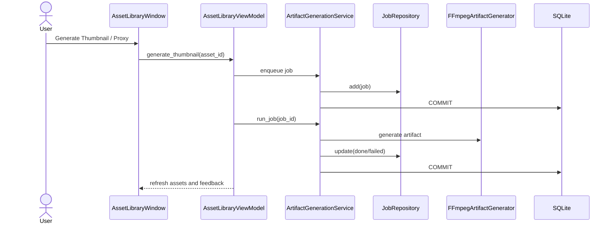
```mermaid
sequenceDiagram
    actor User
    participant View as AssetLibraryWindow
    participant VM as AssetLibraryViewModel
    participant Artifact as ArtifactGenerationService
    participant JobRepo as JobRepository
    participant FF as FFmpegArtifactGenerator
    participant DB as SQLite

    User->>View: Generate Thumbnail / Proxy
    View->>VM: generate_thumbnail(asset_id)
    VM->>Artifact: enqueue job
    Artifact->>JobRepo: add(job)
    Artifact->>DB: COMMIT
    VM->>Artifact: run_job(job_id)
    Artifact->>FF: generate artifact
    Artifact->>JobRepo: update(done/failed)
    Artifact->>DB: COMMIT
    VM-->>View: refresh assets and feedback
```

## Asset Maintenance Sequence

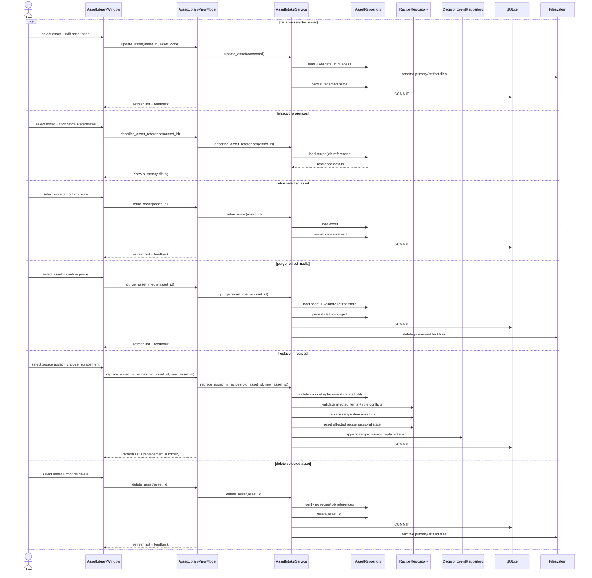
```mermaid
sequenceDiagram
    actor User
    participant View as AssetLibraryWindow
    participant VM as AssetLibraryViewModel
    participant Intake as AssetIntakeService
    participant AssetRepo as AssetRepository
    participant RecipeRepo as RecipeRepository
    participant DecisionRepo as DecisionEventRepository
    participant DB as SQLite
    participant FS as Filesystem

    alt rename selected asset
        User->>View: select asset + edit asset code
        View->>VM: update_asset(asset_id, asset_code)
        VM->>Intake: update_asset(command)
        Intake->>AssetRepo: load + validate uniqueness
        Intake->>FS: rename primary/artifact files
        Intake->>AssetRepo: persist renamed paths
        Intake->>DB: COMMIT
        VM-->>View: refresh list + feedback
    else inspect references
        User->>View: select asset + click Show References
        View->>VM: describe_asset_references(asset_id)
        VM->>Intake: describe_asset_references(asset_id)
        Intake->>AssetRepo: load recipe/job references
        AssetRepo-->>Intake: reference details
        VM-->>View: show summary dialog
    else retire selected asset
        User->>View: select asset + confirm retire
        View->>VM: retire_asset(asset_id)
        VM->>Intake: retire_asset(asset_id)
        Intake->>AssetRepo: load asset
        Intake->>AssetRepo: persist status=retired
        Intake->>DB: COMMIT
        VM-->>View: refresh list + feedback
    else purge retired media
        User->>View: select asset + confirm purge
        View->>VM: purge_asset_media(asset_id)
        VM->>Intake: purge_asset_media(asset_id)
        Intake->>AssetRepo: load asset + validate retired state
        Intake->>AssetRepo: persist status=purged
        Intake->>DB: COMMIT
        Intake->>FS: delete primary/artifact files
        VM-->>View: refresh list + feedback
    else replace in recipes
        User->>View: select source asset + choose replacement
        View->>VM: replace_asset_in_recipes(old_asset_id, new_asset_id)
        VM->>Intake: replace_asset_in_recipes(old_asset_id, new_asset_id)
        Intake->>AssetRepo: validate source/replacement compatibility
        Intake->>RecipeRepo: validate affected items + role conflicts
        Intake->>RecipeRepo: replace recipe item asset ids
        Intake->>RecipeRepo: reset affected recipe approval state
        Intake->>DecisionRepo: append recipe_assets_replaced event
        Intake->>DB: COMMIT
        VM-->>View: refresh list + replacement summary
    else delete selected asset
        User->>View: select asset + confirm delete
        View->>VM: delete_asset(asset_id)
        VM->>Intake: delete_asset(asset_id)
        Intake->>AssetRepo: verify no recipe/job references
        Intake->>AssetRepo: delete(asset_id)
        Intake->>DB: COMMIT
        Intake->>FS: remove primary/artifact files
        VM-->>View: refresh list + feedback
    end
```

## Recipe Attach Role Guidance Sequence

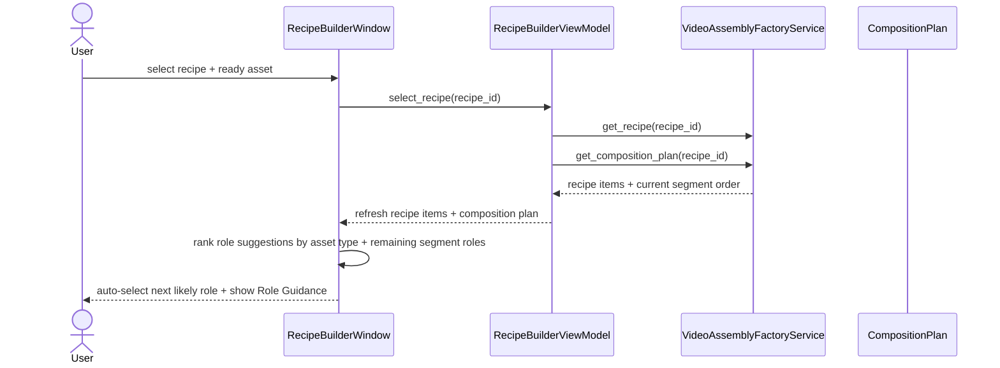
```mermaid
sequenceDiagram
    actor User
    participant View as RecipeBuilderWindow
    participant VM as RecipeBuilderViewModel
    participant Factory as VideoAssemblyFactoryService
    participant Plan as CompositionPlan

    User->>View: select recipe + ready asset
    View->>VM: select_recipe(recipe_id)
    VM->>Factory: get_recipe(recipe_id)
    VM->>Factory: get_composition_plan(recipe_id)
    Factory-->>VM: recipe items + current segment order
    VM-->>View: refresh recipe items + composition plan
    View->>View: rank role suggestions by asset type + remaining segment roles
    View-->>User: auto-select next likely role + show Role Guidance
```

## Folder Discovery Depth Sequence

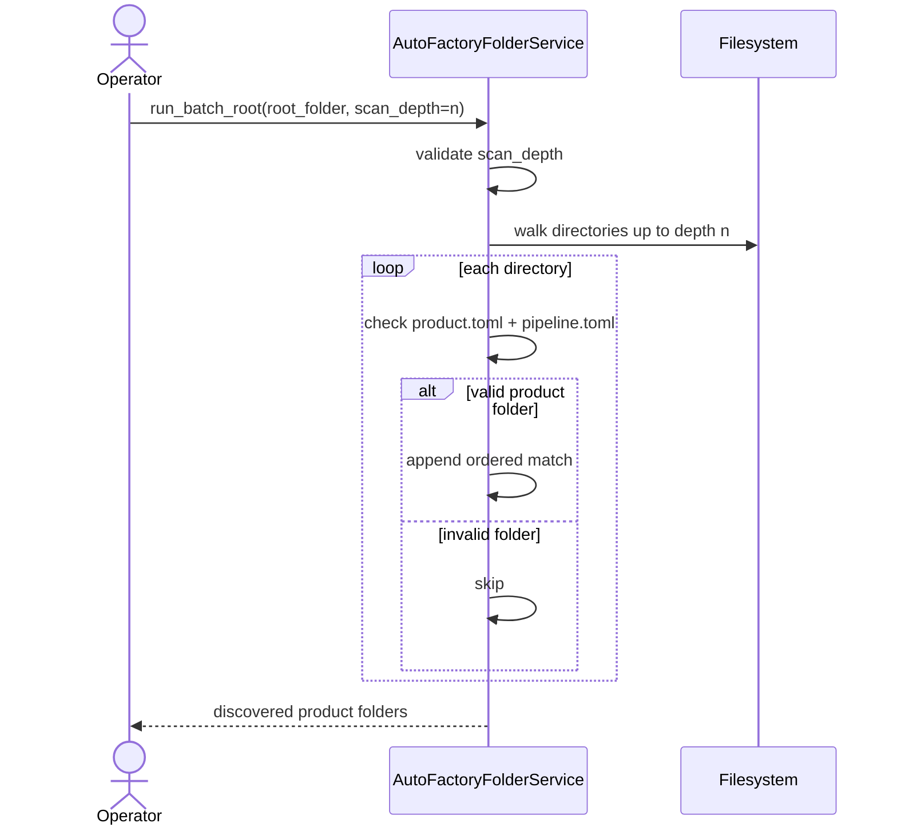
```mermaid
sequenceDiagram
    actor Operator
    participant FolderSvc as AutoFactoryFolderService
    participant FS as Filesystem

    Operator->>FolderSvc: run_batch_root(root_folder, scan_depth=n)
    FolderSvc->>FolderSvc: validate scan_depth
    FolderSvc->>FS: walk directories up to depth n
    loop each directory
        FolderSvc->>FolderSvc: check product.toml + pipeline.toml
        alt valid product folder
            FolderSvc->>FolderSvc: append ordered match
        else invalid folder
            FolderSvc->>FolderSvc: skip
        end
    end
    FolderSvc-->>Operator: discovered product folders
```

## Auto Factory Control Surface Sequence

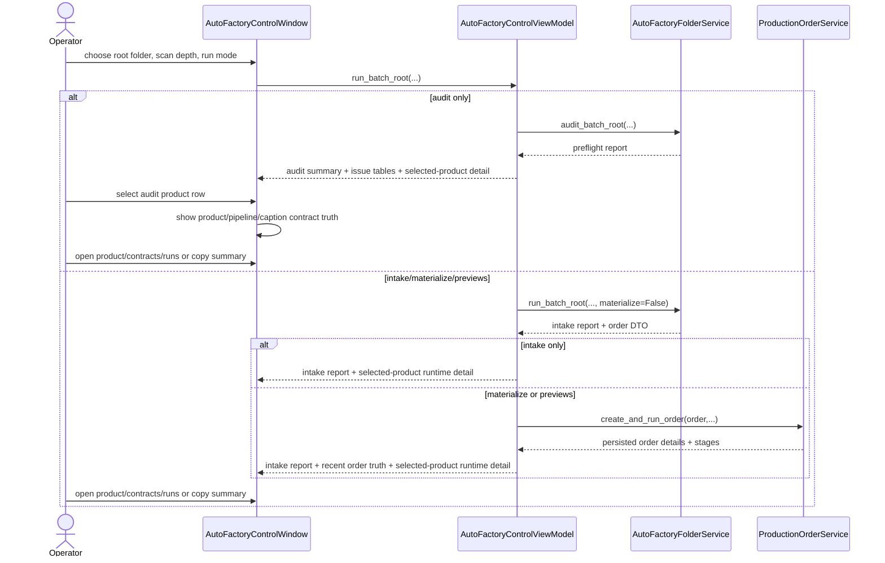
```mermaid
sequenceDiagram
    actor Operator
    participant View as AutoFactoryControlWindow
    participant VM as AutoFactoryControlViewModel
    participant FolderSvc as AutoFactoryFolderService
    participant OrderSvc as ProductionOrderService

    Operator->>View: choose root folder, scan depth, run mode
    View->>VM: run_batch_root(...)
    alt audit only
        VM->>FolderSvc: audit_batch_root(...)
        FolderSvc-->>VM: preflight report
        VM-->>View: audit summary + issue tables + selected-product detail
        Operator->>View: select audit product row
        View->>View: show product/pipeline/caption contract truth
        Operator->>View: open product/contracts/runs or copy summary
    else intake/materialize/previews
        VM->>FolderSvc: run_batch_root(..., materialize=False)
        FolderSvc-->>VM: intake report + order DTO
        alt intake only
            VM-->>View: intake report + selected-product runtime detail
        else materialize or previews
            VM->>OrderSvc: create_and_run_order(order,...)
            OrderSvc-->>VM: persisted order details + stages
            VM-->>View: intake report + recent order truth + selected-product runtime detail
        end
        Operator->>View: open product/contracts/runs or copy summary
    end
```

## Auto Factory Operations Sequence

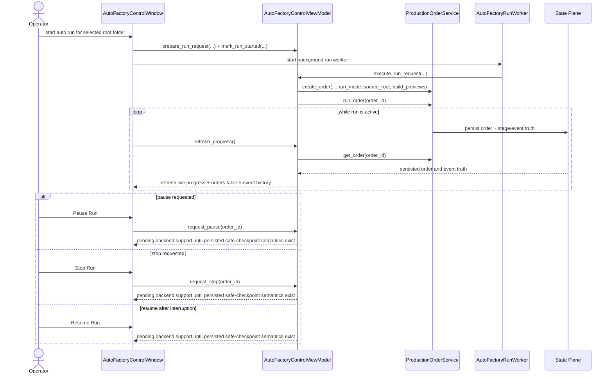
```mermaid
sequenceDiagram
    actor Operator
    participant View as AutoFactoryControlWindow
    participant VM as AutoFactoryControlViewModel
    participant OrderSvc as ProductionOrderService
    participant Worker as AutoFactoryRunWorker
    participant State as State Plane

    Operator->>View: start auto run for selected root folder
    View->>VM: prepare_run_request(...) + mark_run_started(...)
    View->>Worker: start background run worker
    Worker->>VM: execute_run_request(...)
    VM->>OrderSvc: create_order(..., run_mode, source_root, build_previews)
    VM->>OrderSvc: run_order(order_id)
    loop while run is active
        OrderSvc->>State: persist order + stage/event truth
        View->>VM: refresh_progress()
        VM->>OrderSvc: get_order(order_id)
        State-->>VM: persisted order and event truth
        VM-->>View: refresh live progress + orders table + event history
    end
    alt pause requested
        Operator->>View: Pause Run
        View->>VM: request_pause(order_id)
        VM-->>View: pending backend support until persisted safe-checkpoint semantics exist
    else stop requested
        Operator->>View: Stop Run
        View->>VM: request_stop(order_id)
        VM-->>View: pending backend support until persisted safe-checkpoint semantics exist
    else resume after interruption
        Operator->>View: Resume Run
        VM-->>View: pending backend support until persisted safe-checkpoint semantics exist
    end
```

## Assisted Tagging Sequence

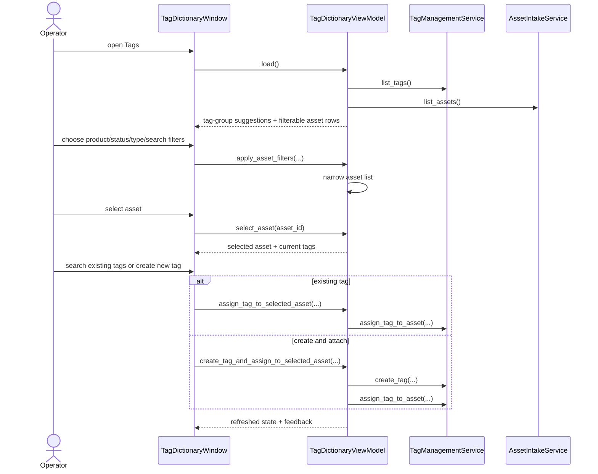
```mermaid
sequenceDiagram
    actor Operator
    participant View as TagDictionaryWindow
    participant VM as TagDictionaryViewModel
    participant TagSvc as TagManagementService
    participant AssetSvc as AssetIntakeService

    Operator->>View: open Tags
    View->>VM: load()
    VM->>TagSvc: list_tags()
    VM->>AssetSvc: list_assets()
    VM-->>View: tag-group suggestions + filterable asset rows
    Operator->>View: choose product/status/type/search filters
    View->>VM: apply_asset_filters(...)
    VM->>VM: narrow asset list
    Operator->>View: select asset
    View->>VM: select_asset(asset_id)
    VM-->>View: selected asset + current tags
    Operator->>View: search existing tags or create new tag
    alt existing tag
        View->>VM: assign_tag_to_selected_asset(...)
        VM->>TagSvc: assign_tag_to_asset(...)
    else create and attach
        View->>VM: create_tag_and_assign_to_selected_asset(...)
        VM->>TagSvc: create_tag(...)
        VM->>TagSvc: assign_tag_to_asset(...)
    end
    VM-->>View: refreshed state + feedback
```

## Bulk Asset Tagging Sequence

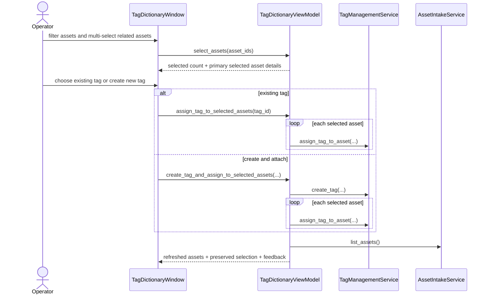
```mermaid
sequenceDiagram
    actor Operator
    participant View as TagDictionaryWindow
    participant VM as TagDictionaryViewModel
    participant TagSvc as TagManagementService
    participant AssetSvc as AssetIntakeService

    Operator->>View: filter assets and multi-select related assets
    View->>VM: select_assets(asset_ids)
    VM-->>View: selected count + primary selected asset details
    Operator->>View: choose existing tag or create new tag
    alt existing tag
        View->>VM: assign_tag_to_selected_assets(tag_id)
        loop each selected asset
            VM->>TagSvc: assign_tag_to_asset(...)
        end
    else create and attach
        View->>VM: create_tag_and_assign_to_selected_assets(...)
        VM->>TagSvc: create_tag(...)
        loop each selected asset
            VM->>TagSvc: assign_tag_to_asset(...)
        end
    end
    VM->>AssetSvc: list_assets()
    VM-->>View: refreshed assets + preserved selection + feedback
```

## Tag-Aware Auto Factory Planner Sequence

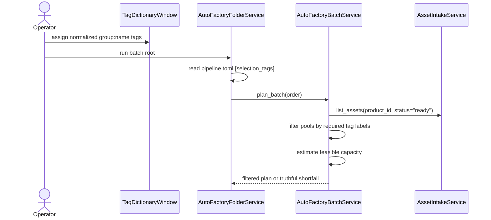
```mermaid
sequenceDiagram
    actor Operator
    participant View as TagDictionaryWindow
    participant FolderSvc as AutoFactoryFolderService
    participant Planner as AutoFactoryBatchService
    participant AssetSvc as AssetIntakeService

    Operator->>View: assign normalized group:name tags
    Operator->>FolderSvc: run batch root
    FolderSvc->>FolderSvc: read pipeline.toml [selection_tags]
    FolderSvc->>Planner: plan_batch(order)
    Planner->>AssetSvc: list_assets(product_id, status="ready")
    Planner->>Planner: filter pools by required tag labels
    Planner->>Planner: estimate feasible capacity
    Planner-->>FolderSvc: filtered plan or truthful shortfall
```

## Folder Tag Metadata Sync Sequence

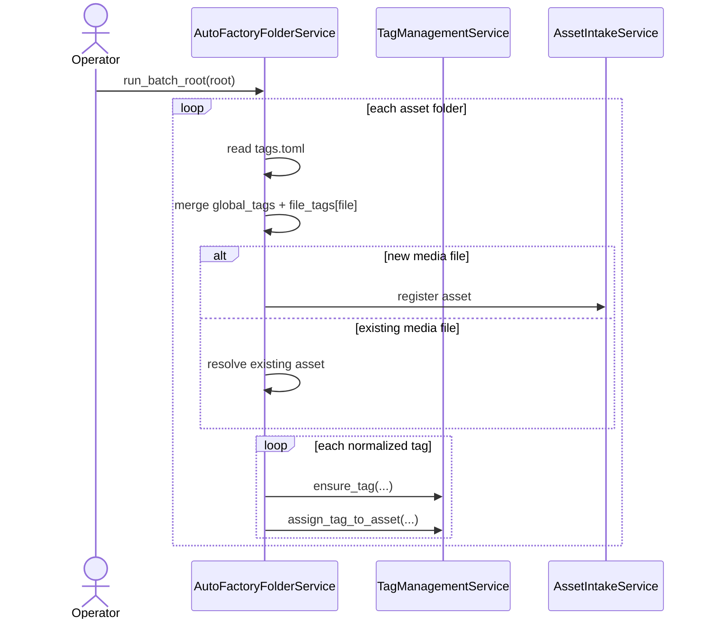
```mermaid
sequenceDiagram
    actor Operator
    participant FolderSvc as AutoFactoryFolderService
    participant TagSvc as TagManagementService
    participant AssetSvc as AssetIntakeService

    Operator->>FolderSvc: run_batch_root(root)
    loop each asset folder
        FolderSvc->>FolderSvc: read tags.toml
        FolderSvc->>FolderSvc: merge global_tags + file_tags[file]
        alt new media file
            FolderSvc->>AssetSvc: register asset
        else existing media file
            FolderSvc->>FolderSvc: resolve existing asset
        end
        loop each normalized tag
            FolderSvc->>TagSvc: ensure_tag(...)
            FolderSvc->>TagSvc: assign_tag_to_asset(...)
        end
    end
```

## Recipe Replacement Aftercare Sequence

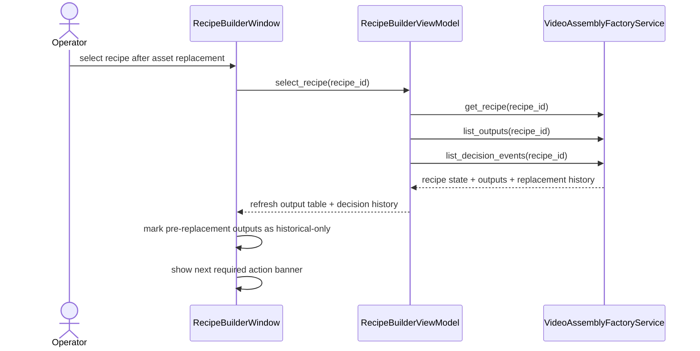
```mermaid
sequenceDiagram
    actor Operator
    participant View as RecipeBuilderWindow
    participant VM as RecipeBuilderViewModel
    participant Factory as VideoAssemblyFactoryService

    Operator->>View: select recipe after asset replacement
    View->>VM: select_recipe(recipe_id)
    VM->>Factory: get_recipe(recipe_id)
    VM->>Factory: list_outputs(recipe_id)
    VM->>Factory: list_decision_events(recipe_id)
    Factory-->>VM: recipe state + outputs + replacement history
    VM-->>View: refresh output table + decision history
    View->>View: mark pre-replacement outputs as historical-only
    View->>View: show next required action banner
```

## Recipe Preview Sequence

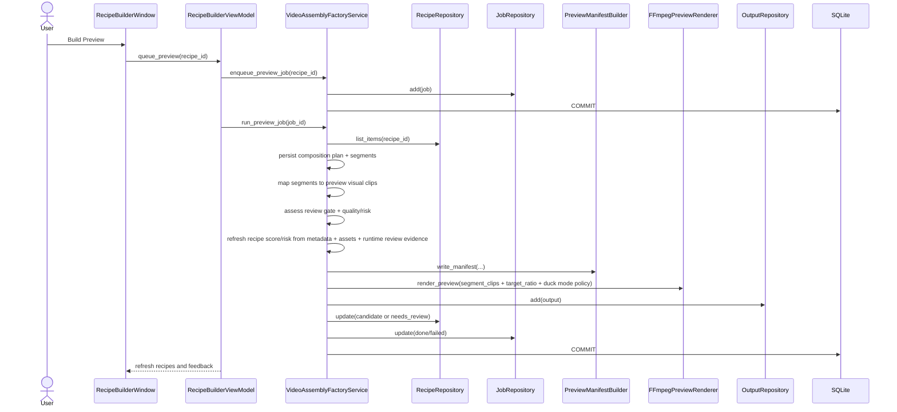
```mermaid
sequenceDiagram
    actor User
    participant View as RecipeBuilderWindow
    participant VM as RecipeBuilderViewModel
    participant Factory as VideoAssemblyFactoryService
    participant RecipeRepo as RecipeRepository
    participant JobRepo as JobRepository
    participant Preview as PreviewManifestBuilder
    participant Render as FFmpegPreviewRenderer
    participant Out as OutputRepository
    participant DB as SQLite

    User->>View: Build Preview
    View->>VM: queue_preview(recipe_id)
    VM->>Factory: enqueue_preview_job(recipe_id)
    Factory->>JobRepo: add(job)
    Factory->>DB: COMMIT
    VM->>Factory: run_preview_job(job_id)
    Factory->>RecipeRepo: list_items(recipe_id)
    Factory->>Factory: persist composition plan + segments
    Factory->>Factory: map segments to preview visual clips
    Factory->>Factory: assess review gate + quality/risk
    Factory->>Factory: refresh recipe score/risk from metadata + assets + runtime review evidence
    Factory->>Preview: write_manifest(...)
    Factory->>Render: render_preview(segment_clips + target_ratio + duck mode policy)
    Factory->>Out: add(output)
    Factory->>RecipeRepo: update(candidate or needs_review)
    Factory->>JobRepo: update(done/failed)
    Factory->>DB: COMMIT
    VM-->>View: refresh recipes and feedback
```

## Review And Final Sequence

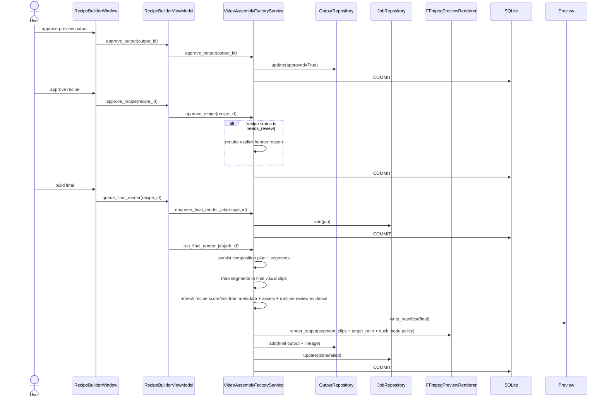
```mermaid
sequenceDiagram
    actor User
    participant View as RecipeBuilderWindow
    participant VM as RecipeBuilderViewModel
    participant Factory as VideoAssemblyFactoryService
    participant Out as OutputRepository
    participant JobRepo as JobRepository
    participant Render as FFmpegPreviewRenderer
    participant DB as SQLite

    User->>View: approve preview output
    View->>VM: approve_output(output_id)
    VM->>Factory: approve_output(output_id)
    Factory->>Out: update(approved=True)
    Factory->>DB: COMMIT
    User->>View: approve recipe
    View->>VM: approve_recipe(recipe_id)
    VM->>Factory: approve_recipe(recipe_id)
    alt recipe status is needs_review
        Factory->>Factory: require explicit human reason
    end
    Factory->>DB: COMMIT
    User->>View: build final
    View->>VM: queue_final_render(recipe_id)
    VM->>Factory: enqueue_final_render_job(recipe_id)
    Factory->>JobRepo: add(job)
    Factory->>DB: COMMIT
    VM->>Factory: run_final_render_job(job_id)
    Factory->>Factory: persist composition plan + segments
    Factory->>Factory: map segments to final visual clips
    Factory->>Factory: refresh recipe score/risk from metadata + assets + runtime review evidence
    Factory->>Preview: write_manifest(final)
    Factory->>Render: render_output(segment_clips + target_ratio + duck mode policy)
    Factory->>Out: add(final output + lineage)
    Factory->>JobRepo: update(done/failed)
    Factory->>DB: COMMIT
```

## Output Reporting Sequence

## Layered Visual Compositing Sequence

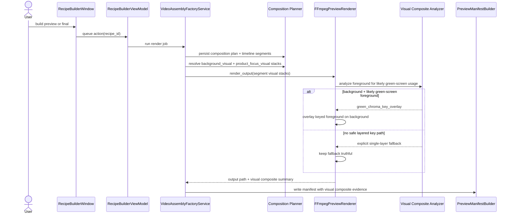
```mermaid
sequenceDiagram
    actor User
    participant View as RecipeBuilderWindow
    participant VM as RecipeBuilderViewModel
    participant Factory as VideoAssemblyFactoryService
    participant Planner as Composition Planner
    participant Render as FFmpegPreviewRenderer
    participant Detect as Visual Composite Analyzer
    participant Preview as PreviewManifestBuilder

    User->>View: build preview or final
    View->>VM: queue action(recipe_id)
    VM->>Factory: run render job
    Factory->>Planner: persist composition plan + timeline segments
    Factory->>Planner: resolve background_visual + product_focus_visual stacks
    Factory->>Render: render_output(segment visual stacks)
    Render->>Detect: analyze foreground for likely green-screen usage
    alt background + likely green-screen foreground
        Detect-->>Render: green_chroma_key_overlay
        Render->>Render: overlay keyed foreground on background
    else no safe layered key path
        Detect-->>Render: explicit single-layer fallback
        Render->>Render: keep fallback truthful
    end
    Render-->>Factory: output path + visual composite summary
    Factory->>Preview: write manifest with visual composite evidence
```

## Output Reporting Sequence

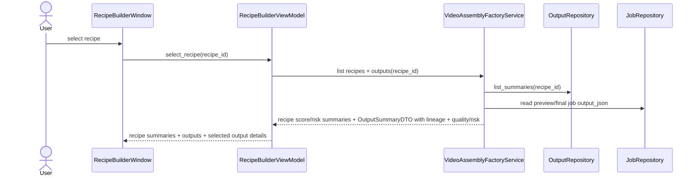
```mermaid
sequenceDiagram
    actor User
    participant View as RecipeBuilderWindow
    participant VM as RecipeBuilderViewModel
    participant Factory as VideoAssemblyFactoryService
    participant Out as OutputRepository
    participant JobRepo as JobRepository

    User->>View: select recipe
    View->>VM: select_recipe(recipe_id)
    VM->>Factory: list recipes + outputs(recipe_id)
    Factory->>Out: list_summaries(recipe_id)
    Factory->>JobRepo: read preview/final job output_json
    Factory-->>VM: recipe score/risk summaries + OutputSummaryDTO with lineage + quality/risk
    VM-->>View: recipe summaries + outputs + selected output details
```

## Approval Audit Sequence

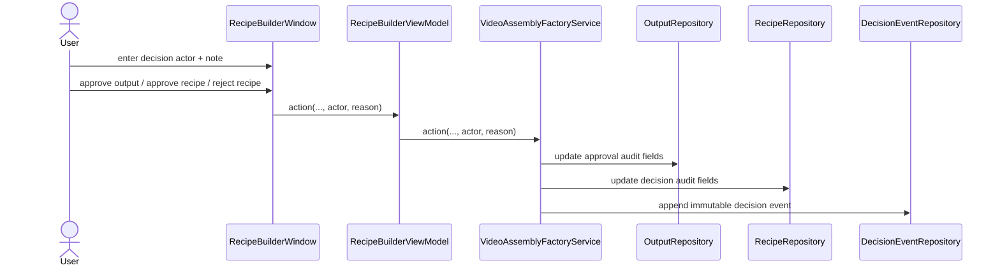
```mermaid
sequenceDiagram
    actor User
    participant View as RecipeBuilderWindow
    participant VM as RecipeBuilderViewModel
    participant Factory as VideoAssemblyFactoryService
    participant Out as OutputRepository
    participant RecipeRepo as RecipeRepository
    participant EventRepo as DecisionEventRepository

    User->>View: enter decision actor + note
    User->>View: approve output / approve recipe / reject recipe
    View->>VM: action(..., actor, reason)
    VM->>Factory: action(..., actor, reason)
    Factory->>Out: update approval audit fields
    Factory->>RecipeRepo: update decision audit fields
    Factory->>EventRepo: append immutable decision event
```

## Runtime Migration Sequence

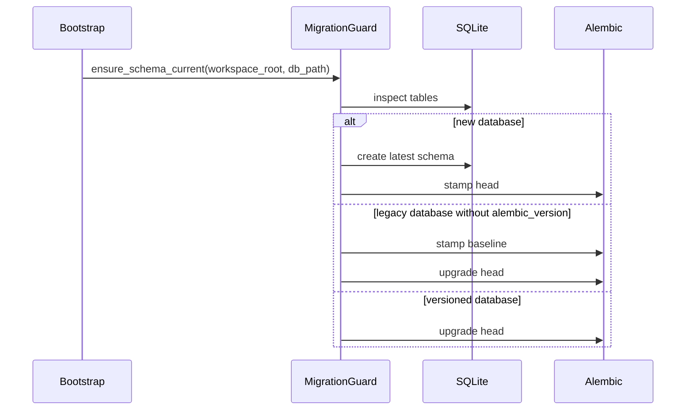
```mermaid
sequenceDiagram
    participant Boot as Bootstrap
    participant Guard as MigrationGuard
    participant DB as SQLite
    participant Alembic as Alembic

    Boot->>Guard: ensure_schema_current(workspace_root, db_path)
    Guard->>DB: inspect tables
    alt new database
        Guard->>DB: create latest schema
        Guard->>Alembic: stamp head
    else legacy database without alembic_version
        Guard->>Alembic: stamp baseline
        Guard->>Alembic: upgrade head
    else versioned database
        Guard->>Alembic: upgrade head
    end
```

## Retry Recovery Sequence

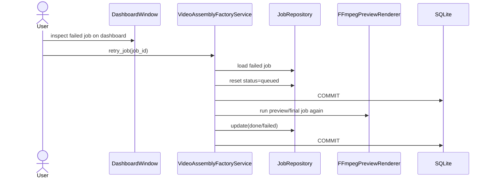
```mermaid
sequenceDiagram
    actor User
    participant Dash as DashboardWindow
    participant Factory as VideoAssemblyFactoryService
    participant JobRepo as JobRepository
    participant Render as FFmpegPreviewRenderer
    participant DB as SQLite

    User->>Dash: inspect failed job on dashboard
    User->>Factory: retry_job(job_id)
    Factory->>JobRepo: load failed job
    Factory->>JobRepo: reset status=queued
    Factory->>DB: COMMIT
    Factory->>Render: run preview/final job again
    Factory->>JobRepo: update(done/failed)
    Factory->>DB: COMMIT
```

## Queued Recovery Sequence

```mermaid
sequenceDiagram
    participant Boot as Bootstrap
    participant Dash as DashboardService
    participant Artifact as ArtifactGenerationService
    participant Factory as VideoAssemblyFactoryService
    participant DB as SQLite

    Boot->>Dash: should_auto_recover_queued_jobs()
    alt startup policy enabled
        Boot->>Dash: recover_queued_jobs(trigger="startup")
        Dash->>Artifact: run_job(queued artifact)
        Dash->>Factory: run_preview_job(queued preview)
        Dash->>Factory: run_final_render_job(queued final)
        Dash->>DB: persisted state refreshed per job
    else startup policy disabled
        Boot-->>DB: no recovery side effect
    end
```

## Path-Root Activation Sequence

```mermaid
sequenceDiagram
    actor User
    participant SettingsView as SettingsWindow
    participant SettingsVM as SettingsViewModel
    participant Settings as SystemSettingsService
    participant Runtime as ApplicationRuntime
    participant Dash as DashboardService

    User->>SettingsView: save path-root changes
    SettingsView->>SettingsVM: save(settings)
    SettingsVM->>Settings: save(settings)
    SettingsVM->>Settings: path_root_status(configured_settings)
    alt changed path roots
        SettingsVM->>Runtime: reload_path_roots()
        Runtime->>Runtime: rebuild module + swap live service proxies
        SettingsVM-->>SettingsView: runtime hot-reload feedback
    else no path changes
        SettingsVM-->>SettingsView: save feedback without runtime rebind
    end
    User->>Dash: refresh dashboard
    Dash->>Settings: path_root_status(current settings)
    Dash-->>User: runtime active paths + configured paths
    Note over Runtime: path-root dependent services reload as one coherent runtime module
```

## Output Resolution Settings Sequence

```mermaid
sequenceDiagram
    actor User
    participant SettingsView as SettingsWindow
    participant SettingsVM as SettingsViewModel
    participant Settings as SystemSettingsService
    participant Factory as VideoAssemblyFactoryService
    participant Render as FFmpegPreviewRenderer

    User->>SettingsView: enter preview/final output resolution
    SettingsView->>SettingsVM: save(settings)
    SettingsVM->>Settings: save(settings)
    Settings-->>SettingsVM: persisted .toml values
    User->>Factory: build preview/final
    Factory->>Settings: load()
    Settings-->>Factory: preview/final output resolution policy
    Factory->>Render: render_preview/render_output(..., target_ratio, target_resolution)
    Render->>Render: normalize into exact output frame when configured
```

## Failed Retry Sequence

```mermaid
sequenceDiagram
    actor User
    participant DashView as DashboardWindow
    participant Dash as DashboardService
    participant Artifact as ArtifactGenerationService
    participant Factory as VideoAssemblyFactoryService

    User->>DashView: Retry Failed Jobs
    DashView->>Dash: retry_failed_jobs(trigger="manual")
    Dash->>Dash: prioritize non-escalated failed jobs first
    alt recovery limit reached before escalated jobs
        Dash-->>DashView: recovery summary (selection=failed, deferred=escalated jobs)
    else retry slot available
        Dash->>Artifact: retry_job(failed artifact)
        Dash->>Factory: retry_job(failed preview/final)
        Dash-->>DashView: recovery summary (selection=failed, escalated visibility)
    end
```

## Workflow State Direction

```mermaid
stateDiagram-v2
    [*] --> PRODUCT_READY
    PRODUCT_READY --> ASSET_READY
    ASSET_READY --> RECIPE_CANDIDATE
    RECIPE_CANDIDATE --> PREVIEW_JOB_QUEUED
    PREVIEW_JOB_QUEUED --> PREVIEW_JOB_PROCESSING
    PREVIEW_JOB_PROCESSING --> PREVIEW_OUTPUT_READY
    PREVIEW_OUTPUT_READY --> OUTPUT_APPROVED
    PREVIEW_OUTPUT_READY --> RECIPE_NEEDS_REVIEW
    OUTPUT_APPROVED --> RECIPE_APPROVED
    RECIPE_NEEDS_REVIEW --> RECIPE_APPROVED
    RECIPE_NEEDS_REVIEW --> REJECTED
    RECIPE_APPROVED --> FINAL_RENDER_PENDING
    FINAL_RENDER_PENDING --> FINAL_RENDER_DONE
```

## Future Composition Direction

```mermaid
sequenceDiagram
    actor User
    participant View as RecipeBuilderWindow
    participant VM as RecipeBuilderViewModel
    participant Factory as VideoAssemblyFactoryService
    participant Plan as CompositionPlan
    participant Render as Preview/Final Renderer
    participant Audit as RenderDecisionLog
    participant Settings as SystemSettingsService

    User->>View: request preview/final render
    View->>VM: queue render(recipe_id)
    VM->>Factory: build composition plan
    Factory->>Plan: resolve master timeline + segments + layers
    Factory->>Settings: load duck and gain policy
    Plan-->>Factory: composition rules
    Factory->>View: expose composition-plan segments + render-decision summary
    Factory->>Render: render with loop/trim/duck/gain policy
    Render-->>Factory: output + audio_mix_summary
Factory->>Factory: assess review gate from composition + runtime audio evidence
Factory->>Factory: refresh recipe score/risk from metadata + asset mix + runtime review evidence
Factory->>Audit: persist render decisions
Factory-->>VM: recipe score/risk summary + output summary + review signals + operator-visible decisions
```

## Caption Runtime Sequence

```mermaid
sequenceDiagram
    actor Operator
    participant FolderSvc as AutoFactoryFolderService
    participant Meta as ProductAutomationMetadataStore
    participant Factory as VideoAssemblyFactoryService
    participant Caption as CaptionRuntimeService
    participant Render as FFmpegPreviewRenderer
    participant Manifest as PreviewManifestBuilder

    Operator->>FolderSvc: run_batch_root(...)
    FolderSvc->>Meta: sync captions.toml into media-root runtime cache
    FolderSvc->>Factory: materialize/build preview
    Factory->>Caption: resolve_for_segments(product_code, recipe_code, segments)
    Caption->>Meta: load_caption_contract(product_code)
    Caption->>Caption: choose main/sub with stable seed
    Caption->>Caption: clamp top-band headline height before eye-line overlap
    Caption-->>Factory: resolved caption instructions + overflow evidence
    Factory->>Render: render_output(..., segment_clips with captions)
    Render->>Render: draw main/sub caption overlays
    Factory->>Manifest: write caption selection + font/fallback + fit evidence
```

## Product Folder Preflight Sequence

```mermaid
sequenceDiagram
    actor Operator
    participant Script as product_folder_preflight.py
    participant FolderSvc as AutoFactoryFolderService
    participant Resolver as Folder Layout Resolver
    participant Parser as Contract + Tag Parsers

    Operator->>Script: run preflight(root_folder, scan_depth)
    Script->>FolderSvc: audit_batch_root(root_folder, scan_depth)
    FolderSvc->>Resolver: discover product folders and resolve old/v2 paths
    Resolver-->>FolderSvc: product dirs + resolved logical paths
    FolderSvc->>Parser: validate product/pipeline/captions/tags contracts
    Parser-->>FolderSvc: parsed data + issues/warnings
    FolderSvc-->>Script: preflight report DTO
    Script-->>Operator: status, counts, and actionable issues
```

## Policy-Aware Loop And Caption Sequence

```mermaid
sequenceDiagram
    actor Operator
    participant FolderSvc as AutoFactoryFolderService
    participant Meta as ProductAutomationMetadataStore
    participant Policy as ProductAutomationPolicyService
    participant Factory as VideoAssemblyFactoryService
    participant Plan as Composition Planner
    participant Caption as CaptionRuntimeService
    participant Render as FFmpegPreviewRenderer
    participant Manifest as PreviewManifestBuilder

    Operator->>FolderSvc: run_batch_root(product_root, build_previews=true)
    FolderSvc->>Meta: sync pipeline.toml + captions.toml
    FolderSvc->>Factory: run preview for product recipe
    Factory->>Policy: load_fill_policies(product_code)
    Policy-->>Factory: voice/music/background/foreground fill rules
    Factory->>Plan: persist_composition(..., fill_policies)
    Plan->>Plan: ignore loopable background music as timeline authority
    Plan-->>Factory: resolved duration + layer assignments
    Factory->>Caption: resolve_for_segments(product_code, recipe_code, segments)
    Caption-->>Factory: style-preset-aware main/sub caption layout
    Factory->>Render: render_output(..., audio_mix_plan, fill_policies)
    Render->>Render: loop voice/foreground/music only when product policy allows
    Factory->>Manifest: write duration source + loop evidence + caption geometry
```

## Promo Headline Compression Sequence

```mermaid
sequenceDiagram
    actor Operator
    participant Contract as captions.toml
    participant Caption as CaptionRuntimeService
    participant Layout as Caption Layout Solver
    participant Geometry as Textbox Geometry
    participant Render as FFmpegPreviewRenderer
    participant Manifest as PreviewManifestBuilder

    Operator->>Contract: author grouped headline with manual \n
    Caption->>Contract: parse line_advance_ratio
    Caption->>Layout: resolve_caption_layout(..., line_advance_ratio)
    Layout->>Layout: measure pixel widths + ink-aware heights
    Layout->>Geometry: resolve compressed grouped line tops
    Geometry-->>Layout: line_top_positions_px
    Layout-->>Caption: compact promo-card geometry
    Caption->>Render: draw grouped caption card
    Caption->>Manifest: persist line_advance_ratio + line geometry
```

## Manual Break Compaction Sequence

```mermaid
sequenceDiagram
    actor Operator
    participant Contract as captions.toml
    participant Caption as CaptionRuntimeService
    participant Solver as Caption Layout Solver
    participant Manifest as PreviewManifestBuilder

    Operator->>Contract: author manual multi-line hook
    Caption->>Contract: parse preferred_line_count
    Caption->>Solver: resolve grouped headline
    Solver->>Solver: rebalance manual lines when width allows
    Solver-->>Caption: manual or manual_compacted line mode
    Caption->>Manifest: persist preferred_line_count + line_break_mode
```

## Target Factory Plane Map

```mermaid
flowchart TB
    OP["Operator Plane"] --> CP["Control Plane"]
    CP --> SP["State Plane"]
    CP --> Q["Dispatch Queue"]
    Q --> EP["Execution Plane Workers"]
    EP --> SP
    EP --> FS["Shared Media / Output Storage"]
```

## Target Job State Machine

```mermaid
stateDiagram-v2
    [*] --> queued
    queued --> leased
    leased --> processing
    processing --> pause_requested
    pause_requested --> paused
    paused --> queued
    processing --> stop_requested
    stop_requested --> stopped
    stopped --> queued
    processing --> succeeded
    processing --> failed_retryable
    processing --> failed_terminal
    processing --> review_required
    failed_retryable --> queued
    review_required --> queued
    review_required --> cancelled
    failed_terminal --> cancelled
    succeeded --> [*]
    cancelled --> [*]
```

## Target Worker Deployment Topology

```mermaid
flowchart LR
    CP["Control Plane Node"] --> DB["State Plane"]
    CP --> Q["Dispatch Queue"]
    Q --> WA["Worker A / Analysis"]
    Q --> WB["Worker B / Preview"]
    Q --> WC["Worker C / Final"]
    WA --> FS["Shared Storage"]
    WB --> FS
    WC --> FS
```

## Caption Preset Group Resolution

```mermaid
sequenceDiagram
    actor Operator
    participant Contract as "captions.toml"
    participant Runtime as "CaptionRuntimeService"
    participant Catalog as "Preset Catalog"
    participant Resolver as "Preset Resolver"

    Operator->>Contract: author style_preset
    Runtime->>Catalog: list presets by role/group
    Catalog-->>Runtime: filtered preset metadata
    Runtime->>Resolver: resolve style_preset for role
    Resolver-->>Runtime: role defaults
    Runtime->>Runtime: apply product overrides
```
