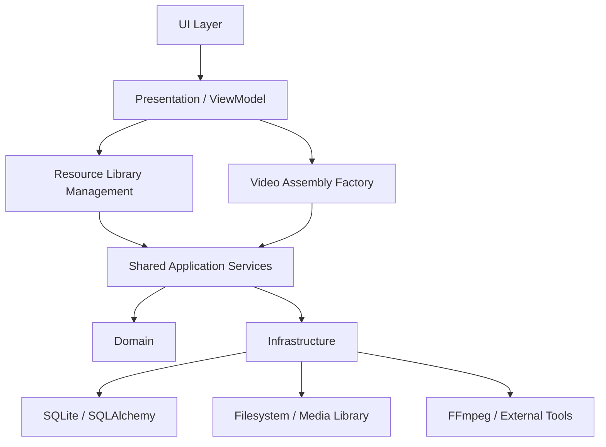
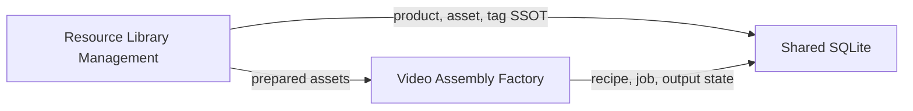
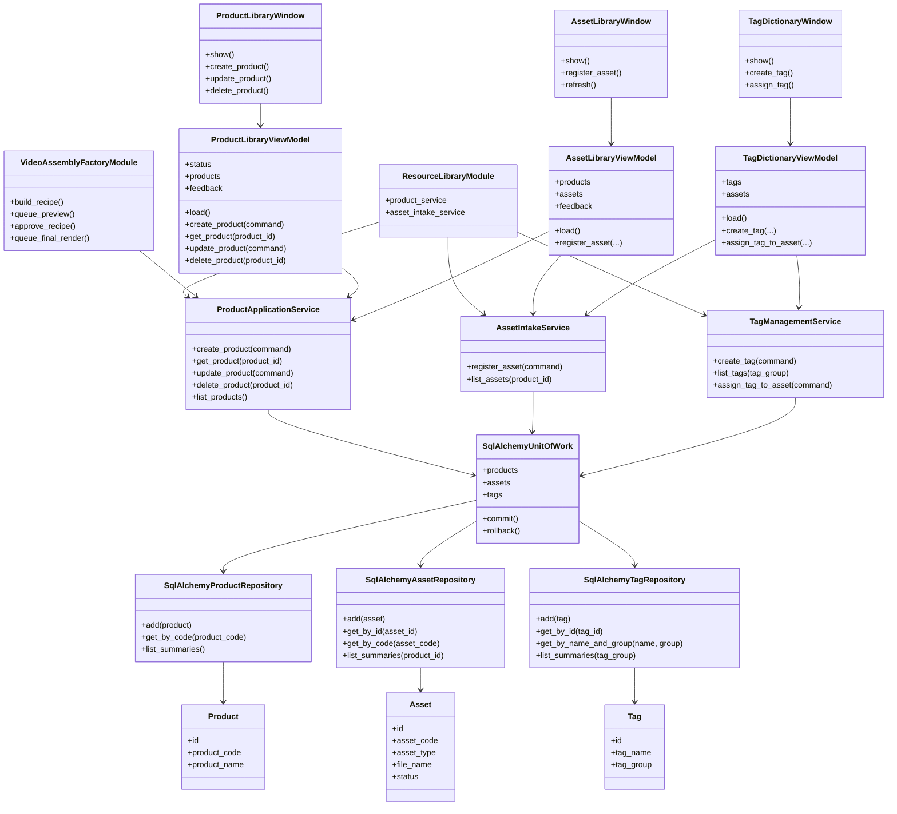
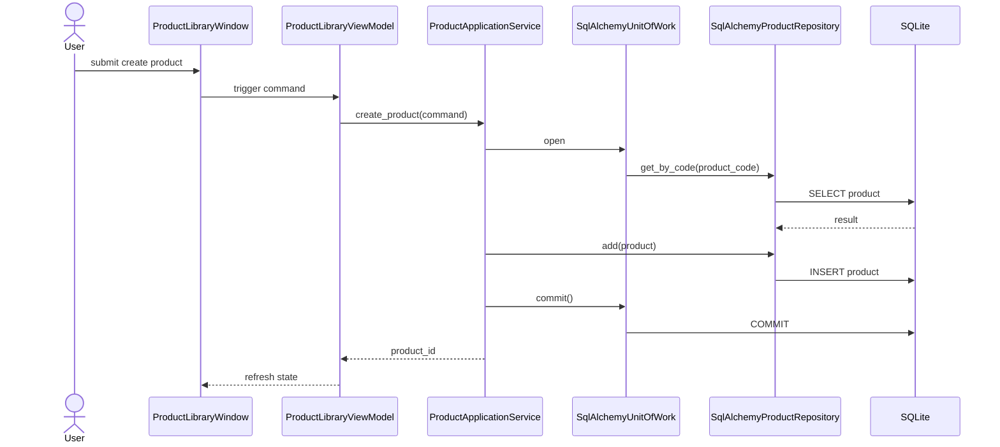
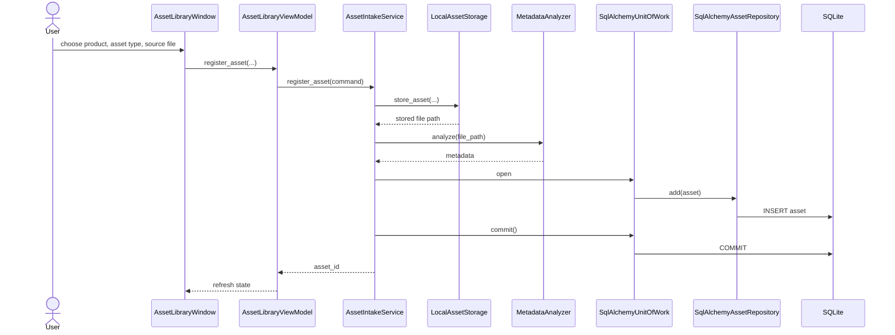
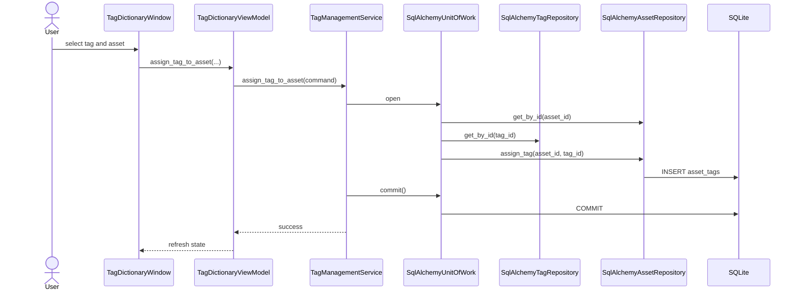
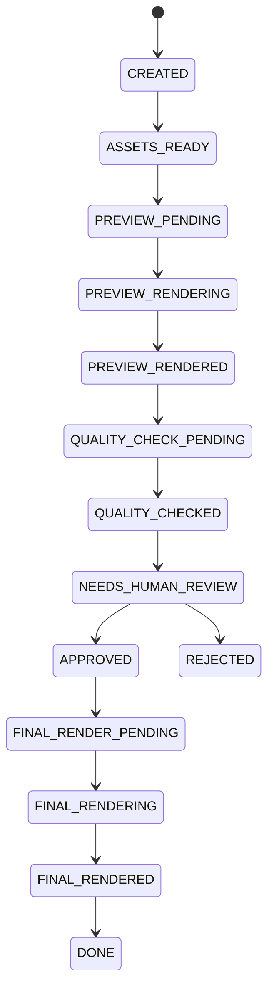

# UML System Overview

เอกสารนี้เป็น UML กลางของระบบสำหรับใช้สื่อสาร architecture กับทีม โดยใช้ Mermaid ใน Markdown เพื่อให้แก้ไขง่ายและเป็นส่วนหนึ่งของ SSOT

## Package Diagram

## Module Relationship

## Component Responsibilities

## Product Creation Sequence

## Asset Intake Sequence

## Tag Assignment Sequence

## Workflow State Direction

## Responsibility Rule

- `Resource Library Management` รับผิดชอบความพร้อมของวัตถุดิบ
- `Video Assembly Factory` รับผิดชอบการประกอบและ workflow ของ output
- ทั้งสองส่วนแชร์ SSOT เดียวกัน แต่ไม่ควรทับความรับผิดชอบกัน
