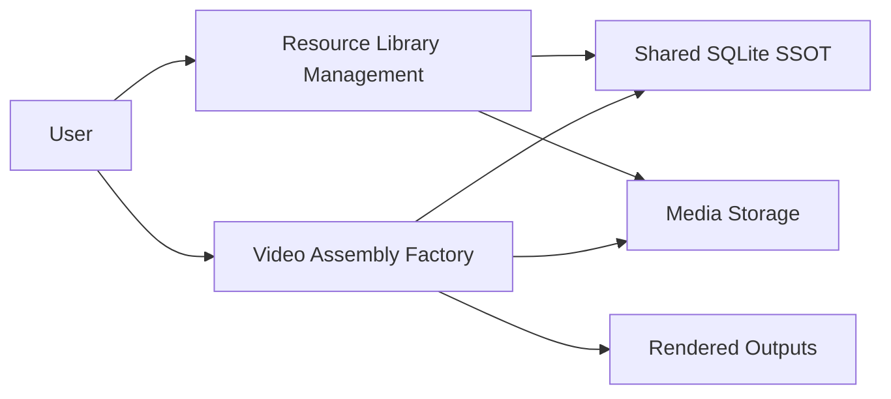

# System Decomposition: Library and Factory

เอกสารนี้นิยามการแบ่งระบบเป็น 2 ส่วนอย่างเป็นทางการ และถือเป็นส่วนหนึ่งของ SSOT

## Decision

MTClipFactory ถูกแบ่งเชิง business และ implementation ออกเป็น 2 ส่วนหลัก:

1. `Resource Library Management`
2. `Video Assembly Factory`

## Why This Split

- ลดการปะปนกันระหว่างงานเตรียมวัตถุดิบกับงานประกอบวิดีโอ
- ทำให้ทีมออกแบบ workflow, test, และ UI ได้ตรงตามบทบาท
- ลดโอกาสที่ business rules จะกระจายซ้ำในหลายจุด
- ทำให้วาง roadmap และ owner ของงานชัดขึ้น

## Module 1: Resource Library Management

### Purpose

รับผิดชอบการจัดการวัตถุดิบและข้อมูลอ้างอิงทั้งหมดก่อนเข้าสู่การประกอบวิดีโอ

### Responsibilities

- create/update product
- ingest assets
- rename and place files by convention
- analyze metadata
- generate thumbnail / proxy
- assign and validate tags
- determine asset readiness
- expose searchable library views

### Outputs to Other Modules

- prepared assets
- normalized metadata
- tag dictionary references
- readiness status

## Module 2: Video Assembly Factory

### Purpose

รับผิดชอบการเลือกวัตถุดิบที่พร้อมแล้วมาประกอบเป็นวิดีโอ preview/final ภายใต้ workflow ที่ตรวจสอบย้อนหลังได้

### Responsibilities

- create and manage recipes
- generate candidates
- score and filter candidates
- enqueue preview jobs
- record review decisions
- enqueue final render jobs
- track outputs and reports

### Inputs from Other Modules

- approved product data
- ready assets
- tag dictionary
- asset metadata and quality signals

## Ownership Rules

- `Library` เป็น owner ของ asset metadata หลัก
- `Factory` เป็น owner ของ recipe, render job, review decision, และ output state
- shared dictionary และ identity rules ต้องมี SSOT เดียว
- ถ้า `Factory` ต้องเสนอการแก้ metadata ให้ทำผ่าน contract หรือ workflow ย้อนกลับไปที่ `Library`

## Recommended Implementation Shape

- ใช้ repo เดียว
- ใช้ database เดียว
- ใช้ shared domain/infrastructure
- แยก application module และ UI flow คนละส่วน

## Suggested Code Direction

```text
src/mt_clip_factory/
  domain/
  infrastructure/
  presentation/
  ui/
  library/
  factory/
```

## UML Context Diagram



## Delivery Rule

ก่อน implement feature ใหม่ ต้องระบุให้ชัดว่า feature นั้นอยู่ฝั่ง `Library`, `Factory`, หรือ `Shared Core`
