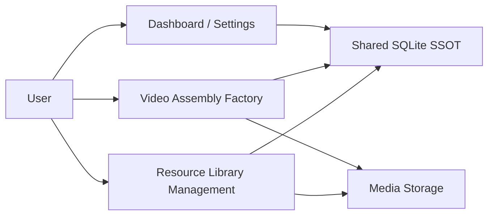

# System Decomposition: Library and Factory

This document defines the required business split of the system.

## Decision

MTClipFactory is intentionally divided into two major capabilities:

1. `Resource Library Management`
2. `Video Assembly Factory`

## Resource Library Management

### Purpose

Prepare and govern reusable video components before they enter assembly workflows.

### Current Responsibilities

- product creation and maintenance
- asset intake
- file placement by convention
- metadata analysis
- tag dictionary and tag assignment
- asset readiness classification
- thumbnail/proxy generation
- searchable library views

### Owned SSOT

- product identity
- asset identity
- asset metadata
- asset tag relationships
- asset readiness state

## Video Assembly Factory

### Purpose

Compose prepared assets into reviewable preview and later final-output workflows.

### Current Responsibilities

- recipe creation
- recipe item assignment
- preview job enqueue
- preview output generation
- output approval decisions
- recipe approval / rejection decisions
- segment-aware preview composition
- final-render composition parity
- runtime voice/music mixing with manifest-visible audio evidence
- settings-backed voice/music balance control with runtime gain staging
- review-threshold evaluation and `needs_review` workflow routing
- runtime-backed audio masking and emergency-fill review evidence
- configurable duck-mode orchestration for narration/music runtime mixing
- recipe-level score and duplicate-risk evaluation
- preview job status tracking
- final job status tracking
- manual retry for persisted factory jobs
- persisted failed-job recovery history and escalation visibility
- output lineage reporting
- output quality/duplicate-risk visibility
- recipe score/risk visibility
- runtime-safe rebind when path-root dependent services are hot reloaded
- dashboard-driven failed-job retry orchestration with deferred escalation handling
- approval actor/time/reason persistence
- immutable decision-event history

### Future Responsibilities

- further recipe-score calibration only if the current metadata, asset-diversity, and runtime-evidence baseline stops being useful

### Owned SSOT

- recipe records
- recipe item relationships
- preview/final job state
- review decisions
- output records
- decision-event history
- review-gate evidence carried in manifests and output summaries
- recipe-level `recipe_score` and `duplicate_risk`

## Shared Core

- SQLite database
- SQLAlchemy models
- job persistence
- unit of work
- dashboard and settings aggregation
- cross-capability job visibility
- queued-job recovery orchestration
- failed-job escalation policy and operator playbook visibility
- runtime-vs-configured path-root truth surface with desktop-app hot reload support
- runtime migration guard

## Ownership Rule

- `Library` may supply assets to `Factory`
- `Factory` must not silently rewrite owned library metadata
- cross-module changes must happen through explicit contracts and documented workflows

## Current Implementation Shape

```text
src/mt_clip_factory/
  domain/
  infrastructure/
  control_center/
  library/
  factory/
  presentation/
  ui/
```

## Context Diagram



## Delivery Rule

Before implementing any feature, classify it as:

- `Library`
- `Factory`
- `Shared Core`
