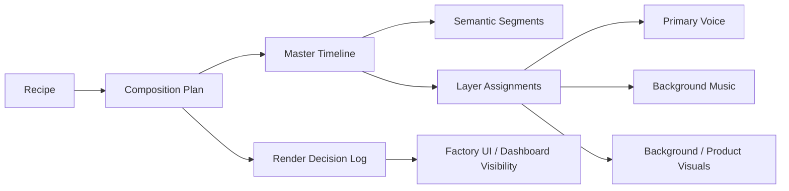

# Composition and Timeline Policy

This document is the SSOT for how MTClipFactory should evolve from a render foundation into a real composition engine.

## Purpose

- define the composition rules before deeper preview/final-render code is written
- keep timeline, audio, and render-decision policy consistent across preview, final, dashboard, and settings
- prevent future code from inventing silent behavior around looping, trimming, ducking, or filler logic

## Core Direction

MTClipFactory must behave like a `timeline director`, not only a `file stitcher`.

The engine should reason about:

- a master timeline
- semantic segments
- visual and audio layers
- configurable fill and review policy
- operator-visible render decisions

## Master Timeline Rule

- every recipe/render job must resolve to one `master timeline`
- the master timeline is usually driven by one of:
  - explicit recipe target duration
  - approved narration duration
  - approved review clip duration
- all visual and audio assets are mapped onto this shared timeline
- the system must not silently let each layer use a different effective duration

## Segment Model

The composition model should support semantic segments such as:

- `hook`
- `problem`
- `benefit`
- `proof`
- `cta`

Each segment should eventually support:

- start time
- end time
- target duration
- primary message
- preferred asset roles
- text/subtitle rule
- audio priority rule

Current implemented baseline on 2026-06-06:

- semantic segments are now persisted in `timeline_segments`
- segment timing is currently inferred from resolved duration bands
- contiguous coverage validation is enforced before segment plans are accepted
- preview now uses segment-aware visual clip mapping and writes inspectable manifest details
- final render now follows the same visual composition path and writes inspectable manifest lineage

## Layer Model

The composition engine should treat these as separate layers:

- `primary_voice`
- `background_music`
- `background_visual`
- `product_focus_visual`
- `text_overlay`
- `subtitle`
- `sfx` in a later phase

Priority rule:

1. `primary_voice`
2. `product_focus_visual`
3. `text_overlay` and `subtitle`
4. `background_music`
5. `background_visual`

## Audio Policy

### Voice-Over Rule

- product narration or review speech must not loop automatically
- voice is treated as the foreground message layer
- if voice duration is shorter than the master timeline, the system may leave silence or background-only sections according to policy
- if voice duration exceeds the target duration, the system must trim according to policy or route the job to review

### Music Rule

- background music may loop to fill the master timeline
- background music must duck under `primary_voice`
- music should recover smoothly after voice sections end
- fade in and fade out should be available as default polish behavior

### Ducking Rule

Recommended configurable policy:

- `music_duck_enabled = true`
- `music_duck_db = -12` to `-18`
- `music_duck_attack_ms = 150-300`
- `music_duck_release_ms = 300-800`

## Visual Fill Policy

### Background Visual Rule

- background video may loop when it is assigned a background role
- loop behavior must be policy-driven, not hardcoded
- allowed future fill modes:
  - `loop`
  - `crossfade_loop`
  - `freeze_last_frame`
  - `speed_adjust`

### Foreground/Product Rule

- product-focus or hero shots should not be repeated blindly just to fill time
- repeated hero shots should be explicit in the recipe/timeline plan or trigger a review warning

## Duration Mismatch Policy

The system must not hide mismatch decisions.

For each render, the engine should record:

- which asset was looped
- how many times it was looped
- whether trim was applied
- whether freeze-last-frame was applied
- whether speed adjustment was applied
- whether music ducking was applied
- whether silence filler was used

These decisions should later be visible in:

- recipe/factory UI
- dashboard summary or detail view
- persisted render metadata

## Preview and Final Consistency Rule

- preview and final render should follow the same composition logic
- the main difference should be output quality, not business behavior
- a preview must not promise a composition policy that the final render ignores

Current preview/final baseline:

- preview and final follow semantic segment order for visual clip assembly
- preview and final write segment clip choices and fill mode into inspectable manifests
- settings and UI now expose narration-loop, music-loop, and duck timing policy
- Recipe Builder output inspection now exposes segment summaries and persisted render-decision summaries
- runtime audio ducking and richer multi-layer mixing are still future work after visual parity

## Review Gate Rule

The engine should route work to operator review when:

- duration mismatch exceeds configured thresholds
- loop repetition is too obvious
- too few usable assets exist for the planned segment layout
- voice overlap or audio masking risk is too high
- composition falls back to emergency fill policy

## Settings Direction

These policies should become configurable through settings and backed by `.toml`:

- `master_duration_source`
- `voice_fill_mode`
- `background_video_fill_mode`
- `background_music_fill_mode`
- `music_duck_enabled`
- `music_duck_db`
- `music_duck_attack_ms`
- `music_duck_release_ms`
- `max_loop_repetitions`
- `loop_warning_threshold_sec`
- `max_speed_adjust_ratio`

Current implemented settings baseline on 2026-06-06:

- `voice_loop_enabled`
- `background_music_loop_enabled`
- `music_duck_enabled`
- `music_duck_db`
- `music_duck_attack_ms`
- `music_duck_release_ms`

## Current Data-Model Baseline

Current implementation now formalizes:

- `timeline_segment`
- `composition_plan`
- `layer_assignment`
- `render_decision_log`

Still future or incomplete:

- richer `audio_mix_policy`
- segment authoring/refinement controls beyond heuristic planning

The exact schema may continue to evolve, but the policy in this document should stay stable unless the team deliberately revises project direction.

## UML Direction

## Delivery Rule

Before implementing deeper composition code, the team should:

1. update this document first if the rule set changes
2. update UML if workflow or component boundaries change
3. update PM artifacts so milestone direction stays visible
