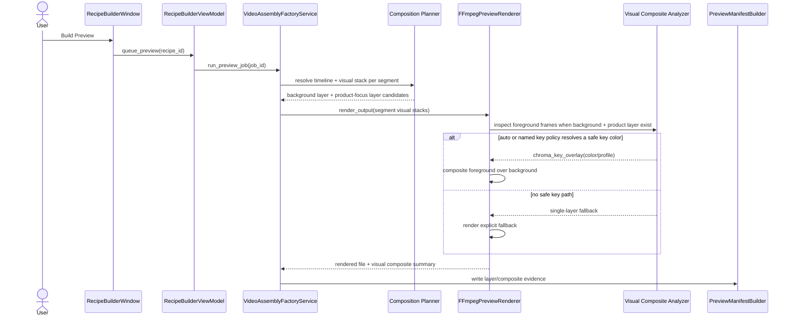
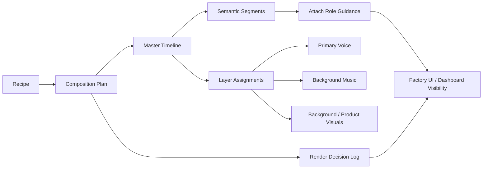

# Composition and Timeline Policy

This document is the SSOT for how MTClipFactory should evolve from a render foundation into a real composition engine.

## Purpose

- define the composition rules before deeper preview/final-render code is written
- keep timeline, audio, and render-decision policy consistent across preview, final, dashboard, and settings
- prevent future code from inventing silent behavior around looping, trimming, ducking, or filler logic

## Core Direction

MTClipFactory must behave like a `timeline director`, not only a `file stitcher`.

The engine should reason about:

- a master timeline
- semantic segments
- visual and audio layers
- configurable fill and review policy
- operator-visible render decisions

## Master Timeline Rule

- every recipe/render job must resolve to one `master timeline`
- the master timeline is usually driven by one of:
  - explicit recipe target duration
  - approved narration duration
  - approved review clip duration
- all visual and audio assets are mapped onto this shared timeline
- the system must not silently let each layer use a different effective duration

## Segment Model

The composition model should support semantic segments such as:

- `hook`
- `problem`
- `benefit`
- `proof`
- `cta`

Each segment should eventually support:

- start time
- end time
- target duration
- primary message
- preferred asset roles
- text/subtitle rule
- audio priority rule

Current implemented baseline on 2026-06-06:

- semantic segments are now persisted in `timeline_segments`
- segment timing is currently inferred from resolved duration bands
- contiguous coverage validation is enforced before segment plans are accepted
- preview now uses segment-aware visual clip mapping and writes inspectable manifest details
- final render now follows the same visual composition path and writes inspectable manifest lineage
- Recipe Builder attach-role guidance can now use current asset type plus the selected recipe's segment order to suggest the next likely semantic role before preview is built

Layered-compositing baseline direction locked on 2026-06-13:

- a segment may carry both `background_visual` and `product_focus_visual` at the same time
- the background layer should be treated as a persistent base plate when a background visual exists
- the product-focus layer should sit above the background layer for product-led segments
- preview and final must use the same layer-stack business rules so operator trust does not split between the two outputs
- if a foreground/product visual appears to be green-screen media, the renderer may apply chroma-key compositing automatically and must write that decision into manifest evidence
- the keyed foreground baseline must not stay hardcoded to green only; operators need a visible policy seam for other studio/background colors
- if a foreground/product visual cannot be composited safely, the fallback behavior must stay explicit in the manifest instead of silently pretending layered composition happened

## Layer Model

The composition engine should treat these as separate layers:

- `primary_voice`
- `background_music`
- `background_visual`
- `product_focus_visual`
- `text_overlay`
- `subtitle`
- `sfx` in a later phase

Priority rule:

1. `primary_voice`
2. `product_focus_visual`
3. `text_overlay` and `subtitle`
4. `background_music`
5. `background_visual`

## Audio Policy

### Voice-Over Rule

- product narration or review speech must not loop automatically
- voice is treated as the foreground message layer
- if voice duration is shorter than the master timeline, the system may leave silence or background-only sections according to policy
- if voice duration exceeds the target duration, the system must trim according to policy or route the job to review

### Music Rule

- background music may loop to fill the master timeline
- background music must duck under `primary_voice`
- music should recover smoothly after voice sections end
- fade in and fade out should be available as default polish behavior

### Ducking Rule

Recommended configurable policy:

- `music_duck_enabled = true`
- `music_duck_mode = "sidechain_compressor"` for higher-quality runtime mixing when available
- `music_duck_mode = "windowed_volume_duck"` as a compatibility fallback
- `music_duck_db = -12` to `-18`
- `music_duck_attack_ms = 150-300`
- `music_duck_release_ms = 300-800`
- `music_duck_threshold_db = -30` to `-18`
- `music_duck_ratio = 4.0` to `12.0`
- `voice_mix_gain_db = 0` to `+4`
- `music_mix_gain_db = -8` to `-2`

## Visual Fill Policy

### Target Frame Normalization Rule

- preview and final render must respect the recipe `target_ratio` when one is provided
- preview and final render may also consume operator-configured exact output resolution when one is configured
- mixed visual source sizes should be normalized into one requested output frame instead of leaking source dimensions directly into the final output
- the normalization path should preserve aspect ratio first, then pad to the target frame when needed
- normalization behavior must stay aligned between preview and final render
- any fallback when ratio parsing fails should be explicit and testable
- exact output resolution should override heuristic max-dimension scaling when it is configured intentionally

### Background Visual Rule

- background video may loop when it is assigned a background role
- loop behavior must be policy-driven, not hardcoded
- allowed future fill modes:
  - `loop`
  - `crossfade_loop`
  - `freeze_last_frame`
  - `speed_adjust`

### Foreground/Product Rule

- product-focus or hero shots should not be repeated blindly just to fill time
- repeated hero shots should be explicit in the recipe/timeline plan or trigger a review warning

## Duration Mismatch Policy

The system must not hide mismatch decisions.

For each render, the engine should record:

- which asset was looped
- how many times it was looped
- whether trim was applied
- whether freeze-last-frame was applied
- whether speed adjustment was applied
- whether music ducking was applied
- whether silence filler was used

These decisions should later be visible in:

- recipe/factory UI
- dashboard summary or detail view
- persisted render metadata

## Preview and Final Consistency Rule

- preview and final render should follow the same composition logic
- the main difference should be output quality, not business behavior
- a preview must not promise a composition policy that the final render ignores

Current preview/final baseline:

- preview and final follow semantic segment order for visual clip assembly
- preview and final write segment clip choices and fill mode into inspectable manifests
- settings and UI now expose narration-loop, music-loop, and duck timing policy
- Recipe Builder output inspection now exposes segment summaries and persisted render-decision summaries
- preview and final now apply a runtime voice/music mix path
- manifests now expose applied runtime audio-mix evidence
- ducking now uses a configurable engine with `sidechain_compressor` as the default runtime path and `windowed_volume_duck` as fallback
- preview and final now apply configurable voice/music gain staging before the final mix
- preview and final now normalize visual clips into the recipe `target_ratio` frame so mixed source ratios render into one bounded output canvas

Layered visual compositing baseline on 2026-06-13:

- preview and final should now treat segment visuals as a stack, not only a single chosen file
- a background visual may remain active underneath a keyed product-focus visual for the same segment
- green-screen detection is allowed as a render-time baseline when no explicit alpha asset is available yet
- manifests should expose whether a segment used:
  - `single_layer`
  - `background_only`
  - `green_chroma_key_overlay`
  - `blue_chroma_key_overlay`
  - `magenta_chroma_key_overlay`
  - `custom_chroma_key_overlay`
  - future explicit alpha-based modes

Multi-color keyed-compositing direction locked on 2026-06-13:

- the visual key policy should support `auto`, `green`, `blue`, `magenta`, `custom`, and `disabled`
- `auto` may detect from a small known palette for common studio key colors
- named key policies should override auto-detection when the operator knows the capture setup
- `custom` should accept a hex color value for unusual studio backgrounds
- `disabled` should keep layered compositing from attempting chroma-key work and should fall back truthfully
- the chosen key policy must be visible in settings, not hidden inside render code

## Layered Visual Workflow

Operator-intent workflow for keyed presenter-over-background composition:

1. register a `background_video`
2. register a `foreground_video`
3. attach both to the recipe
4. build preview
5. renderer resolves the background plate and the product-focus clip per segment
6. if the product-focus clip looks like green-screen media, renderer applies keyed overlay over the background plate
7. manifest records the applied composite mode per segment
8. operator reviews the preview and then proceeds with normal approval/final flow

## Visual Key UI Direction

Settings should expose a dedicated `Visual Composite` section with:

- `Key Color Policy`
  - `auto`
  - `green`
  - `blue`
  - `magenta`
  - `custom`
  - `disabled`
- `Custom Key Color`
  - hex color such as `#00FF00` or `#2255FF`

UI rule:

- keep the key policy in `Settings`, not on every recipe row, until per-asset overrides are justified by operator evidence
- enable the custom hex input only when the policy is `custom`
- output details and manifests must reveal which composite mode and key color were actually used

## Layered Visual Sequence

## Review Gate Rule

The engine should route work to operator review when:

- duration mismatch exceeds configured thresholds
- loop repetition is too obvious
- too few usable assets exist for the planned segment layout
- voice overlap or audio masking risk is too high
- composition falls back to emergency fill policy

Current implemented baseline on 2026-06-06:

- review thresholds are configurable for duration mismatch, looped segment count, minimum distinct visual assets, and maximum consecutive same-asset segments
- preview and final manifests now persist `review_gate` evidence with `required`, `summary`, `signals`, `quality_score`, and `duplicate_risk`
- review assessment now combines composition evidence with renderer-provided audio evidence before finalizing risk signals
- duration-unknown visual or audio layers now raise manifest-visible `emergency_fill_detected` review signals
- narration/music overlap without confirmed ducking protection now raises manifest-visible `audio_masking_risk`
- recipes can be routed to `needs_review` automatically after preview generation
- human approval remains possible, but flagged recipes must carry an explicit approval reason
- recipe records now also persist `recipe_score` and recipe-level `duplicate_risk` derived from metadata completeness, asset diversity, and runtime review evidence
- Recipe Builder recipe summaries now surface recipe score/risk before operators drill into output manifests

## Settings Direction

These policies should become configurable through settings and backed by `.toml`:

- `master_duration_source`
- `voice_fill_mode`
- `background_video_fill_mode`
- `background_music_fill_mode`
- `music_duck_enabled`
- `music_duck_db`
- `music_duck_attack_ms`
- `music_duck_release_ms`
- `max_loop_repetitions`
- `loop_warning_threshold_sec`
- `max_speed_adjust_ratio`

Current implemented settings baseline on 2026-06-06:

- `voice_loop_enabled`
- `background_music_loop_enabled`
- `music_duck_enabled`
- `music_duck_mode`
- `music_duck_db`
- `music_duck_attack_ms`
- `music_duck_release_ms`
- `music_duck_threshold_db`
- `music_duck_ratio`
- `voice_mix_gain_db`
- `music_mix_gain_db`
- `review_duration_mismatch_sec`
- `review_max_looped_segments`
- `review_min_distinct_visual_assets`
- `review_max_consecutive_same_visual_segments`

Current implemented duck-engine baseline on 2026-06-06:

- `sidechain_compressor` is now the primary configurable duck mode
- `windowed_volume_duck` remains available as a supported fallback mode
- manifests now carry applied duck mode evidence plus threshold or gain details, depending on the selected strategy
- manifests now also carry applied voice/music gain-stage evidence for the final mix balance

## Current Data-Model Baseline

Current implementation now formalizes:

- `timeline_segment`
- `composition_plan`
- `layer_assignment`
- `render_decision_log`
- recipe-level `recipe_score` and `duplicate_risk`

Still future or incomplete:

- segment authoring/refinement controls beyond heuristic planning

The exact schema may continue to evolve, but the policy in this document should stay stable unless the team deliberately revises project direction.

## UML Direction

## Delivery Rule

Before implementing deeper composition code, the team should:

1. update this document first if the rule set changes
2. update UML if workflow or component boundaries change
3. update PM artifacts so milestone direction stays visible
