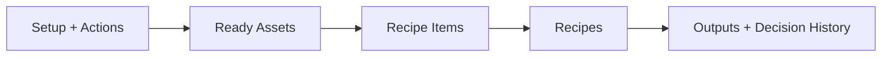

# User Manual 2026-06-12

This document is the operator-facing user manual for MTClipFactory.

It explains what the system is for, how to launch it, and how to complete the main day-to-day workflow through the current desktop UI.

## 1. Program Purpose

MTClipFactory is a desktop workflow tool for assembling product advertisement videos from reusable media ingredients.

The system is designed to help an operator:

- manage product records
- ingest and organize media assets
- tag and classify assets
- build recipe-based video outputs
- generate preview and final renders
- review risky outputs before release
- monitor failures, retries, and path-root behavior from a central dashboard

In simple terms:

1. Create a product.
2. Add the media for that product.
3. Build a recipe for the ad.
4. Generate a preview.
5. Review and approve the result.
6. Generate the final output.

## 2. Before You Start

Confirm the following before using the system:

- the app is being run from `F:\programming\python\MTClipFactory`
- the project virtual environment exists at `F:\programming\python\MTClipFactory\.venv`
- `app_config.toml` points to the intended workspace paths
- FFmpeg and FFprobe paths are valid
- you are using a test or controlled workspace, not unknown production data

Current configured runtime paths are stored in [app_config.toml](/F:/programming/python/MTClipFactory/app_config.toml).

## 3. How To Launch

Recommended launch method:

1. Double-click [run_mtclipfactory_ui.bat](/F:/programming/python/MTClipFactory/run_mtclipfactory_ui.bat)
2. Wait for the desktop application to open
3. The first screen should be the `Dashboard`

Useful helper launchers:

- [run_mtclipfactory_ui.bat](/F:/programming/python/MTClipFactory/run_mtclipfactory_ui.bat): open the desktop UI
- [run_mtclipfactory_pytest.bat](/F:/programming/python/MTClipFactory/run_mtclipfactory_pytest.bat): run the regression suite
- [run_mtclipfactory_ui_smoke.bat](/F:/programming/python/MTClipFactory/run_mtclipfactory_ui_smoke.bat): run offscreen UI smoke verification

## 4. Main Screens

### Dashboard

The `Dashboard` is the main control center.

Use it to:

- refresh the system summary
- open `Products`, `Assets`, `Recipes`, `Auto Factory`, `Tags`, and `Settings`
- recover queued jobs
- retry failed jobs
- inspect system counts, active paths, and operational settings
- review current alerts and operator playbook guidance

### Products

The `Products` screen is where product records are created and maintained.

Main actions:

- `Create`
- `Update`
- `Delete`
- `Refresh`
- `Asset Intake`

Important notes:

- a product must exist before assets can be registered against it
- delete only works when the selected product has no assets

### Assets

The `Assets` screen is used to ingest media files into the system.

Main actions:

- choose a `Product`
- choose an `Asset Type`
- optionally enter an `Asset Code`
- browse to a source file
- click `Register`
- select an existing asset and click `Update Selected` to rename its asset code
- select an existing asset and click `Delete Selected` to remove it when it is not referenced by recipe items or artifact jobs
- select an existing asset and click `Show References` to inspect where it is used
- select an existing asset and click `Retire Selected` to block future use without deleting history
- select an existing retired asset and click `Purge Media` to delete the stored files while keeping the record for audit truth
- select an existing asset and click `Replace In Recipes...` to move affected recipe items onto a ready replacement asset
- optionally generate `Thumbnail` or `Proxy`
- use filters to narrow the list

Typical asset types include:

- background video
- voiceover
- background music

Important notes:

- the source file must exist
- assets should reach a usable state before they are attached to recipes
- only selected assets can be used for thumbnail or proxy generation commands
- `Update Selected` currently updates the selected asset's code and keeps its media record aligned with the renamed file paths
- `Delete Selected` is blocked when the asset is already attached to a recipe or still referenced by artifact jobs
- `Retire Selected` is the correct action when a referenced asset is no longer acceptable for future use
- `Purge Media` is a storage-cleanup action for retired assets; it deletes media files from disk but preserves the asset record and historical references
- purged assets are historical records and are not intended for future recipe rebuilding unless a replacement asset is registered and attached
- `Replace In Recipes...` only offers ready replacement assets from the same product and asset type, and it returns the affected recipes to a rebuild-required state
- outputs created before the replacement event remain visible for lineage but cannot be reused as approval evidence for the changed recipe

### Tags

The `Tags` screen is used to create labels and attach them to assets.

Main actions:

- narrow the asset list first, then select one or more related assets
- keep one primary selected asset as the main detail focus while bulk tagging
- create a tag with `Tag Name` and `Tag Group`
- reuse an existing `Tag Group` from the drop-down when possible instead of retyping it
- narrow the asset list with `Product`, `Status`, `Asset Type`, and `Search` filters before assigning a tag
- narrow the available tag list with `Group` and tag search when needed
- attach an existing tag to the selected asset set
- or click `Create And Attach` to create a new tag and attach it immediately to the selected asset set

Typical use cases:

- classify mood
- classify content style
- group assets for easier filtering and review
- prepare explicit asset labels that auto-factory planning can consume later

Important notes:

- the asset table now shows each asset's current normalized tag labels in the same screen
- automation-oriented tag labels should stay in the existing `group:name` format, for example `message:proof` or `scene:studio`
- the selected-asset panel is now the fastest way to verify what is already attached before adding another tag
- when multiple assets are selected, the panel still shows one primary asset so the operator can sanity-check before bulk apply

### Auto Factory

The `Auto Factory` screen is the operator control surface for folder-driven automation.

Use it to:

- browse to one batch root folder
- set explicit `Scan Depth`
- optionally override the batch code
- choose `Intake Only`, `Intake + Materialize`, or `Intake + Materialize + Build Previews`
- review discovered product folders, product create/reuse outcomes, and deterministic asset-intake actions
- inspect recent production orders and their stage truth after materialize or preview runs

### Recipes

The `Recipes` screen is the core `Video Assembly Factory` UI.

Use it to:

- create a recipe for a selected product
- attach ready assets to that recipe
- build preview
- inspect output details and review evidence
- approve or reject workflow decisions
- build the final output

Main actions:

- select a product
- create a recipe
- attach ready assets to the selected recipe
- build preview
- approve output
- approve recipe
- reject recipe
- build final

Other important surfaces in this screen:

- `Recipes` table
- `Ready Assets` table
- `Recipe Items`
- `Recipe Outputs`
- `Workflow Guidance`
- `Output Details`
- `Decision History`

Workspace layout:

- left column: `Setup + Actions`
- middle column: `Ready Assets` and `Recipe Items`
- right column: `Recipes` and `Outputs + Decision History`
- drag the dividers between columns or between stacked panels to resize the workspace for the current task

The `Output Details` area shows:

- lineage information
- manifest path
- quality score
- duplicate risk
- composition plan summary
- review-gate evidence
- runtime audio-mix evidence
- runtime visual-composite evidence

Important notes:

- the `Ready Assets` table shows only assets whose current status is `ready`
- the `Recipes` screen now uses resizable panels instead of one fixed canvas, so widen `Ready Assets` during attachment work and widen `Outputs` during review work
- each main table in `Recipes` has its own vertical scroll when the row count exceeds the visible panel height
- if an expected asset does not appear here, inspect it in `Assets` first and confirm intake and analysis completed successfully
- `Target Ratio` is now applied during preview and final render to normalize visual output framing, so mixed visual ratios are fitted into the requested output frame instead of passing through unbounded
- if `Settings` also defines an exact output resolution, that exact preview/final frame overrides the old ratio-only size heuristic while still preserving the chosen framing ratio
- `Attach Role` now offers suggested choices based on the selected asset type and current recipe segment flow, and still allows typed custom roles when the workflow needs a special label
- visual assets may suggest semantic composition roles such as `hook`, `problem`, `benefit`, `proof`, and `cta`
- `voiceover` assets should normally use `voice`
- `background_music` assets should normally use `music`
- when you select an asset, the first suggested role is auto-selected for faster attachment
- the `Role Guidance` message explains which role is suggested next and why
- when both a `background_video` and a presenter-style `foreground_video` are attached, preview/final can now build a layered visual result instead of showing raw green-screen media directly
- the current baseline auto-detects likely green-screen foregrounds and applies keyed overlay over the background plate when the evidence is clear enough
- `Output Details` now includes `Runtime Visual Composite` lines so you can inspect whether the renderer used `green_chroma_key_overlay` or a simpler fallback mode
- if a referenced asset was later replaced from the `Assets` screen, the `Workflow Guidance` line and the `Aftercare` column in `Recipe Outputs` tell you whether older outputs are historical-only or whether a newly rebuilt output still needs approval
- `Historical only` means the output remains visible for audit lineage but must not be used as approval evidence after the recipe changed
- `Post-replacement` means the output was created after replacement and is the candidate you should review and approve next
- `Current approved` means a post-replacement output has already been approved and the recipe can continue through the normal final-build path

### Settings

The `Settings` screen is the central authority surface for system configuration.

It is organized into grouped panels:

- `Workspace Paths`
- `FFmpeg Toolchain`
- `Runtime Limits`
- `Render Output`
- `Recovery Policy`
- `Visual Composite`
- `Audio Behavior`
- `Review Gate`

Main actions:

- edit paths and policy values
- optionally enter exact preview/final output resolution such as `1080x1920`
- choose a key color policy for layered foreground/background compositing
- enter a custom key color such as `#2255FF` when the capture background is not one of the common presets
- use the slider for quick adjustment
- use the numeric entry box for exact values
- click `Save Settings`
- click `Reload` if external changes were made and you want to reload the form

Important note:

- path-root changes may hot-reload immediately or may require next-start behavior depending on the runtime policy in effect
- leave preview/final output resolution blank if you want the renderer to keep automatic ratio-based sizing
- use `auto` key policy for common green/blue/magenta studio backgrounds, use `custom` for unusual key colors, and use `disabled` when keyed compositing should not run

## 5A. Folder-Driven Automation Baseline

The system now has a service-level automation baseline for product-folder batch intake.

Current scope:

- read one batch root containing one or more product folders
- discover valid product folders at root depth `0..n` from the selected root
- read `product.toml` and `pipeline.toml`
- create missing products automatically
- ingest media from `foreground`, `background`, `music`, and `voice`
- create internal recipes automatically through the factory planner
- optionally enqueue and run preview jobs automatically for those created internal recipes

Important notes:

- this baseline now has a dedicated desktop operator screen reachable from `Dashboard -> Auto Factory`
- `scan_depth = 0` means only the selected root is checked, `1` means root plus direct children, and larger values include deeper descendants
- rerunning the same product folder should skip already-ingested deterministic asset codes instead of creating duplicate asset records
- `Intake Only` is the safe preparation mode when you want products and assets ready before consuming planner capacity
- `Intake + Materialize` and `Intake + Materialize + Build Previews` now create persisted `Production Order` records so stage truth stays inspectable
- `pipeline.toml` may now include `[selection_tags]` so automation can require existing normalized asset labels such as `message:proof` or `scene:studio`
- when preview automation is enabled, the system still stops at the normal human review boundary and does not auto-approve outputs, auto-approve recipes, or auto-build finals

Suggested operator flow:

1. Open `Auto Factory` from the `Dashboard`
2. Click `Browse...` and choose the batch root
3. Set `Scan Depth`
4. Keep or override `Batch Code`
5. Choose the appropriate `Run Mode`
6. Click `Run Auto Factory`
7. Review the intake report and, when applicable, the recent production-order stage results

## 5. Standard Workflow

Use this sequence for a normal operator run.

### Step 1. Create A Product

1. Open `Products`
2. Enter `Product Code`
3. Enter `Product Name`
4. Optionally enter category, brand, platform, and description
5. Click `Create`

### Step 2. Register Assets

1. Open `Assets`
2. Choose the product
3. Choose the asset type
4. Select the source file
5. Enter an asset code if needed
6. Click `Register`
7. Repeat for video, voiceover, and background music as needed

If you need to correct an asset code later:

1. Select the asset in `Registered Assets`
2. Edit `Asset Code`
3. Click `Update Selected`

If you need to remove an unused asset:

1. Select the asset in `Registered Assets`
2. Click `Delete Selected`
3. Confirm the deletion prompt

Important note:

- deletion is blocked when the asset is already used by recipes or artifact jobs

If the asset is already referenced but should not be used again:

1. Select the asset in `Registered Assets`
2. Click `Show References`
3. Review which recipes or jobs still point at it
4. Click `Retire Selected`
5. Register a replacement asset if future output rebuilding is required
6. Click `Replace In Recipes...` and choose the replacement asset
7. Click `Purge Media` later if you also want to reclaim disk space

### Step 3. Create Tags If Needed

1. Open `Tags`
2. Use `Product`, `Status`, `Asset Type`, and `Search` filters to narrow the asset list
3. Select one or more assets you want to prepare
4. Review the primary selected asset and its current tags in the selected-asset panel
5. Reuse an existing `Tag Group` from the drop-down when it matches your intent, or type a new one if needed
6. Either select an existing tag and attach it, or click `Create And Attach`

### Step 4. Create A Recipe

1. Open `Recipes`
2. Select the product in the product picker
3. Enter `Recipe Code`
4. Optionally enter target platform and ratio
5. Click `Create Recipe`

### Step 5. Attach Assets To The Recipe

1. Select the recipe in the recipe table
2. Select a ready asset in the asset table
3. Review the auto-selected role and the `Role Guidance` message, then keep the suggested role or type a custom role if needed
4. Click `Attach Selected Asset`
5. Repeat until the recipe has the required ingredients

### Step 6. Build A Preview

1. Select the recipe
2. Click `Build Preview`
3. Wait for the output to appear in `Recipe Outputs`
4. Select the output to inspect `Output Details`

### Step 7. Review The Preview

Check:

- output path exists
- review-gate evidence makes sense
- audio mix evidence is visible when voice and music are involved
- quality score and duplicate risk are visible

If the preview is flagged for review:

- inspect the review signals
- capture a meaningful decision reason before approval

### Step 8. Approve Output And Recipe

1. Select the preview output
2. Enter `Decision Actor`
3. Optionally enter `Decision Note`
4. Click `Approve Output`
5. Select the recipe
6. Click `Approve Recipe`

Important note:

- if the recipe is in `needs_review`, provide a meaningful approval reason

### Step 9. Build The Final Output

1. Select the approved recipe
2. Click `Build Final`
3. Wait for the final output to appear in `Recipe Outputs`
4. Confirm the final output kind is `final`

If attached clips use different source sizes:

- keep `Target Ratio` filled before building preview or final
- the renderer will fit each visual into that frame and pad when necessary
- expect letterbox or pillarbox bars when a source ratio does not match the target frame exactly

## 6. Dashboard-Based Recovery

Use `Dashboard` when jobs get stuck or fail.

### Recover Queued Jobs

Use `Recover Queued Jobs` when there are jobs still waiting in the queue and you want the system to attempt them now.

### Retry Failed Jobs

Use `Retry Failed Jobs` when failed jobs should be re-attempted.

The dashboard will also show:

- failed jobs
- escalated jobs
- deferred retry behavior
- operator playbook messages

Read the operator playbook text before retrying repeatedly.

## 7. Settings Guidance

Use `Settings` carefully because these values affect runtime behavior.

### Workspace Paths

These define where the app reads and writes:

- database
- media library
- docs
- outputs
- preview outputs

### FFmpeg Toolchain

These define which FFmpeg binaries are used for analysis and rendering.

### Runtime Limits

These affect:

- CPU limit
- RAM limit
- disk free threshold
- worker counts
- refresh timing

### Recovery Policy

These control:

- startup recovery behavior
- maximum jobs recovered per run
- failed-job escalation threshold

### Audio Behavior

These control:

- voice looping policy
- music looping policy
- music ducking
- duck mode
- duck attack and release
- voice and music gain

### Review Gate

These control when outputs are pushed into extra review based on composition risk.

## 8. How To Read Output Details

When you select an output in `Recipes`, the detail panel helps you audit the result.

Useful fields:

- `Kind`: preview or final
- `Approved`
- `Approved By`
- `Manifest Path`
- `Source Output Code`
- `Quality Score`
- `Duplicate Risk`

Also review:

- `Review Gate`
- `Runtime Audio Mix`
- timeline segments
- render decisions

## 9. Common Operator Errors

### "Select a product first"

Cause:

- no product is selected for the action

Fix:

- create or select a product before continuing

### "Select a recipe first"

Cause:

- no recipe is selected before build or approval actions

Fix:

- select the recipe row before clicking preview, approve, reject, or final

### "Select both a recipe and an asset first"

Cause:

- attempting to attach assets without the required selections

Fix:

- select one recipe and one ready asset

### Approval Does Not Work

Possible causes:

- output was not approved first
- recipe needs a reason before approval

Fix:

- approve at least one output
- provide a decision note for flagged recipes

### Path Changes Did Not Behave As Expected

Cause:

- runtime path-root policy may still be pending reload behavior

Fix:

- inspect `Dashboard` path information
- compare runtime-active paths versus configured paths

## 10. Safe Operating Advice

- do not point the system at unknown production data during first-time testing
- verify `app_config.toml` before changing workspace roots
- review dashboard attention text before retrying failures repeatedly
- use meaningful approval notes for auditability
- keep a small controlled rollout before broadening access to more users

## 11. Current Readiness Note

As of the latest full-system release audit, the system is:

- ready for controlled operator rollout and UAT
- not yet formally signed off for unrestricted broad release

Reference:

- [26_Full_System_Release_Audit_Report_2026-06-11.md](/F:/programming/python/MTClipFactory/doc/26_Full_System_Release_Audit_Report_2026-06-11.md)

## 12. Quick Start Checklist

1. Launch the app with [run_mtclipfactory_ui.bat](/F:/programming/python/MTClipFactory/run_mtclipfactory_ui.bat)
2. Create a product in `Products`
3. Register assets in `Assets`
4. Create tags if needed in `Tags`
5. Create a recipe in `Recipes`
6. Attach ready assets
7. Build preview
8. Review output details
9. Approve output and recipe
10. Build final
