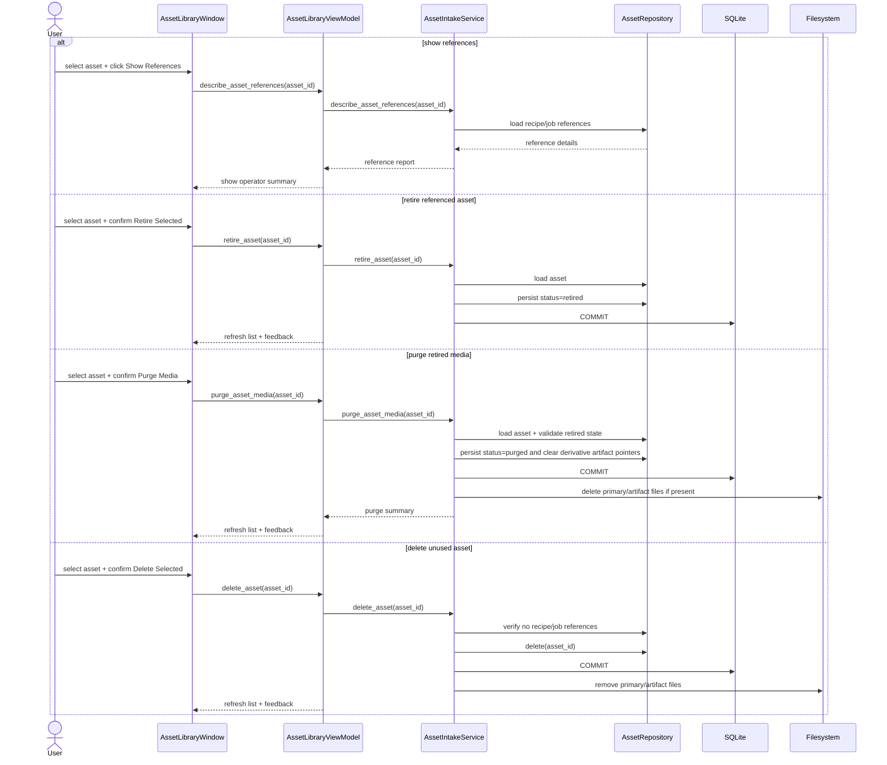
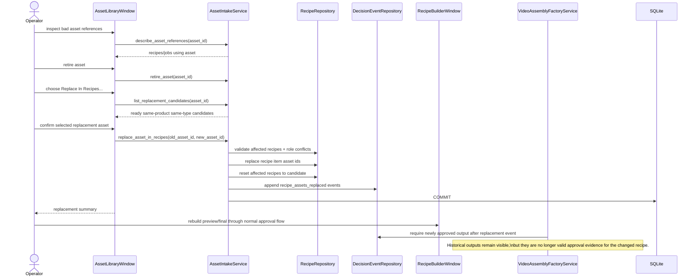

# Asset Lifecycle And Media Purge Workflow

This document defines the SSOT workflow for handling assets that are no longer acceptable for operational use but may still be referenced by recipes, jobs, outputs, or audit history.

It exists to solve two conflicting needs safely:

- preserve workflow truth and audit lineage
- allow operators to stop using bad assets and reclaim disk space

## 1. Problem Statement

Some assets are later found to be below standard even after they have already been attached to recipes or used in completed preview/final workflows.

If the system hard-deletes those assets immediately:

- recipe lineage becomes misleading
- job history loses its original evidence chain
- completed outputs can no longer be explained truthfully

If the system never removes their binary files:

- disk usage grows without bound
- operators cannot clean up known-bad media safely

## 2. Workflow Policy

The system separates `record lifecycle` from `binary-file lifecycle`.

- the asset record remains when history must be preserved
- the media files may be removed later under a controlled purge workflow

### Asset State Meanings

- `ready`: usable for recipe attachment
- `needs_review`: present but not considered ready for recipe attachment
- `retired`: no longer allowed for new workflow use, but media files are still present
- `purged`: no longer allowed for new workflow use, and the stored media/artifact files have been deleted from disk

### Operator Decision Matrix

| Situation | Action | Result |
| --- | --- | --- |
| Asset is unused | `Delete Selected` | Record and files are removed |
| Asset is referenced and should not be used again | `Retire Selected` | Record stays, future use is blocked |
| Retired asset still wastes disk and only historical truth must remain | `Purge Media` | Files are deleted, record stays |
| Retired or purged asset must be replaced for future output rebuilding | `Replace In Recipes...` with a ready same-product same-type asset | Historical lineage stays truthful while future work uses the new asset |

## 3. Operator Workflow

### A. Referenced Asset Found To Be Invalid

1. Open `Assets`
2. Select the asset
3. Click `Show References`
4. Review the recipe and job references
5. Click `Retire Selected`
6. Register a replacement asset if future recipe/output work is required
7. Click `Replace In Recipes...` and choose a replacement asset
8. Rebuild affected recipe outputs as a separate corrective workflow
9. If the old media is no longer needed on disk, click `Purge Media`

### B. Unused Asset Cleanup

1. Open `Assets`
2. Select the asset
3. Confirm it has no references
4. Click `Delete Selected`

### C. Corrective Replacement Workflow

1. Open `Assets`
2. Select the bad or outdated asset
3. Click `Show References`
4. Confirm which recipes will be affected
5. Click `Replace In Recipes...`
6. Choose a replacement asset from the suggested ready candidates
7. Confirm the replacement summary
8. Rebuild and re-approve outputs for the affected recipes through the normal factory workflow

## 4. Safety Rules

- `Delete Selected` remains blocked when the asset is referenced by recipe items or artifact jobs.
- `Retire Selected` must not break historical references.
- `Purge Media` requires the asset to be retired first.
- `Purge Media` removes the stored binary files but preserves enough metadata for audit truth, including asset id, code, type, filename, status, and historical path fields.
- Purged assets must not appear as `ready` candidates in the Recipe Builder.
- Rebuilding an old recipe after its asset was purged is expected to require a replacement asset first.
- `Replace In Recipes...` only allows replacement assets that are `ready`, belong to the same product, and use the same asset type as the source asset.
- If replacement would create a duplicate `asset + role` pair inside an affected recipe, the workflow must stop and ask the operator to resolve the conflict manually.
- After replacement, affected recipes return to a non-approved state and must produce a newly approved preview before they can be approved again.
- Historical outputs remain visible for lineage, but outputs created before the replacement event must not be re-approved as if they matched the new recipe content.

## 5. Sequence Design

### Asset Lifecycle Sequence

### Post-Build Invalid Asset Correction Sequence

## 6. Plan Review

The reviewed implementation plan for the replacement delivery slice is:

1. extend the lifecycle policy and UML first
2. add replacement candidate discovery and recipe-item replacement without a schema migration
3. keep hard delete restricted to unreferenced assets only
4. keep historical outputs visible but prevent stale approvals after recipe replacement
5. expose the new replacement action in the `Assets` UI
6. verify with pytest and UI smoke

### Why No Schema Migration In This Slice

The current `assets.status` field is sufficient for `retired` and `purged`, and the current persisted path metadata can remain as historical evidence even after the files are removed from disk.

This keeps the implementation testable and low-risk while solving the operator problem immediately.

### Replacement Design Review

The replacement workflow deliberately avoids rewriting or deleting historical outputs. Instead, it:

1. records a `recipe_assets_replaced` event
2. rewrites current recipe-item references to the new asset
3. pushes the affected recipe back to a rebuild-required state
4. blocks approval of outputs that predate the replacement event

This keeps lineage truthful without needing a schema migration for output supersession in the current delivery slice.
