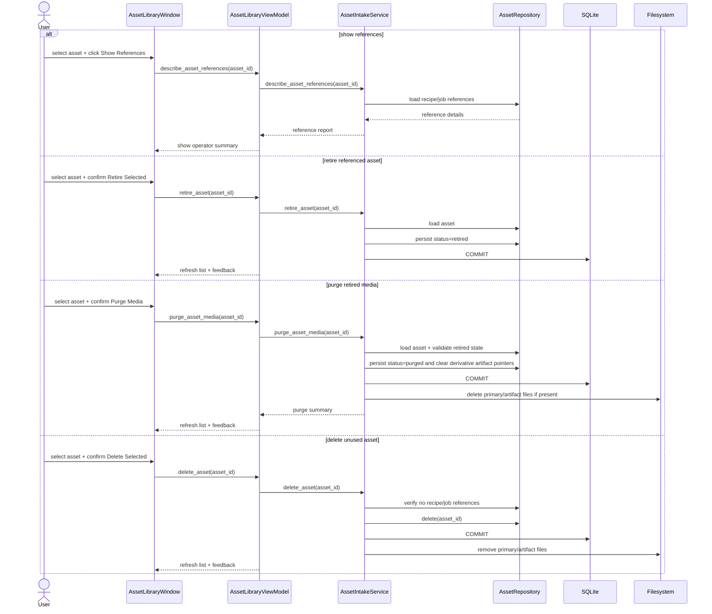
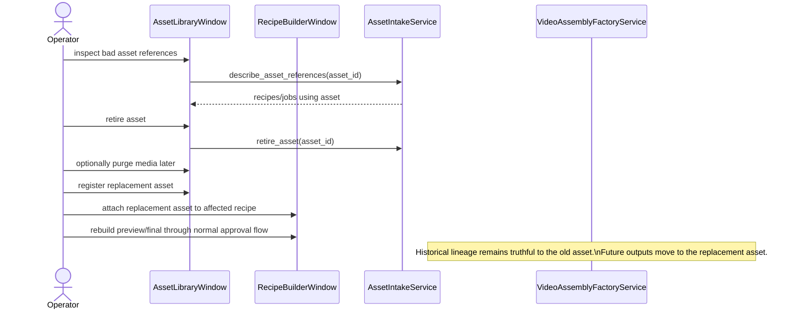

# Asset Lifecycle And Media Purge Workflow

This document defines the SSOT workflow for handling assets that are no longer acceptable for operational use but may still be referenced by recipes, jobs, outputs, or audit history.

It exists to solve two conflicting needs safely:

- preserve workflow truth and audit lineage
- allow operators to stop using bad assets and reclaim disk space

## 1. Problem Statement

Some assets are later found to be below standard even after they have already been attached to recipes or used in completed preview/final workflows.

If the system hard-deletes those assets immediately:

- recipe lineage becomes misleading
- job history loses its original evidence chain
- completed outputs can no longer be explained truthfully

If the system never removes their binary files:

- disk usage grows without bound
- operators cannot clean up known-bad media safely

## 2. Workflow Policy

The system separates `record lifecycle` from `binary-file lifecycle`.

- the asset record remains when history must be preserved
- the media files may be removed later under a controlled purge workflow

### Asset State Meanings

- `ready`: usable for recipe attachment
- `needs_review`: present but not considered ready for recipe attachment
- `retired`: no longer allowed for new workflow use, but media files are still present
- `purged`: no longer allowed for new workflow use, and the stored media/artifact files have been deleted from disk

### Operator Decision Matrix

| Situation | Action | Result |
| --- | --- | --- |
| Asset is unused | `Delete Selected` | Record and files are removed |
| Asset is referenced and should not be used again | `Retire Selected` | Record stays, future use is blocked |
| Retired asset still wastes disk and only historical truth must remain | `Purge Media` | Files are deleted, record stays |
| Retired or purged asset must be replaced for future output rebuilding | Register replacement asset and reattach it in recipes | Historical lineage stays truthful while future work uses the new asset |

## 3. Operator Workflow

### A. Referenced Asset Found To Be Invalid

1. Open `Assets`
2. Select the asset
3. Click `Show References`
4. Review the recipe and job references
5. Click `Retire Selected`
6. Register a replacement asset if future recipe/output work is required
7. Rebuild affected recipe outputs as a separate corrective workflow
8. If the old media is no longer needed on disk, click `Purge Media`

### B. Unused Asset Cleanup

1. Open `Assets`
2. Select the asset
3. Confirm it has no references
4. Click `Delete Selected`

## 4. Safety Rules

- `Delete Selected` remains blocked when the asset is referenced by recipe items or artifact jobs.
- `Retire Selected` must not break historical references.
- `Purge Media` requires the asset to be retired first.
- `Purge Media` removes the stored binary files but preserves enough metadata for audit truth, including asset id, code, type, filename, status, and historical path fields.
- Purged assets must not appear as `ready` candidates in the Recipe Builder.
- Rebuilding an old recipe after its asset was purged is expected to require a replacement asset first.

## 5. Sequence Design

### Asset Lifecycle Sequence

### Post-Build Invalid Asset Correction Sequence

## 6. Plan Review

The reviewed implementation plan for the first delivery slice is:

1. document the lifecycle policy and UML first
2. add reference-report, retire, and media-purge behavior without a schema migration
3. keep hard delete restricted to unreferenced assets only
4. expose the new operator actions in the `Assets` UI
5. verify with pytest and UI smoke

### Why No Schema Migration In This Slice

The current `assets.status` field is sufficient for `retired` and `purged`, and the current persisted path metadata can remain as historical evidence even after the files are removed from disk.

This keeps the implementation testable and low-risk while solving the operator problem immediately.

### Known Follow-Up

This slice does not yet auto-replace asset references inside recipes. Replacement remains an explicit operator workflow and should be designed as a separate milestone because it changes recipe state intentionally.
