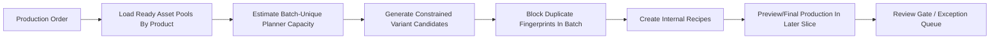
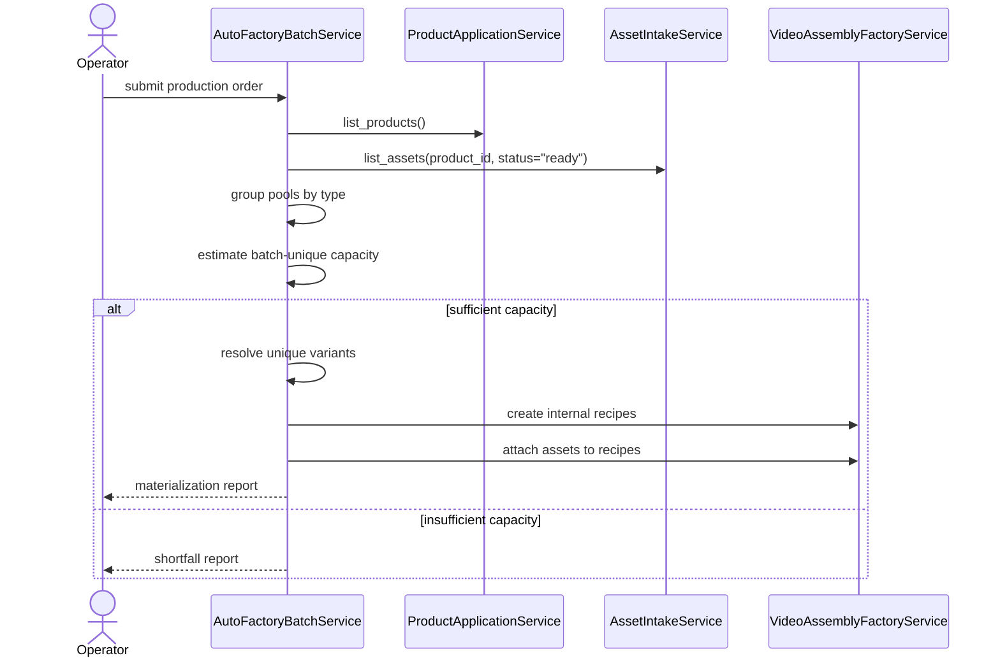
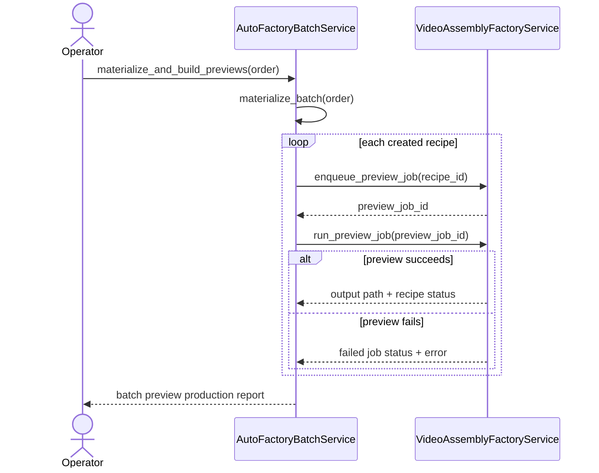
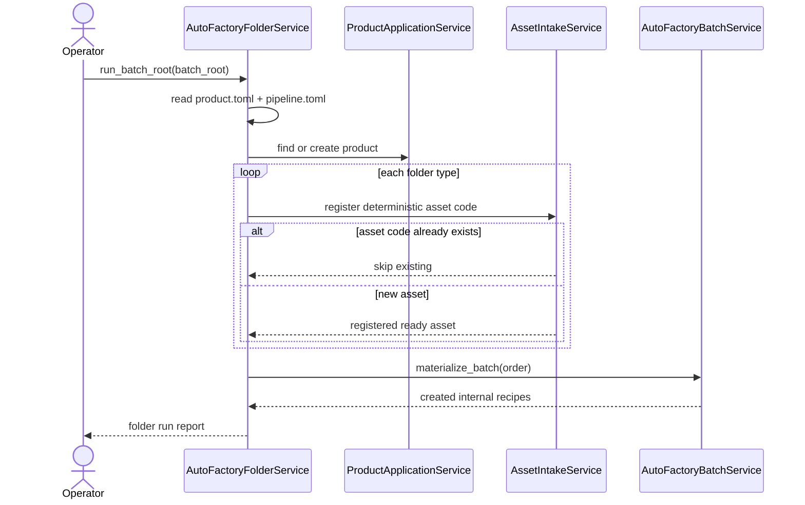

# Auto Factory Batch Production Workflow

This document is the SSOT for evolving MTClipFactory from an operator-driven recipe screen into a factory-style batch production system.

This workflow now sits inside the broader enterprise-factory pipeline defined in [33_Enterprise_Video_Production_Factory_Pipeline_Review_2026-06-13.md](/F:/programming/python/MTClipFactory/doc/33_Enterprise_Video_Production_Factory_Pipeline_Review_2026-06-13.md) and [34_Enterprise_Factory_Architecture_Blueprint_2026-06-13.md](/F:/programming/python/MTClipFactory/doc/34_Enterprise_Factory_Architecture_Blueprint_2026-06-13.md).

The current implementation now also has a persisted control-plane seam through [35_Production_Order_And_Orchestration_Workflow_2026-06-13.md](/F:/programming/python/MTClipFactory/doc/35_Production_Order_And_Orchestration_Workflow_2026-06-13.md).

Folder discovery depth and assisted tagging ergonomics for this workflow are extended in [36_Folder_Discovery_Depth_And_Assisted_Tagging_Workflow_2026-06-13.md](/F:/programming/python/MTClipFactory/doc/36_Folder_Discovery_Depth_And_Assisted_Tagging_Workflow_2026-06-13.md).

The first desktop operator control surface for this workflow is now defined in [37_Auto_Factory_Control_Surface_Workflow_2026-06-13.md](/F:/programming/python/MTClipFactory/doc/37_Auto_Factory_Control_Surface_Workflow_2026-06-13.md).

Tag-aware asset-pool filtering for this workflow is now defined in [38_Tag_Aware_Auto_Factory_Selection_Workflow_2026-06-13.md](/F:/programming/python/MTClipFactory/doc/38_Tag_Aware_Auto_Factory_Selection_Workflow_2026-06-13.md).

## Purpose

- let operators request output counts by product instead of building recipes one by one
- keep the current `Library -> Factory -> Review` architecture intact instead of inventing a separate hidden pipeline
- define a safe automation baseline before implementation spreads across services or UI

## User Mental Model

The operator should think in terms of a `Production Order`, not a manual recipe.

Example:

- Product `A`: produce `100` clips with `batch-only uniqueness`
- Product `B`: produce `10` clips with `batch-only uniqueness`

The system should translate that order into:

1. asset eligibility checks
2. batch planning
3. internal recipe generation
4. preview/final production
5. review-by-exception handling

## Core Decision

`Recipe` remains part of the system, but it becomes an internal production artifact.

Operators should not need to hand-build every recipe when the goal is batch output generation.

## Production Order Model

Each production order should contain:

- `batch_code`
- one or more `product requests`

Each product request should contain:

- `product_code`
- `requested_output_count`
- `uniqueness_scope`
- `target_platform`
- `target_ratio`
- `duration_mode`
- optional duration bounds or fixed duration

Baseline policies locked for the first automation slice:

- `uniqueness_scope = "batch"`
- `duration_mode = "voice_with_bounds"`

## Folder Contract

The automation pipeline should support one product folder per product:

```text
ProductA/
  product.toml
  pipeline.toml
  foreground/
  background/
  music/
  voice/
  archive/
  outputs/
```

Folder meaning:

- `foreground/` -> `foreground_video`
- `background/` -> `background_video`
- `music/` -> `background_music`
- `voice/` -> `voiceover`

`product.toml` should define product identity.

`pipeline.toml` should define production policy.

### Baseline TOML Examples

`product.toml`

```toml
[product]
product_code = "product_a"
product_name = "Product A"
default_platform = "shopee"
```

`pipeline.toml`

```toml
[request]
requested_output_count = 100
target_platform = "shopee"
target_ratio = "9:16"
uniqueness_scope = "batch"
duration_mode = "voice_with_bounds"
min_duration_sec = 12.0
max_duration_sec = 30.0
```

### Intake Rules

- the folder service should create the product automatically when `product_code` does not already exist
- if the product already exists, the service should reuse it instead of silently rewriting its metadata
- asset registration should derive deterministic globally-safe asset codes using product code plus type prefix
- rerunning the same folder should skip already-registered deterministic asset codes instead of duplicating records

## Uniqueness Policy

The initial automation baseline should enforce uniqueness only within the current batch.

Why this baseline is locked first:

- easier for operators to reason about
- easier to estimate capacity truthfully
- avoids dragging full historical output matching into every run
- keeps the first factory baseline testable and explainable

### Uniqueness Fingerprint

Two outputs are considered duplicates in the same batch when they share the same production fingerprint.

The baseline fingerprint should include:

- product code
- voice asset id or `none`
- music asset id or `none`
- background asset id or `none`
- ordered foreground-role assignment sequence
- target platform
- target ratio
- duration mode and resolved duration

Important rule:

- assets themselves are reusable
- duplicated `fingerprints` are not

This means the system should not physically remove an asset after use.
It should only block reuse of the same effective combination inside the current batch.

## Duration Policy

The first automation baseline should use `voice_with_bounds`.

Resolution order:

1. if a voiceover asset exists, use its duration as the primary timeline source
2. apply minimum and maximum bounds
3. if no voiceover exists, fall back to a fixed duration policy
4. preview/final still use one resolved `master timeline` per output

Baseline rule:

- narration remains the preferred timeline driver
- background music may loop to the resolved duration
- background visuals may loop according to existing fill policy
- foreground visuals are distributed across semantic segments

## Candidate Generation Policy

The system should not use full mathematical permutation across all assets.

The baseline should use `constrained permutation`.

Why:

- full permutation explodes combinatorially
- many mathematically different outputs are not meaningfully different for operators
- review and capacity become harder to explain

The batch planner should instead:

1. load the ready asset pool for the requested product
2. optionally filter those pools by explicit required asset tag labels
3. generate planner-approved foreground sequences for semantic roles
4. combine those sequences with optional background, music, and voice pools
5. stop duplicate fingerprints within the same batch
6. select the first `N` unique variants in deterministic order

## Capacity Rule

The planner must estimate capacity before creating internal recipes.

If a request cannot be satisfied under current planner policy, the system must not silently produce fewer outputs while pretending the order completed successfully.

Required behavior:

- report `requested_output_count`
- report `planner_feasible_unique_count`
- report whether the batch can be fulfilled exactly

## Workflow



## Batch Planning Sequence



## Reviewed First Implementation Slice

The reviewed first delivery slice should be:

1. production-order DTOs
2. batch planner service
3. batch-unique capacity estimation
4. internal recipe creation through existing services
5. pytest coverage

Explicitly deferred to later slices:

- folder watcher or scheduled auto-scan
- preview/final auto-run orchestration
- review-by-exception UI
- historical uniqueness modes
- asset cooldown or historical reuse weighting

## Reviewed Second Implementation Slice

The reviewed second delivery slice should be:

1. parse `product.toml` and `pipeline.toml`
2. discover product folders under one batch root
3. create missing products automatically
4. intake eligible media files from `foreground/background/music/voice`
5. skip already-ingested deterministic asset codes on rerun
6. build and materialize one `Production Order` from the folder tree

Explicitly deferred again:

- filesystem watcher loops
- archive movement
- preview/final auto-run

## Reviewed Third Implementation Slice

The reviewed third delivery slice should be:

1. take one materialized batch of internal recipes
2. enqueue one preview job per created recipe
3. run preview rendering deterministically in batch order
4. collect per-recipe preview result truth, including job status, output path, and resulting recipe status
5. keep recipe approval and final render outside this automation slice

Explicitly deferred again:

- automatic preview approval
- automatic recipe approval
- automatic final render
- review-by-exception operator queue UI
- scheduler or watcher driven batch execution

## Auto Preview Production Sequence



## Delivered Third Slice

- materialized batches can now enqueue and run preview jobs automatically in deterministic recipe order
- batch reporting now includes per-recipe job status, output path, output identity, failure text, and resulting recipe review status
- folder-driven runs can now optionally continue from intake and materialization into preview production
- approval and final render remain explicitly outside this automation slice

## Reviewed Fourth Implementation Slice

The reviewed fourth delivery slice should be:

1. add a desktop `Auto Factory` window reachable from the dashboard
2. let operators browse to one root folder, choose `scan_depth`, and pick an explicit run mode
3. show truthful intake results in-screen instead of relying on service-only calls
4. route materialize and preview modes through persisted `ProductionOrderService` records

Explicitly deferred again:

- scheduler or watcher driven execution
- automatic final-render automation
- review-by-exception queue management beyond current stage truth

## Folder Intake Sequence



## Why This Slice First

- it reuses current `Product`, `Asset`, and `Recipe` services instead of bypassing them
- it adds automation without weakening current approval discipline
- it gives PM and operators a truthful capacity answer before media rendering starts
- it stays compatible with the current document-first and testability-first rules

## Review Notes

Before coding, the plan was reviewed against the current architecture and the following conclusions were locked:

1. automation belongs inside `Video Assembly Factory`, not as an undocumented side script
2. `batch-only uniqueness` is the right first uniqueness scope
3. `voice_with_bounds` is the right first duration policy
4. `internal recipe generation` is a safe first implementation seam
5. render and approval automation should only follow after planner truth is stable
6. folder-driven automation should stay idempotent for repeated intake runs before watcher behavior is introduced
7. preview automation may run automatically only up to the normal review gate; it must not silently cross the human approval boundary
8. batch preview reporting must expose both success and failure per recipe so PM and operators can audit partial outcomes truthfully

## Delivered Fourth Slice

- a dedicated desktop `Auto Factory` control surface now exists with guided root-folder browse, batch-code override, `scan_depth`, and explicit run-mode selection
- the screen now shows discovered product folders, product create/reuse outcomes, deterministic asset-intake actions, recent production orders, and selected order stages
- materialize and preview runs now use the persisted `ProductionOrderService` seam after intake so operator automation stays aligned to control-plane truth
