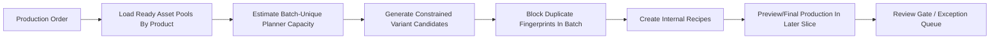
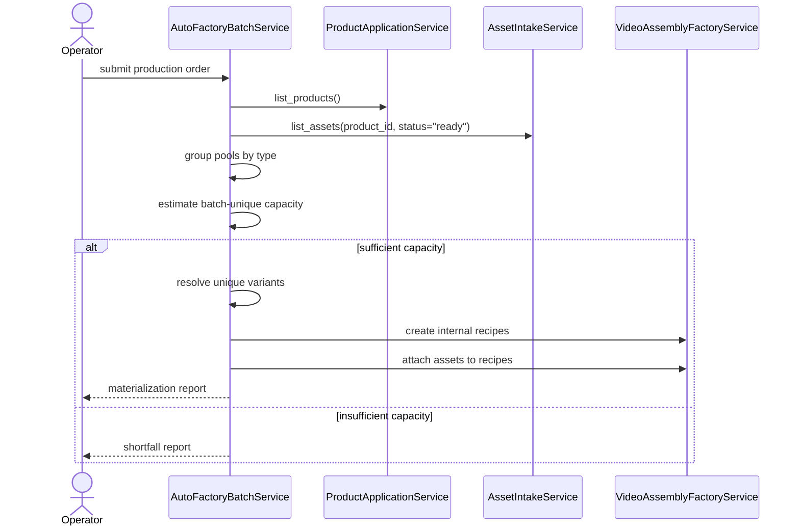

# Auto Factory Batch Production Workflow

This document is the SSOT for evolving MTClipFactory from an operator-driven recipe screen into a factory-style batch production system.

## Purpose

- let operators request output counts by product instead of building recipes one by one
- keep the current `Library -> Factory -> Review` architecture intact instead of inventing a separate hidden pipeline
- define a safe automation baseline before implementation spreads across services or UI

## User Mental Model

The operator should think in terms of a `Production Order`, not a manual recipe.

Example:

- Product `A`: produce `100` clips with `batch-only uniqueness`
- Product `B`: produce `10` clips with `batch-only uniqueness`

The system should translate that order into:

1. asset eligibility checks
2. batch planning
3. internal recipe generation
4. preview/final production
5. review-by-exception handling

## Core Decision

`Recipe` remains part of the system, but it becomes an internal production artifact.

Operators should not need to hand-build every recipe when the goal is batch output generation.

## Production Order Model

Each production order should contain:

- `batch_code`
- one or more `product requests`

Each product request should contain:

- `product_code`
- `requested_output_count`
- `uniqueness_scope`
- `target_platform`
- `target_ratio`
- `duration_mode`
- optional duration bounds or fixed duration

Baseline policies locked for the first automation slice:

- `uniqueness_scope = "batch"`
- `duration_mode = "voice_with_bounds"`

## Folder Contract

The automation pipeline should support one product folder per product:

```text
ProductA/
  product.toml
  pipeline.toml
  foreground/
  background/
  music/
  voice/
  archive/
  outputs/
```

Folder meaning:

- `foreground/` -> `foreground_video`
- `background/` -> `background_video`
- `music/` -> `background_music`
- `voice/` -> `voiceover`

`product.toml` should define product identity.

`pipeline.toml` should define production policy.

## Uniqueness Policy

The initial automation baseline should enforce uniqueness only within the current batch.

Why this baseline is locked first:

- easier for operators to reason about
- easier to estimate capacity truthfully
- avoids dragging full historical output matching into every run
- keeps the first factory baseline testable and explainable

### Uniqueness Fingerprint

Two outputs are considered duplicates in the same batch when they share the same production fingerprint.

The baseline fingerprint should include:

- product code
- voice asset id or `none`
- music asset id or `none`
- background asset id or `none`
- ordered foreground-role assignment sequence
- target platform
- target ratio
- duration mode and resolved duration

Important rule:

- assets themselves are reusable
- duplicated `fingerprints` are not

This means the system should not physically remove an asset after use.
It should only block reuse of the same effective combination inside the current batch.

## Duration Policy

The first automation baseline should use `voice_with_bounds`.

Resolution order:

1. if a voiceover asset exists, use its duration as the primary timeline source
2. apply minimum and maximum bounds
3. if no voiceover exists, fall back to a fixed duration policy
4. preview/final still use one resolved `master timeline` per output

Baseline rule:

- narration remains the preferred timeline driver
- background music may loop to the resolved duration
- background visuals may loop according to existing fill policy
- foreground visuals are distributed across semantic segments

## Candidate Generation Policy

The system should not use full mathematical permutation across all assets.

The baseline should use `constrained permutation`.

Why:

- full permutation explodes combinatorially
- many mathematically different outputs are not meaningfully different for operators
- review and capacity become harder to explain

The batch planner should instead:

1. load the ready asset pool for the requested product
2. generate planner-approved foreground sequences for semantic roles
3. combine those sequences with optional background, music, and voice pools
4. stop duplicate fingerprints within the same batch
5. select the first `N` unique variants in deterministic order

## Capacity Rule

The planner must estimate capacity before creating internal recipes.

If a request cannot be satisfied under current planner policy, the system must not silently produce fewer outputs while pretending the order completed successfully.

Required behavior:

- report `requested_output_count`
- report `planner_feasible_unique_count`
- report whether the batch can be fulfilled exactly

## Workflow



## Batch Planning Sequence



## Reviewed First Implementation Slice

The reviewed first delivery slice should be:

1. production-order DTOs
2. batch planner service
3. batch-unique capacity estimation
4. internal recipe creation through existing services
5. pytest coverage

Explicitly deferred to later slices:

- folder watcher or scheduled auto-scan
- preview/final auto-run orchestration
- review-by-exception UI
- historical uniqueness modes
- asset cooldown or historical reuse weighting

## Why This Slice First

- it reuses current `Product`, `Asset`, and `Recipe` services instead of bypassing them
- it adds automation without weakening current approval discipline
- it gives PM and operators a truthful capacity answer before media rendering starts
- it stays compatible with the current document-first and testability-first rules

## Review Notes

Before coding, the plan was reviewed against the current architecture and the following conclusions were locked:

1. automation belongs inside `Video Assembly Factory`, not as an undocumented side script
2. `batch-only uniqueness` is the right first uniqueness scope
3. `voice_with_bounds` is the right first duration policy
4. `internal recipe generation` is a safe first implementation seam
5. render and approval automation should only follow after planner truth is stable
