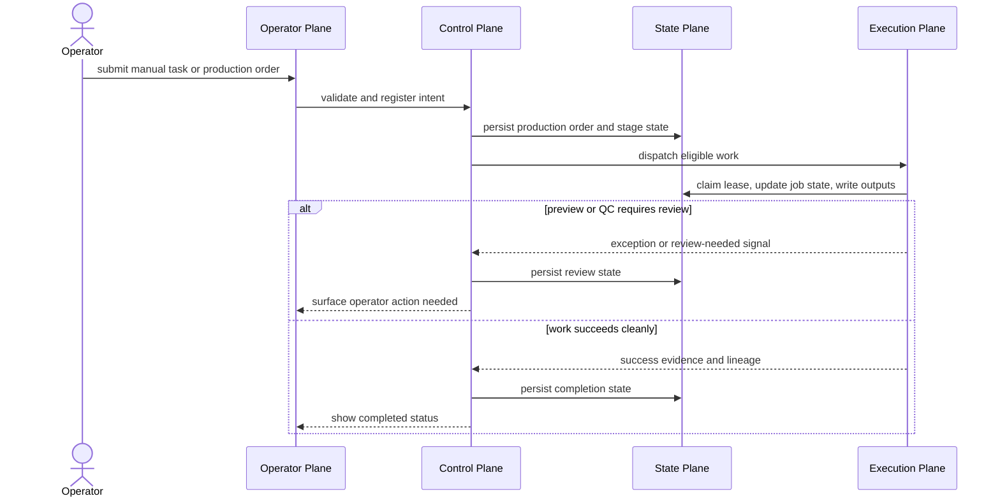

# Enterprise Video Production Factory Pipeline Review 2026-06-13

This document is the SSOT review for re-baselining MTClipFactory as a world-class `Video Production Factory` that supports both manual and automated production modes.

## Review Verdict

- yes, the system pipeline should be reviewed now
- yes, the project now needs a broader system-documentation pack in addition to milestone-level SSOT slices
- no, the project should not expand directly into distributed final-render automation before this operating model is locked

## Why The Review Is Needed Now

The project is no longer only a desktop recipe tool.

It now has:

- manual recipe production
- persisted preview and final jobs
- review gates
- asset lifecycle governance
- folder-driven automation
- batch recipe materialization
- batch preview automation

Those capabilities are strong, but they are still documented mostly as implementation slices.
The next target requires a true factory operating model:

- reliable and stable
- durable and recoverable
- high performance
- scalable by worker-node count

## Current Strengths To Preserve

- document-first SSOT discipline
- strong library/factory module boundary
- persisted jobs and dashboard visibility
- append-only decision history
- timeline-driven composition direction
- review gate as a human-trust boundary
- testable service seams

## Critical Gaps To Close Before Distributed Expansion

1. The end-to-end pipeline is not yet documented as one factory-grade workflow from intake to delivery and archive.
2. The system has persisted jobs, but it does not yet have a fully documented `control plane` and `worker lease` model for multi-node execution.
3. Retry and recovery exist, but business-failure versus infrastructure-failure handling is not yet formalized as a single factory policy.
4. The current automation baseline stops before final production, so the future approval boundary and exception-routing model must be made explicit before expansion.
5. Capacity, throughput, concurrency, and backpressure rules are not yet documented as first-class operating constraints.

## Required Factory Operating Model

The system should be treated as one production factory with four cooperating planes:

1. `Control Plane`: accepts production orders, plans work, schedules work, and tracks truth.
2. `Execution Plane`: workers that perform intake, analysis, planning, preview, final render, packaging, and archive tasks.
3. `State Plane`: source of truth for products, assets, recipes, jobs, outputs, lineage, approvals, retries, and leases.
4. `Operator Plane`: manual UI, review queues, overrides, recovery actions, and governance visibility.

## End-To-End Pipeline

| Stage | Purpose | Typical Mode | Success Output | Failure / Recovery Expectation |
| --- | --- | --- | --- | --- |
| Production Order Intake | accept operator or batch request | manual or automated | persisted production order | reject invalid order before hidden work starts |
| Asset Intake | register source media into SSOT | manual or automated | asset record plus stored media | retain error visibility and retry intake safely |
| Normalize / Prepare | optional path, naming, proxy, thumbnail prep | automated | prepared artifact set | isolate file failures from catalog truth |
| Metadata Analysis | read duration, ratio, size, codec, audio traits | automated | persisted metadata | retry transient tool failure, escalate malformed media |
| Validate / Policy Gate | check standards and asset eligibility | manual-assisted or automated | readiness decision | block non-compliant assets from production use |
| Asset Readiness Catalog | expose only eligible assets to planning | automated | ready asset pools | preserve non-ready assets for remediation, not silent drop |
| Batch Planning | estimate capacity and select unique variants | automated | batch plan report | report shortfall truthfully before recipe creation |
| Recipe Materialization | create internal recipes and attach assets | automated | internal recipe set | keep idempotent creation rules and duplicate protection |
| Preview Production | render preview outputs for review | manual or automated | preview outputs plus manifests | retry transient render failures, surface business review states |
| Review / Exception Queue | human approval, rejection, replacement, override | manual | approved or rejected decisions | preserve append-only audit truth |
| Final Production | render final outputs from approved recipes | manual or automated | final outputs plus lineage | never cross approval boundary silently |
| QC / Packaging / Delivery | compliance checks and export-ready artifacts | manual-assisted or automated | delivered package | quarantine failed delivery steps without corrupting outputs |
| Archive / Retention / Purge | retain evidence and reclaim storage safely | automated with manual policy control | archive record and storage outcome | keep lineage even after purge |

## Global Rules Across Every Stage

Every stage must answer these five questions explicitly:

1. What is the input contract?
2. What is the output contract?
3. What persisted state change proves success?
4. What failures are transient versus business-terminal?
5. What retry, replay, rollback, or compensation rule applies?

## Manual And Automated Modes

The system must support two legitimate operating modes.

### Manual-Guided Mode

- operator creates or edits recipes directly
- operator chooses assets and reviews outputs explicitly
- automation assists with rendering, scoring, and exception visibility

### Factory-Automated Mode

- operator submits a production order or folder batch
- system materializes internal recipes automatically
- system may generate preview and later final work automatically under policy
- human review remains available for flagged or governed states

## Reliability Requirements

- every important work unit must have persisted state
- every worker action must be idempotent
- every queueable task must expose status and recovery metadata
- every approval boundary must remain explicit
- every output must keep lineage to recipe, assets, and job evidence

## Durability And Recoverability Requirements

- production orders, jobs, outputs, approvals, and lineage must survive process restarts
- lease expiration, worker crash, and retry semantics must be documented before multi-node execution
- storage purge must not destroy audit truth
- transient failures, permanent business failures, and operator-rejected outcomes must be reported differently

## High-Performance Requirements

- planning, analysis, and rendering must be separated into independently scalable work classes
- CPU-heavy, IO-heavy, and FFmpeg-heavy tasks must not share one hidden execution bottleneck
- the system must support concurrency caps, queue prioritization, and backpressure rules
- batch planning must report feasible capacity before expensive rendering starts

## Scalable-Architecture Requirements

- worker count must become a configurable deployment variable, not a code rewrite
- job dispatch must support node-local or remote workers
- queue claims must use leases or equivalent ownership semantics
- duplicate execution must be prevented or made harmless by idempotency keys

## Locked Decisions From This Review

1. `Recipe` remains an internal production artifact even when operators submit only production orders.
2. `Review Gate` remains the normal human-trust boundary; automation must stop or route to exception handling there unless policy explicitly allows otherwise.
3. `Production Order`, `Job`, `Output`, and `Lineage` must become first-class system concepts in the architecture documents, not only service details.
4. `Control Plane` and `Execution Plane` must be documented separately before distributed workers are implemented.
5. The documentation pack must expand now so later scale-out work does not drift into undocumented behavior.

## Documentation Pack Required

The system now needs a broader documentation pack that covers:

- product vision and operating model
- end-to-end pipeline SSOT
- enterprise architecture blueprint
- job state machine and retry model
- worker-node topology and scaling model
- manual versus automated workflow boundaries
- failure recovery playbook
- storage, archive, retention, and purge policy
- observability, SLA, and capacity language

## Factory Re-Baseline Workflow

## Review Sequence

## What Should Happen Next

1. lock this pipeline review as SSOT
2. lock the enterprise architecture blueprint and worker model
3. define job state machine, lease model, and production-order persistence
4. then implement scalable orchestration in controlled milestones
