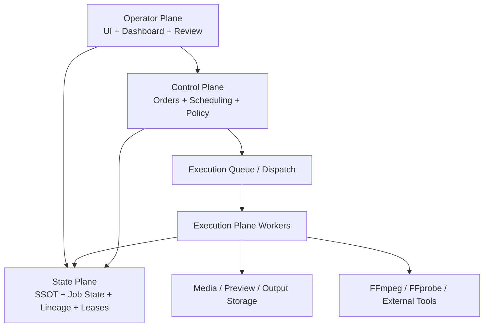
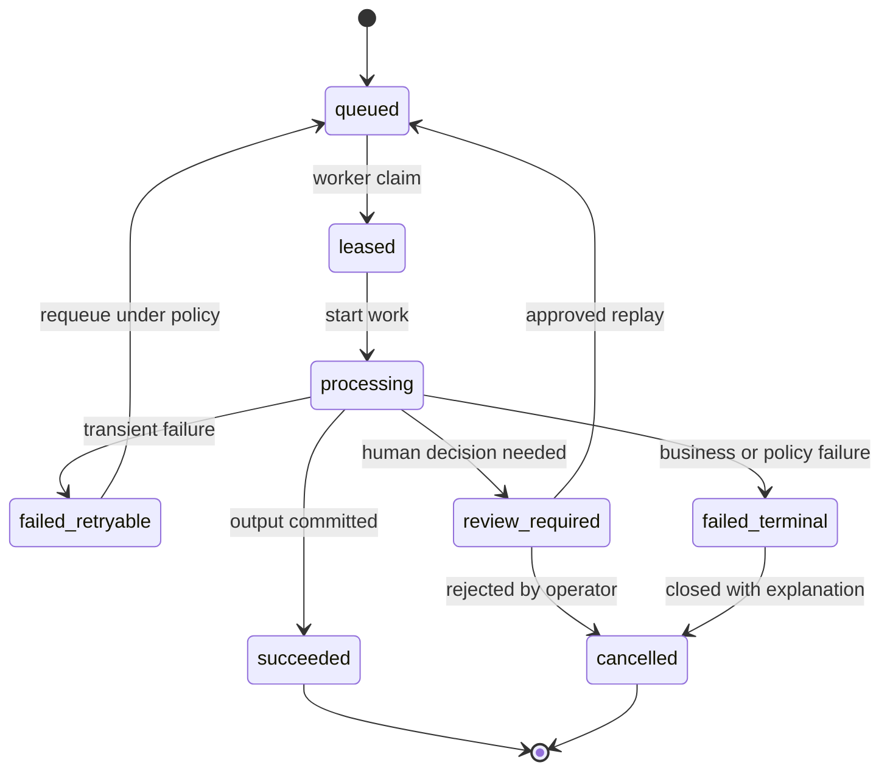
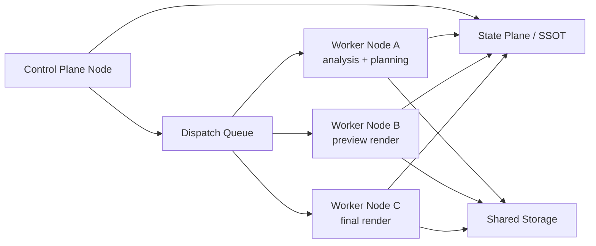
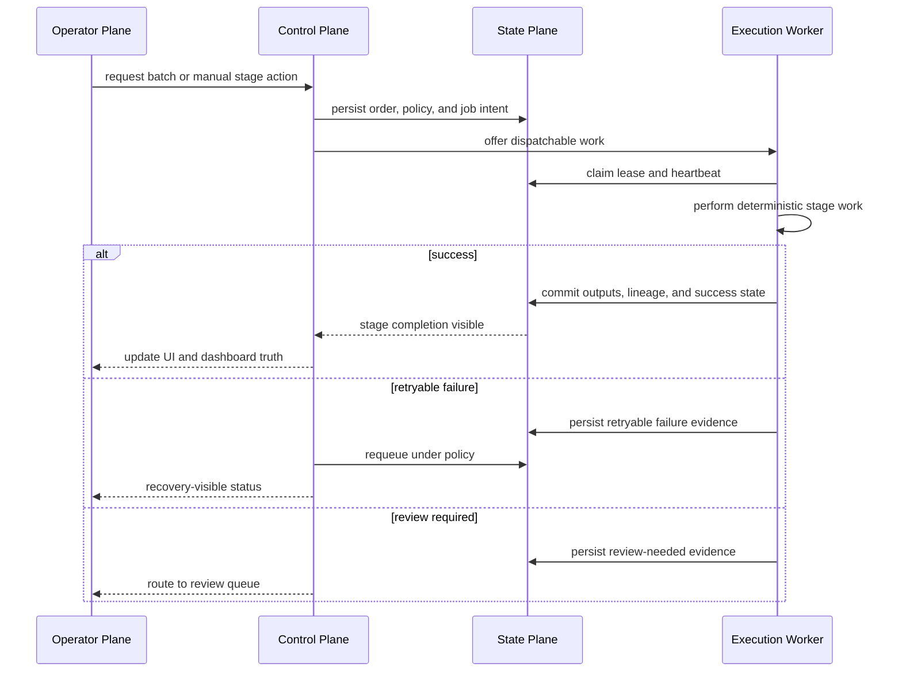

# Enterprise Factory Architecture Blueprint 2026-06-13

This document is the SSOT blueprint for evolving MTClipFactory into a scalable `Video Production Factory`.

## Purpose

- define the target architecture before distributed execution expands
- separate control, execution, state, and operator concerns clearly
- make reliability, recoverability, performance, and scaling requirements concrete

## Architecture Overview

The target system should operate through four planes.

### 1. Control Plane

Responsibilities:

- accept production orders and manual work intents
- validate policy and business prerequisites
- create stage-aware jobs
- schedule work to execution classes
- manage retries, escalation, and review routing
- enforce approval boundaries

Typical services:

- production-order service
- orchestration service
- scheduling service
- retry and escalation policy service
- capacity and quota service

### 2. Execution Plane

Responsibilities:

- perform background work deterministically
- claim, heartbeat, and release leases
- emit outputs and evidence
- report partial and final status back to the state plane

Worker classes:

- intake worker
- metadata-analysis worker
- artifact-prep worker
- batch-planning worker
- recipe-materialization worker
- preview-render worker
- final-render worker
- packaging or archive worker

### 3. State Plane

Responsibilities:

- persist products, assets, recipes, outputs, jobs, lineage, approvals, and retention metadata
- persist production orders and stage status
- persist job leases, retry counts, failure evidence, and escalation state
- remain the source of truth even when workers crash or restart

### 4. Operator Plane

Responsibilities:

- manual recipe authoring and inspection
- approval and exception handling
- dashboard, settings, and monitoring
- replay, retry, replace, retire, purge, and override actions

## Target Component Model

## Job Model

Every queueable work item should have:

- stable job id
- job type
- production-order id when applicable
- recipe id or asset id when applicable
- idempotency key
- priority
- lease owner
- lease expiration
- retry count
- failure class
- operator-visible error summary

## Recommended Job State Machine

## Idempotency Rules

- production-order registration must reject or merge duplicate submissions safely
- recipe materialization must not create duplicate recipes for the same order item and fingerprint
- preview and final work must not silently create conflicting outputs for the same stage intent
- archive and purge actions must be repeat-safe

## Lease And Heartbeat Model

Before scalable workers are added, the architecture should lock these rules:

- a worker may execute only leased work
- leases expire if a worker dies or stops heartbeating
- requeue after lease expiration must be explicit and traceable
- duplicate execution must be tolerated safely through idempotent write paths

## Worker-Node Topology

## Scaling Rules

- scale planning and analysis workers separately from render workers
- allow preview and final worker pools to have different concurrency caps
- isolate long-running renders from short metadata jobs
- introduce queue priorities so review-blocking work can move ahead of low-value bulk work when necessary

## Reliability Rules

- no worker may report success before its persisted state and output references are committed
- operator-visible recovery metadata must be written on every failure path
- approval and review decisions must remain append-only
- every stage must have one explicit owner of truth

## Storage Model Direction

Current practical baseline:

- SQLite for SSOT
- local filesystem for media, previews, and outputs

Target expansion direction:

- state plane abstraction that can move from SQLite to a stronger multi-node database when justified
- shared storage abstraction that can move from local filesystem to network or object storage when justified
- no hidden path assumptions inside worker implementations

## Observability Requirements

The system should eventually report:

- queue depth by job type
- worker lease counts
- worker heartbeats
- retry and escalation counts
- stage latency by pipeline step
- throughput by product and batch
- review-required rate
- render-failure rate

## Manual Versus Automated Boundary

- manual mode is not a fallback failure mode; it is a first-class operating mode
- automated mode must still surface exception queues and human approval gates
- no architecture decision should assume all work becomes hands-free

## Suggested Next Implementation Stream

1. persist `Production Order` as a first-class state-plane object
2. define shared job state machine and lease semantics
3. introduce stage-aware orchestration service inside the control plane
4. separate worker execution classes behind one dispatch contract
5. only then expand into scalable multi-node workers

## Architecture Review Sequence

