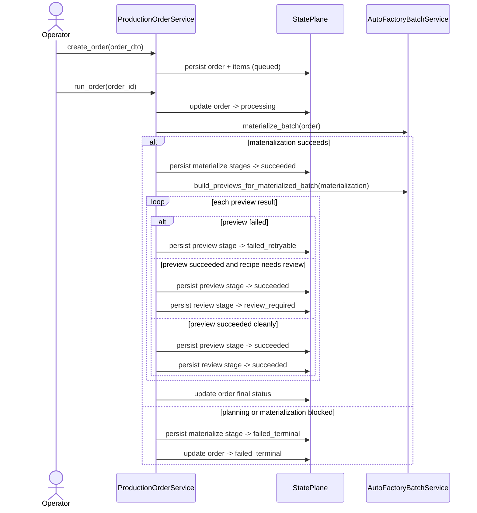
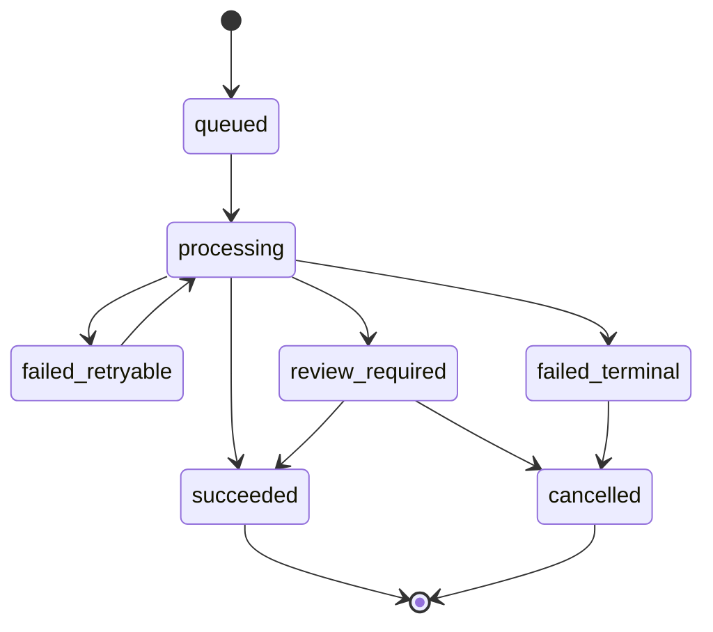

# Production Order And Orchestration Workflow 2026-06-13

This document is the SSOT for `IR-19`.

It defines the first implementation seam that turns the enterprise factory blueprint into persisted control-plane state.

## Purpose

- persist `Production Order` independently from recipe rows
- introduce one shared orchestration-state vocabulary for automated factory stages
- let automation report `materialize`, `preview`, and `review` stage truth without depending only on low-level job rows
- keep the baseline compatible with the current local desktop runtime

## Core Decision

`Production Order` becomes the control-plane source of truth for automated factory intent.

`Job` remains the execution-plane source of truth for low-level background work.

`Production Order Stage` becomes the shared orchestration layer that links the two.

## First-Slice Persistence Model

The first control-plane slice should persist:

1. `production_orders`
2. `production_order_items`
3. `production_order_stages`

### Production Order

Represents one operator or automation request.

Required fields:

- `order_code`
- `batch_code`
- `source_mode`
- `requested_by`
- `status`
- `strict_fulfillment`
- `created_at`
- optional `started_at`
- optional `finished_at`

### Production Order Item

Represents one product request inside the order.

Required fields:

- `production_order_id`
- `product_id`
- `product_code_snapshot`
- `requested_output_count`
- `target_platform`
- `target_ratio`
- `uniqueness_scope`
- `duration_mode`
- optional `fixed_duration_sec`
- `min_duration_sec`
- `max_duration_sec`

### Production Order Stage

Represents stage-aware orchestration truth.

Required fields:

- `production_order_id`
- optional `production_order_item_id`
- `stage_name`
- `stage_scope`
- `status`
- `sequence_index`
- optional `job_id`
- optional `recipe_id`
- optional `output_id`
- optional `failure_class`
- optional `detail_json`
- `created_at`
- `updated_at`

## Shared Orchestration Status Vocabulary

The first shared orchestration statuses should be:

- `queued`
- `processing`
- `succeeded`
- `failed_retryable`
- `failed_terminal`
- `review_required`
- `cancelled`

This vocabulary is for control-plane orchestration truth.

It does not require replacing every existing execution-plane `JobStatus` immediately.

## Mapping Rule Between Execution And Orchestration

- low-level execution jobs keep their current status semantics for now
- orchestration stages map those low-level outcomes into the shared control-plane vocabulary
- review-needed outcomes must be represented explicitly even when the underlying render job technically succeeded

## Stage Names In The First Slice

- `materialize`
- `preview`
- `review`

`final`, `package`, and `archive` remain future stages.

## Order Execution Sequence

## Orchestration State Machine

## Order Final-Status Rule

The first-slice order result should resolve by priority:

1. if any stage is `failed_terminal`, order becomes `failed_terminal`
2. else if any stage is `failed_retryable`, order becomes `failed_retryable`
3. else if any stage is `review_required`, order becomes `review_required`
4. else order becomes `succeeded`

## Failure Classification Rule

The first slice should classify failures conservatively:

- planning or fulfillment impossibility -> `failed_terminal`
- preview render runtime failure -> `failed_retryable`
- human review required -> `review_required`

## Review Notes

This plan was reviewed against the current codebase and the following decisions were locked before implementation:

1. `Production Order` should be introduced as additive persistence, not by overloading `Recipe`.
2. Existing `jobs` should not be rewritten aggressively in the same slice.
3. Shared orchestration truth should live in dedicated stage rows rather than only in job payload JSON.
4. The first slice should stop at `materialize + preview + review` because that is enough to prove the control-plane seam without overreaching into final automation.

## Delivered IR-19 Slice

- persisted `production_orders`, `production_order_items`, and `production_order_stages`
- delivered `ProductionOrderService` for create, run, list, and inspect flows
- mapped low-level preview outcomes into explicit control-plane `succeeded`, `failed_retryable`, `failed_terminal`, and `review_required` states
- kept the baseline additive to existing job orchestration instead of rewriting every execution-plane status path
