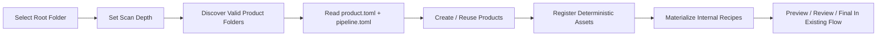
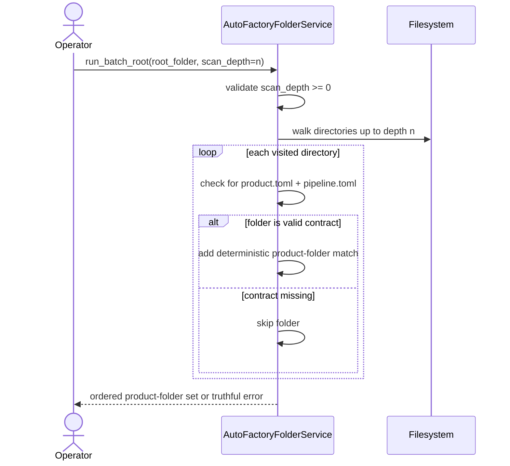
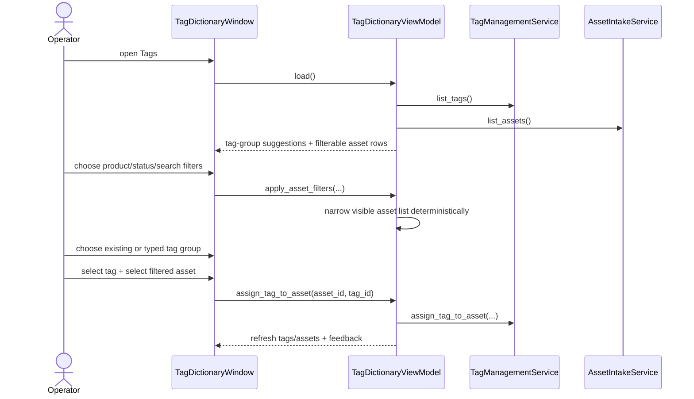

# Folder Discovery Depth And Assisted Tagging Workflow 2026-06-13

This document is the SSOT for the next operator-ergonomics slice that sits on top of the existing folder-driven auto-factory baseline.

It extends [32_Auto_Factory_Batch_Production_Workflow.md](/F:/programming/python/MTClipFactory/doc/32_Auto_Factory_Batch_Production_Workflow.md) without replacing the current product-folder contract.

## Purpose

- let operators point the system at one `root folder` instead of assuming product folders always live exactly one level below the root
- define one explicit `scan depth` contract so folder discovery is predictable and testable
- reduce manual typing during tag creation and asset tagging by preferring guided controls such as combo boxes, filters, and inline suggestions
- keep the current desktop workflow understandable while the broader production-factory automation continues to grow

## Root Folder Scan-Depth Contract

`scan_depth` is measured from the selected root folder.

- `0` means scan only the root itself
- `1` means scan the root and direct child folders
- `2` means scan root, child, and grandchild folders
- `n` means scan every directory whose relative depth from root is less than or equal to `n`

Important rules:

- the root itself may be a valid product folder if it contains both `product.toml` and `pipeline.toml`
- product discovery remains contract-based; a folder is a product folder only when both TOML files exist
- discovery order must stay deterministic so repeated runs produce the same planning order
- once a valid product folder is matched, discovery should treat it as a terminal node instead of continuing into its asset subfolders
- negative depth values are invalid and must fail truthfully

## Product Folder Structure

The product-folder contract remains:

```text
AnyAncestor/
  OptionalGrouping/
    ProductA/
      product.toml
      pipeline.toml
      foreground/
      background/
      music/
      voice/
```

The new rule is not a new folder structure.

It is only a new discovery rule that allows valid product folders to live deeper under the selected root.

## Operator-Assisted Tagging Goals

The tagging workflow should reduce free typing and make meaning easier to apply consistently.

The first assisted-input slice should provide:

1. reusable tag-group suggestions from already-existing tags
2. fast asset narrowing through product, status, and free-text search filters
3. one filtered asset list dedicated to tag assignment instead of forcing the operator to scan the entire asset inventory manually
4. editable combo-box style controls where free typing is still allowed, but guided choices are preferred first

The next additive UX hardening for this same workflow should also provide:

1. asset-type filtering inside the tag-assignment screen
2. visible current assigned tag labels per asset
3. clear guidance that normalized `group:name` labels may be consumed by automation

## Reviewed Workflow



## Folder Discovery Sequence



## Assisted Tagging Sequence



## Review Notes

This plan was reviewed before implementation and the following decisions were locked:

1. scan depth should be additive to the current product-folder contract, not a replacement for it
2. root-level product folders must be supported because some operators organize one product per selected root
3. guided controls should reduce typing, but must not block expert operators from typing a new tag value when needed
4. asset filtering belongs inside the tag workflow itself because cross-window context switching is what currently creates most operator friction
5. this slice should improve discovery and tagging ergonomics without inventing a new hidden automation path outside the existing services
