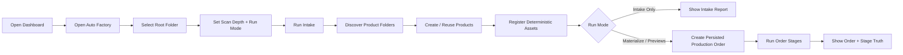
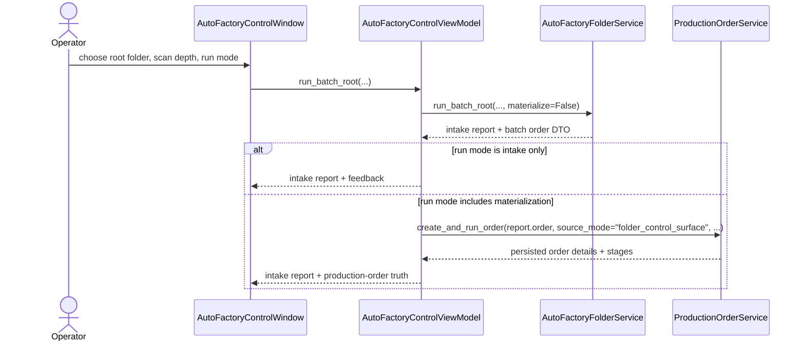

# Auto Factory Control Surface Workflow 2026-06-13

This document is the SSOT for the first desktop operator control surface that drives folder-based auto-factory intake from inside the MTClipFactory UI.

It extends [32_Auto_Factory_Batch_Production_Workflow.md](/F:/programming/python/MTClipFactory/doc/32_Auto_Factory_Batch_Production_Workflow.md), [35_Production_Order_And_Orchestration_Workflow_2026-06-13.md](/F:/programming/python/MTClipFactory/doc/35_Production_Order_And_Orchestration_Workflow_2026-06-13.md), and [36_Folder_Discovery_Depth_And_Assisted_Tagging_Workflow_2026-06-13.md](/F:/programming/python/MTClipFactory/doc/36_Folder_Discovery_Depth_And_Assisted_Tagging_Workflow_2026-06-13.md).

## Purpose

- give operators one real desktop control surface for folder-root selection, scan depth, and run controls
- keep automation inside the documented app workflow instead of requiring hidden scripts or ad hoc service calls
- preserve control-plane truth by persisting a `Production Order` whenever the operator advances beyond intake-only mode
- prefer guided controls such as browse buttons, spin boxes, combo boxes, and run-mode selectors over free typing

## Core Decision

The desktop control surface should split the workflow into two steps even when the operator clicks one `Run` button:

1. folder discovery, product creation, and deterministic asset intake
2. optional persisted production-order execution for materialization and preview stages

Why this split is locked:

- folder intake already has a truthful, idempotent service seam through `AutoFactoryFolderService`
- production-order persistence already has a truthful control-plane seam through `ProductionOrderService`
- the UI should compose those seams instead of inventing a third hidden orchestration path

## Operator Controls

The first control-surface slice should provide:

1. a root-folder path field with `Browse...`
2. an optional batch-code override
3. a numeric `Scan Depth` control
4. one explicit `Run Mode` selector:
   - `Intake Only`
   - `Intake + Materialize`
   - `Intake + Materialize + Build Previews`
5. visible feedback for:
   - discovered product folders
   - created or reused products
   - registered versus skipped deterministic assets
   - created recipes
   - preview results when enabled
   - persisted production-order status and stages when a production order exists

## Run-Mode Contract

`Intake Only`

- discover valid product folders under the selected root
- create or reuse products
- register deterministic asset codes
- do not create or run a production order

`Intake + Materialize`

- perform the same intake phase first
- create a persisted `Production Order`
- run the order through the `materialize` stage
- return stage truth through the control-plane records

`Intake + Materialize + Build Previews`

- perform the same intake phase first
- create a persisted `Production Order`
- run the order through `materialize`, `preview`, and `review`
- stop at the current human review boundary

## Reviewed Workflow

## Control-Surface Sequence

## Review Notes

This plan was reviewed before implementation and the following decisions were locked:

1. the UI must not bypass the new `Production Order` control-plane model when it runs materialization or previews
2. `Intake Only` should remain available because operators need a safe preparation mode before consuming planner capacity
3. scan depth should stay numeric and explicit rather than inferred from folder structure guesses
4. the first UI slice should show truthful operational results and recent production-order state before adding background watcher loops or scheduled scans
5. the control surface should remain additive to the current dashboard and factory windows instead of replacing them

## Delivered Slice

- delivered a dedicated `Auto Factory` desktop window reachable from the dashboard
- delivered guided controls for root-folder browse, optional batch-code override, `scan_depth`, and explicit run mode
- delivered truthful result surfaces for discovered product folders, product create/reuse outcomes, deterministic asset-intake actions, recent orders, and selected order stages
- delivered a composed execution path where folder intake always runs first and materialize/preview modes then create and run persisted `Production Order` records
