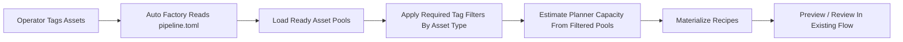
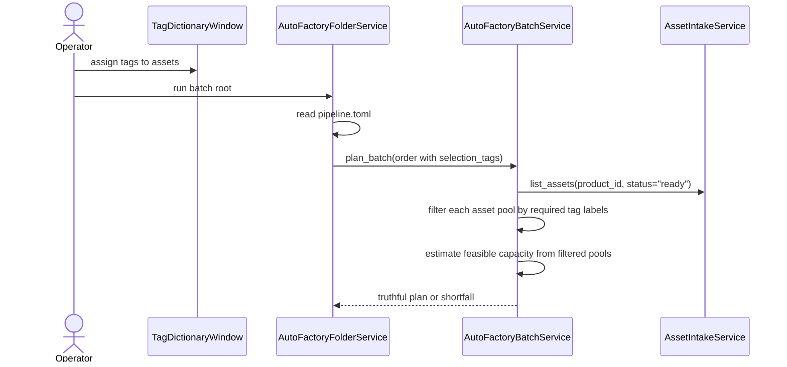
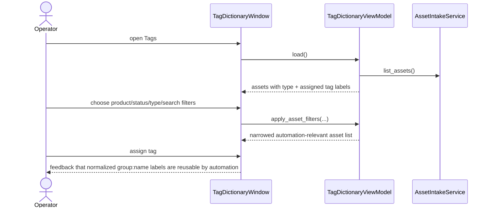

# Tag Aware Auto Factory Selection Workflow 2026-06-13

This document is the SSOT for the first slice that makes asset tags operational inside auto-factory planning instead of leaving tags as operator-only metadata.

It extends [32_Auto_Factory_Batch_Production_Workflow.md](/F:/programming/python/MTClipFactory/doc/32_Auto_Factory_Batch_Production_Workflow.md), [36_Folder_Discovery_Depth_And_Assisted_Tagging_Workflow_2026-06-13.md](/F:/programming/python/MTClipFactory/doc/36_Folder_Discovery_Depth_And_Assisted_Tagging_Workflow_2026-06-13.md), and [37_Auto_Factory_Control_Surface_Workflow_2026-06-13.md](/F:/programming/python/MTClipFactory/doc/37_Auto_Factory_Control_Surface_Workflow_2026-06-13.md).

## Purpose

- let operators tag assets in a way that directly influences automated planning
- make planner asset selection more explainable than one opaque ready-asset pool
- improve tagging UI/UX so operators can target the correct assets without cross-window guessing
- keep the first slice additive, testable, and truthful

## Core Decision

The first tag-aware planning slice uses explicit asset-type tag requirements, not full semantic AI inference.

The planner should support optional required tag labels for:

- `foreground_video`
- `background_video`
- `background_music`
- `voiceover`

The matching rule in this first slice is:

- every listed required tag for that asset type must already exist on the asset
- tag labels use the existing normalized `group:name` format
- no tag rule means current planner behavior stays unchanged

Why this decision is locked first:

- operators can understand and audit exact tag rules
- the existing tag model already exposes normalized `group:name` labels
- all-of matching is deterministic and easy to verify with pytest
- richer rule modes such as any-of, preferred-weighted, or role-specific semantic scoring can be deferred

## Folder Contract Extension

`pipeline.toml` may now optionally include:

```toml
[selection_tags]
foreground = ["message:proof"]
background = ["scene:studio"]
music = ["mood:warm"]
voice = ["language:th"]
```

Interpretation:

- `foreground` filters `foreground_video`
- `background` filters `background_video`
- `music` filters `background_music`
- `voice` filters `voiceover`

## Operator UX Direction

The `Tags` screen should help operators see whether their tag work is automation-relevant.

The first UX hardening slice should provide:

1. asset-type filtering inside the tag-assignment workflow
2. visibility of each asset's current assigned tag labels in the same table used for tag assignment
3. a brief explanation that automation can consume `group:name` tag labels

## Reviewed Workflow



## Tag-Aware Planner Sequence



## Tagging UX Sequence



## Review Notes

This plan was reviewed before implementation and the following decisions were locked:

1. the first planner slice should use deterministic explicit tag rules, not hidden heuristics
2. the existing `group:name` label format should remain the automation contract
3. asset-type filtering belongs inside the `Tags` screen because operators think in terms of media role when preparing assets for automation
4. planner shortfalls caused by tag rules must remain truthful and must not silently fall back to untagged assets
5. this slice should improve selection truth without changing the later human review boundary

## Delivered Slice

- delivered optional `[selection_tags]` support in `pipeline.toml` for `foreground`, `background`, `music`, and `voice`
- delivered deterministic planner filtering that requires every configured `group:name` label to already exist on the matching asset type
- delivered truthful shortfall reporting when tag rules remove otherwise-ready visual assets from the planner pool
- delivered `Tags` screen hardening through `Asset Type` filtering, visible current asset tag labels, and in-screen guidance that automation can consume normalized tag labels
