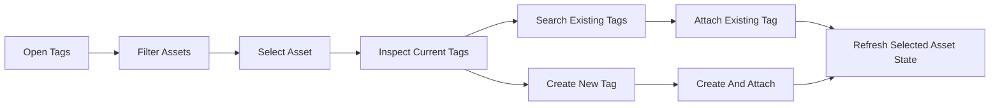
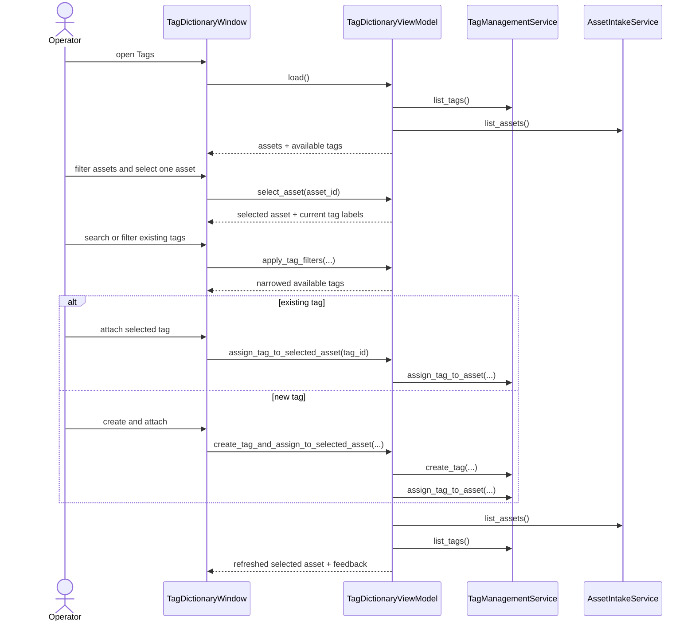

# Asset First Tagging Workflow 2026-06-13

This document is the SSOT for the next usability slice of the `Tags` screen.

It refines [36_Folder_Discovery_Depth_And_Assisted_Tagging_Workflow_2026-06-13.md](/F:/programming/python/MTClipFactory/doc/36_Folder_Discovery_Depth_And_Assisted_Tagging_Workflow_2026-06-13.md) and remains compatible with [38_Tag_Aware_Auto_Factory_Selection_Workflow_2026-06-13.md](/F:/programming/python/MTClipFactory/doc/38_Tag_Aware_Auto_Factory_Selection_Workflow_2026-06-13.md).

## Purpose

- make tagging feel natural for operators who think from the asset first
- reduce the need to mentally coordinate two unrelated tables before every assignment
- let operators see current tags, search existing tags, and create-and-attach new tags from one focused workflow
- keep the current domain/service seam intact for this slice

## Core Decision

The main tagging flow should become `asset-first`, not `tag-first`.

The primary operator loop should be:

1. narrow the asset list
2. select one asset
3. inspect its current tags
4. attach an existing tag or create-and-attach a new tag immediately

The existing tag list remains useful, but it becomes a support tool rather than the mental starting point.

## Interaction Model

The first asset-first slice should provide:

1. one selected-asset panel
2. visible current tag labels for that asset
3. search and optional group narrowing for existing tags
4. `Create and Attach` for the selected asset
5. refresh that preserves the operator's current focus as much as possible

Explicitly deferred:

- bulk tagging
- tag removal / unassign
- tag recommendation scoring
- multi-asset compare workflows

## Reviewed Workflow

## Asset-First Tagging Sequence

## Review Notes

This plan was reviewed before implementation and the following decisions were locked:

1. the main UX should optimize for one selected asset at a time because that matches current operator preparation work
2. the existing `Create Tag` behavior should remain available, but `Create and Attach` should become the fastest happy path
3. tag search and group narrowing belong next to the available tag list, not hidden behind a separate screen
4. the first slice should not invent tag removal behavior unless the service seam is designed for it
5. the workflow should stay compatible with automation-facing normalized `group:name` labels
