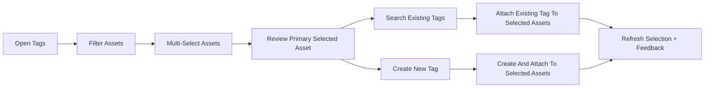
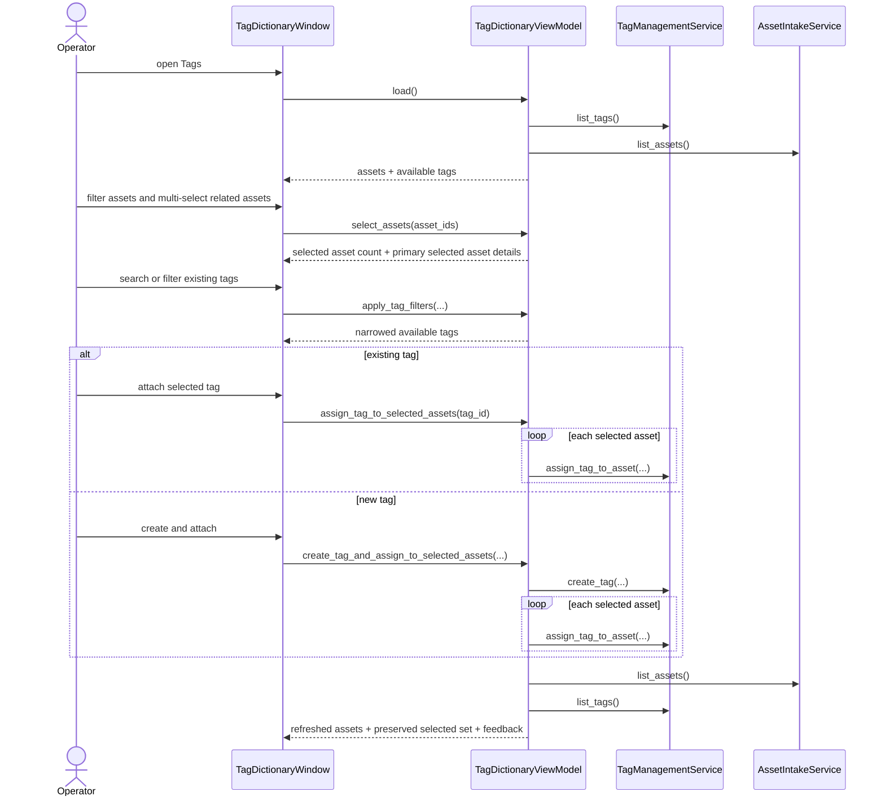

# Bulk Asset Tagging Workflow 2026-06-14

This document is the SSOT for the next usability slice of the `Tags` screen.

It extends [39_Asset_First_Tagging_Workflow_2026-06-13.md](/F:/programming/python/MTClipFactory/doc/39_Asset_First_Tagging_Workflow_2026-06-13.md) and remains compatible with [38_Tag_Aware_Auto_Factory_Selection_Workflow_2026-06-13.md](/F:/programming/python/MTClipFactory/doc/38_Tag_Aware_Auto_Factory_Selection_Workflow_2026-06-13.md).

## Purpose

- reduce repetitive tag assignment when multiple assets need the same automation-relevant label
- keep the tagging workflow operator-friendly by preserving one visible primary asset focus
- let operators apply one existing tag or one newly created tag across a selected asset set
- keep the first bulk slice additive to the current service seam by reusing single-asset assignment calls

## Core Decision

Bulk tagging should be `multi-select asset-first`, not `tag-first mass editing`.

The primary operator loop should become:

1. narrow the asset list
2. multi-select the assets that should share one tag
3. keep one primary selected asset visible for detail review
4. attach one existing tag or create-and-attach one new tag to the selected asset set

Why this decision is locked first:

- operators still think from assets first, not from abstract tags first
- one primary selected asset preserves confidence and prevents "blind bulk apply" anxiety
- the current tag service seam already supports safe per-asset assignment and duplicate assignment is naturally idempotent
- the slice stays testable without introducing a new persistence contract

## Interaction Model

The first bulk slice should provide:

1. multi-row selection in the asset table
2. one primary selected asset summary and current-tag panel
3. selected-asset count visibility
4. existing-tag attach across the selected asset set
5. `Create And Attach` across the selected asset set
6. refresh that preserves selected assets as much as possible after reload and filtering

Explicitly deferred:

- bulk tag removal / unassign
- partial-success conflict dialogs
- role-aware tag recommendations
- saved bulk-tag presets

## Reviewed Workflow

## Bulk Asset Tagging Sequence

## Review Notes

This plan was reviewed before implementation and the following decisions were locked:

1. bulk tagging should remain centered on assets, not move to a separate tag-batch tool
2. one primary selected asset must remain visible even when many assets are selected
3. the first slice should reuse the existing single-asset assignment seam instead of inventing a bulk repository contract
4. duplicate tag assignment should remain safe and idempotent through the existing repository behavior
5. automation-facing normalized `group:name` labels remain the operator contract
