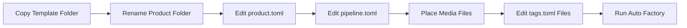

# New Product Auto Factory Template Kit 2026-06-14

This document is the SSOT guide for the reusable new-product template kit used to prepare folder-driven automation runs.

It complements [32_Auto_Factory_Batch_Production_Workflow.md](/F:/programming/python/MTClipFactory/doc/32_Auto_Factory_Batch_Production_Workflow.md), [41_Automation_Tag_Taxonomy_Guide_2026-06-14.md](/F:/programming/python/MTClipFactory/doc/41_Automation_Tag_Taxonomy_Guide_2026-06-14.md), and the template files under [doc/templates/new_product_auto_factory_template](/F:/programming/python/MTClipFactory/doc/templates/new_product_auto_factory_template).

## Purpose

- give operators one ready-to-copy folder kit for new products
- reduce setup mistakes in `product.toml`, `pipeline.toml`, and tag metadata
- keep the automation contract visible without requiring operators to remember every required file name

## Template Kit Location

Use this folder as the starting point for new products:

- [doc/templates/new_product_auto_factory_template](/F:/programming/python/MTClipFactory/doc/templates/new_product_auto_factory_template)

## Included Files

The template kit includes:

- `product.toml`
- `pipeline.toml`
- `captions.toml`
- `foreground/tags.toml`
- `background/tags.toml`
- `music/tags.toml`
- `voice/tags.toml`
- `README.md`

## How Operators Should Use It

1. copy the whole template folder
2. rename the copied folder to the new product folder name
3. update `product.toml`
4. update `pipeline.toml`
5. update `captions.toml` when captioned automation is needed
6. place media files into `foreground`, `background`, `music`, and `voice`
7. edit the matching `tags.toml` files when automation tags are needed
8. run the batch root from the `Auto Factory` screen

## Minimum Required Files

The current automation contract requires:

- `product.toml`
- `pipeline.toml`

The asset subfolders are the expected operator baseline:

- `foreground/`
- `background/`
- `music/`
- `voice/`

Current service behavior can tolerate a missing asset-type folder, but the template kit keeps all four folders so operators do not need to remember which names are valid.

## Tag Metadata Direction

The template kit includes `tags.toml` files as a preparation baseline for the planned folder-auto tagging workflow.

That means:

- operators can already prepare `global_tags` and per-file `file_tags`
- those files act as a stable contract and checklist for current folder-driven automation plus caption-ready preview/final runtime
- the current delivered auto-factory intake now reads `tags.toml` and applies normalized tags additively to matching assets during folder runs

The template kit also includes `captions.toml` as the current product-level contract for automated caption selection and rendering.

## Example Operator Flow

## Review Notes

This template kit locks the following decisions:

1. new-product setup should begin from a copied folder kit instead of handwritten files
2. the contract file names should stay explicit and operator-readable
3. tag metadata should live near the asset folders that it describes
4. the future auto-tagging seam should reuse the same template files instead of inventing a second metadata format later
