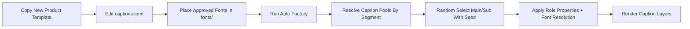
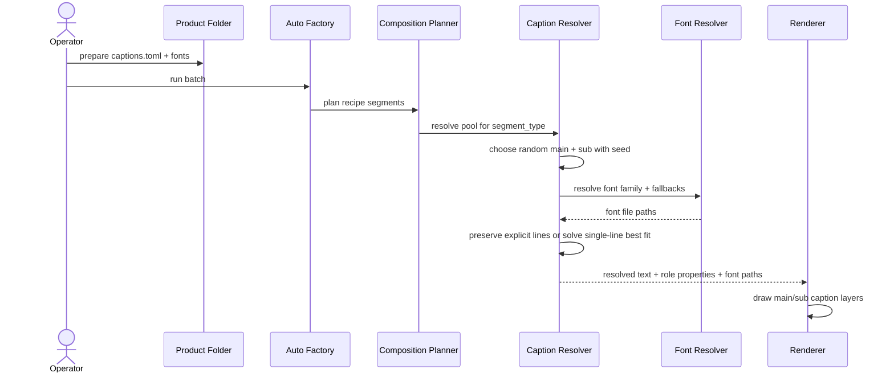

# Product Caption Pool And Font Workflow 2026-06-14

This document is the SSOT for product-level caption preparation and the current runtime caption baseline in MTClipFactory.

It complements [18_Composition_and_Timeline_Policy.md](/F:/programming/python/MTClipFactory/doc/18_Composition_and_Timeline_Policy.md), [41_Automation_Tag_Taxonomy_Guide_2026-06-14.md](/F:/programming/python/MTClipFactory/doc/41_Automation_Tag_Taxonomy_Guide_2026-06-14.md), and [42_New_Product_Auto_Factory_Template_Kit_2026-06-14.md](/F:/programming/python/MTClipFactory/doc/42_New_Product_Auto_Factory_Template_Kit_2026-06-14.md).

## Purpose

- give operators one practical structure for product-level caption authoring
- separate `main caption` from `sub caption` so automation can preserve visual hierarchy
- define how random caption selection should work without becoming opaque
- define how project-approved fonts should be prepared for the active renderer integration

## Core Decision

Product caption authoring should use:

1. product-level caption pools
2. separate `main` and `sub` caption roles
3. random selection with reproducible seed behavior
4. role-specific caption properties
5. project-level approved font files in the workspace `fonts` folder

## Caption File Location

Each product automation folder should support:

```text
ProductA/
  product.toml
  pipeline.toml
  captions.toml
  foreground/
  background/
  music/
  voice/
```

## Caption Pool Model

The product caption source should be `captions.toml`.

The baseline model uses:

- `caption_selection`
- `caption_pools`
- `caption_properties`

## Main And Sub Caption Roles

`main` caption:

- the primary message line
- larger and more visually dominant
- typically used for hook, benefit, proof, or CTA emphasis

`sub` caption:

- supporting explanation or secondary meaning
- smaller and visually subordinate
- typically used to reinforce the main caption or add context

## Manual Line Break Rule

Operators may author line breaks explicitly with `\n`.

Example:

```text
กลับมาแจก\nความสดใส\nและพลังบวกได้เต็มที่
```

Rule:

1. if `\n` is present, the renderer must respect that manual line break intent first
2. if `\n` is absent, the runtime must keep the caption as one rendered line and solve `font_size` against the textbox instead of auto-wrapping
3. if the manual line count exceeds policy, the item should be reviewable instead of silently reshaped beyond recognition
4. if a single-line caption still cannot fit at the allowed minimum size, the output should remain reviewable instead of being force-broken into extra lines

## Random Selection Rule

Caption selection should be `random_with_seed`, not purely opaque random.

Why:

- it still gives variation
- it stays auditable
- reruns can be explained
- preview and final can remain aligned when they use the same resolved caption choice

Recommended baseline:

- choose one `main` caption randomly from the current segment pool
- choose one `sub` caption randomly from the current segment pool
- use a stable run seed so the same resolved choice can be traced in manifest evidence later

## Caption Pool Shape

Recommended example:

```toml
[caption_selection]
mode = "random_with_seed"
seed_scope = "batch"

[caption_pools.hook]
main = [
  "กลับมาแจก\nความสดใส\nและพลังบวกได้เต็มที่",
  "เติมพลังใจ\nให้ทุกวันสดใส",
]
sub = [
  "เริ่มต้นวันใหม่ด้วยพลังที่ใช่",
  "ช่วยเสริมอารมณ์บวกและความน่าจดจำ",
]

[caption_pools.benefit]
main = [
  "ดูแลกระดูก\nและฟันในทุกวัน",
]
sub = [
  "เหมาะกับการดูแลต่อเนื่องในชีวิตประจำวัน",
]
```

## Caption Property Model

Caption properties should be defined separately for `main` and `sub`.

Recommended fields:

- `position`
- `alignment`
- `vertical_alignment`
- `textbox_alignment`
- `textbox_mode`
- `style_preset`
- `font_family`
- `font_fallbacks`
- `font_size`
- `min_font_size`
- `font_weight`
- `text_color`
- `stroke_color`
- `stroke_width`
- `background_color`
- `background_opacity`
- `box_border_color`
- `box_border_opacity`
- `box_border_width`
- `padding`
- `max_lines`
- `max_chars_per_line`
- `textbox_width_ratio`
- `textbox_height_ratio`
- `overflow_policy`
- `enter_animation`
- `review_required_if_overflow`

Textbox guidance:

- `textbox_alignment` places the textbox itself in the frame
- `alignment` places the text inside that textbox
- `vertical_alignment` places the text block inside that textbox
- `textbox_mode = "grouped"` keeps one shared box for the whole role
- `textbox_mode = "per_line"` creates one box per rendered line
- `style_preset` can apply a built-in professional baseline such as `sale_blast`, `clean_cta`, `dark_lower_third`, or `benefit_stack` before explicit field overrides
- `textbox_height_ratio = 0` means fit-content height; values above `0` define a target textbox height as a fraction of frame height, and the best-fit solver should scale text to stay inside it when possible
- legacy `max_width_ratio` remains supported as a backward-compatible fallback, but new contracts should prefer `textbox_width_ratio`

Recommended example:

```toml
[caption_properties.main]
style_preset = "sale_blast"
position = "center"
alignment = "center"
vertical_alignment = "middle"
textbox_alignment = "center"
textbox_mode = "per_line"
font_family = "TH Baijam"
font_fallbacks = ["TH Chakra Petch", "THSarabun", "Tahoma", "Arial Unicode MS"]
font_size = 72
min_font_size = 48
font_weight = "bold"
text_color = "#FFFFFF"
stroke_color = "#000000"
stroke_width = 3
background_color = "#000000"
background_opacity = 0.15
padding = 20
max_lines = 3
preferred_line_count = 2
max_chars_per_line = 18
textbox_width_ratio = 0.78
textbox_height_ratio = 0.18
overflow_policy = "wrap_then_scale_then_review"
enter_animation = "pop_in"
review_required_if_overflow = true

[caption_properties.sub]
style_preset = "dark_lower_third"
position = "bottom"
alignment = "center"
vertical_alignment = "middle"
textbox_alignment = "center"
textbox_mode = "grouped"
font_family = "TH Baijam"
font_fallbacks = ["TH Chakra Petch", "THSarabun", "Tahoma", "Arial Unicode MS"]
font_size = 42
min_font_size = 28
font_weight = "bold"
text_color = "#FFFFFF"
stroke_color = "#020617"
stroke_width = 3
background_color = "#0F172A"
background_opacity = 0.76
padding = 16
max_lines = 2
preferred_line_count = 1
max_chars_per_line = 30
textbox_width_ratio = 0.90
textbox_height_ratio = 0.12
overflow_policy = "wrap_then_scale_then_review"
enter_animation = "fade_in"
review_required_if_overflow = true
```

## Overflow Policy

Recommended baseline rules:

- `main` uses `wrap_then_scale_then_review`
- `sub` uses `wrap_then_truncate_or_review`

This means:

1. respect manual `\n` first
2. if `\n` is absent, keep one rendered line and use best-fit sizing inside the textbox
3. reduce size only within approved bounds
4. if still unsafe, route to review instead of silently producing unreadable text

## Font Folder Rule

Project-approved caption fonts should live in:

- [fonts](/F:/programming/python/MTClipFactory/fonts)

Supported operator-prepared file types:

- `.ttf`
- `.otf`

Current runtime baseline:

1. caption properties use `font_family`
2. renderer resolves `font_family` against project fonts first
3. if needed, renderer may fall back to system fonts
4. missing fonts should produce explicit warning or reviewable fallback, not silent substitution
5. runtime fitting should use a best-fit solver that measures real pixel widths and heights before choosing the final caption block

Default operator baseline:

- `TH Baijam.ttf` is now the preferred default caption font when the product contract does not intentionally choose another family

## Reviewed Workflow



## Caption Resolution Sequence



## Template Kit Direction

The new-product template kit should include `captions.toml` so operators can start from a concrete file instead of inventing their own schema.

## Review Notes

This document locks the following decisions:

1. caption authoring is product-level metadata, not ad hoc per-render text entry
2. `main` and `sub` are separate caption roles with separate property baselines
3. manual line breaks with `\n` are first-class author intent
4. caption selection should be random but seed-aware
5. project-approved fonts belong in the workspace `fonts` folder
