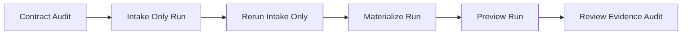

# Biothentic0001 Auto Factory Test And Audit Plan 2026-06-14

This document is the SSOT test and audit plan for validating the folder-driven automation workflow against the real product folder:

- `G:\My Drive\tee\clip\products\Biothentic0001`

It complements [20_Master_Test_Plan.md](/F:/programming/python/MTClipFactory/doc/20_Master_Test_Plan.md), [32_Auto_Factory_Batch_Production_Workflow.md](/F:/programming/python/MTClipFactory/doc/32_Auto_Factory_Batch_Production_Workflow.md), and [42_New_Product_Auto_Factory_Template_Kit_2026-06-14.md](/F:/programming/python/MTClipFactory/doc/42_New_Product_Auto_Factory_Template_Kit_2026-06-14.md).

## Purpose

- validate whether the current real product folder is ready for operator automation
- define one practical audit sequence before live `Auto Factory` runs
- separate what is ready now from what is intentionally deferred or still missing

## Current Observed Folder State

Observed on `2026-06-14`:

- `product.toml`: present
- `pipeline.toml`: present
- `foreground/`: present
- `background/`: present
- `voice/`: present
- `music/`: present
- `captions.toml`: present
- folder-level `tags.toml`: present

Current `product.toml`:

- `product_code = "biothentic0001"`
- `product_name = "Biothentic Calcium"`

Current `pipeline.toml`:

- `[request]`
- `requested_output_count = 3`
- `duration_mode = "voice_with_bounds"`
- `[selection_tags]`: present

## Audit Scope

This audit should validate:

1. folder-contract correctness
2. deterministic intake readiness
3. planner readiness for the current media pool
4. rerun safety for `Intake Only`
5. operator visibility and truthful reporting

This audit does not yet require:

- product caption rendering
- automated music coverage
- final-render automation

## Known Gaps Before Full-Scope Audit

The current `Biothentic0001` folder can support a useful first automation audit, but it does not yet cover every workflow.

Current gaps:

- no actual music media file yet, so the audit cannot validate background-music intake or music-aware planner behavior
- caption metadata exists, but current shipped runtime does not render caption pools yet

## Audit Goal Levels

### Level 1: Contract Audit

Confirm that the folder is valid for current baseline automation.

Pass criteria:

- `product.toml` loads successfully
- `pipeline.toml` loads successfully
- `foreground`, `background`, and `voice` files are discoverable
- `scan_depth` can find the folder from the chosen batch root

### Level 2: Intake Audit

Confirm that the folder can be ingested safely.

Pass criteria:

- product is created or reused truthfully
- assets are registered with deterministic asset codes
- rerunning `Intake Only` skips existing assets instead of duplicating them

### Level 3: Planning Audit

Confirm that the current asset pool can be planned truthfully.

Pass criteria:

- requested output count is evaluated against feasible unique count
- recipe materialization succeeds only when the planner can fulfill current rules
- order-stage truth is visible through the `Auto Factory` control surface

### Level 4: Preview Audit

Confirm that the created recipes can build previews without silently crossing the human review boundary.

Pass criteria:

- preview jobs run for materialized recipes
- per-recipe preview status is visible
- resulting review state remains truthful

## Recommended Execution Sequence

## Detailed Test Steps

### Phase A: Contract Audit

1. Open `Auto Factory`.
2. Choose root folder `G:\My Drive\tee\clip\products`.
3. Set `scan_depth = 1`.
4. Confirm the system discovers `Biothentic0001`.
5. Confirm no folder-contract error is raised.

Expected result:

- one product folder is discovered
- the discovered path matches `G:\My Drive\tee\clip\products\Biothentic0001`

### Phase B: Intake Audit

1. Run `Intake Only`.
2. Confirm the product is created or reused.
3. Confirm foreground, background, and voice assets are registered.
4. Capture the registered asset count.

Expected result:

- no duplicate product creation
- deterministic asset codes are assigned
- the report lists registered assets and skipped-existing count truthfully

### Phase C: Rerun Audit

1. Run `Intake Only` again with the same root and `scan_depth`.
2. Compare the second run report to the first.

Expected result:

- `registered_asset_count = 0` for already-ingested files
- `skipped_existing_asset_count` increases to the current asset count
- no duplicate asset records are created

### Phase D: Materialization Audit

1. Run `Intake + Materialize`.
2. Keep the batch code explicit for audit traceability.
3. Capture the created production order and stage outcomes.

Expected result:

- a new production order is created
- `materialize` stages are recorded truthfully
- the requested output count of `3` either succeeds truthfully or fails with a truthful planner shortfall

Audit note:

- because rerunning materialization with the same `batch_code` can collide on recipe-code reuse, each audit materialization run should use a fresh explicit batch code

Recommended batch-code examples:

- `biothentic_audit_intake_001`
- `biothentic_audit_materialize_001`
- `biothentic_audit_preview_001`

### Phase E: Preview Audit

1. Run `Intake + Materialize + Build Previews`.
2. Capture preview job outcomes and recipe review states.

Expected result:

- preview stages are recorded per recipe
- preview results stop at the human review boundary
- no automatic approval or final-render behavior occurs

## Evidence To Capture

Capture the following:

- screenshot of `Auto Factory` discovered-folder and intake report
- screenshot of production-order stage table
- resulting asset list for `biothentic0001`
- resulting recipe list created by the audit batch
- preview output paths, if preview mode is executed
- any failure text or review-required state

## Pass / Concern Criteria

### Pass

- folder contract is accepted
- intake is deterministic
- rerun skips existing assets truthfully
- materialize and preview stage truth are visible

### Concern

- planner capacity shortfall for the requested count
- unexpected duplicate recipe-code collision caused by reused batch code
- any asset failing readiness or ingestion unexpectedly

### Not Yet Covered

- music behavior
- tag-aware planner filtering
- caption selection workflow
- folder-driven tag metadata sync

## Recommended Follow-Up Before Broader Audit

To expand this folder into a fuller audit target, add:

1. `music/` with at least one usable track
2. `captions.toml`
3. folder-level `tags.toml` files
4. optional `[selection_tags]` inside `pipeline.toml`

## Review Notes

This plan locks the following practical decisions:

1. `Biothentic0001` is suitable for a first current-baseline automation audit
2. the first audit should start with `Intake Only`, not jump directly to preview production
3. rerun behavior must be explicitly checked as part of the audit, not assumed
4. each materialization or preview audit run should use a fresh batch code for clearer traceability
