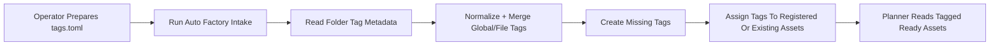
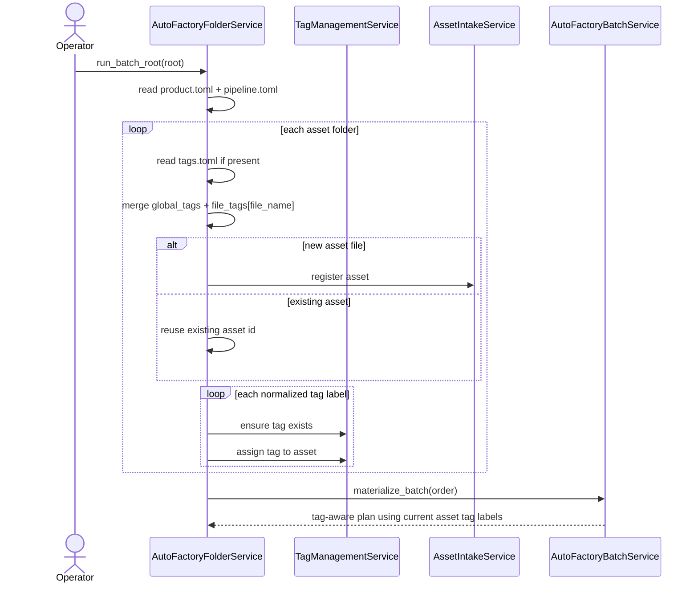

# Folder Tag Metadata Sync Workflow 2026-06-14

This document is the SSOT for applying folder-driven tag metadata during auto-factory intake.

It extends [38_Tag_Aware_Auto_Factory_Selection_Workflow_2026-06-13.md](/F:/programming/python/MTClipFactory/doc/38_Tag_Aware_Auto_Factory_Selection_Workflow_2026-06-13.md), [41_Automation_Tag_Taxonomy_Guide_2026-06-14.md](/F:/programming/python/MTClipFactory/doc/41_Automation_Tag_Taxonomy_Guide_2026-06-14.md), and [42_New_Product_Auto_Factory_Template_Kit_2026-06-14.md](/F:/programming/python/MTClipFactory/doc/42_New_Product_Auto_Factory_Template_Kit_2026-06-14.md).

## Purpose

- make `tags.toml` operational during folder-driven intake
- let operator-prepared folder metadata influence planner selection in the same automation run
- keep reruns safe and additive for repeated intake passes

## Core Decision

Each asset-type folder may contain `tags.toml` with:

- `global_tags`
- `[file_tags]`

The intake service should:

1. load `tags.toml` when present
2. normalize all tag labels into `group:name`
3. merge `global_tags` with matching `file_tags`
4. deduplicate the merged labels
5. create missing tags when needed
6. assign those tags to the matching asset during intake

## Contract Shape

Example:

```toml
global_tags = [
  "role:foreground",
  "product:biothentic",
]

[file_tags]
"hook_a.mp4" = [
  "message:hook",
  "mood:exciting",
]
"proof_a.mp4" = [
  "message:proof",
  "style:clean",
]
```

## Matching Rule

- `global_tags` apply to every file in the folder
- `[file_tags]` applies only to the exact file name key
- final tag set for one asset is `global_tags ∪ file_tags[file_name]`
- final tag set must not contain duplicates after normalization

## Normalization Rule

Each tag label must:

1. contain exactly one `:`
2. have non-empty `group` and `name`
3. be stored as lowercase normalized text

Examples:

- `Mood:Exciting` -> `mood:exciting`
- `message:Hook` -> `message:hook`

## Rerun Rule

Current delivered behavior is additive and rerun-safe for tag application.

This means:

- rerunning the same folder should not create duplicate asset-tag links
- rerunning with newly added folder tags should add the missing tags to matching assets
- current delivered slice does not yet remove previously assigned tags when metadata is later deleted from `tags.toml`

Why this baseline is locked first:

- it makes operator-prepared tag metadata useful immediately
- it preserves the existing service seam without introducing tag-removal behavior in the same milestone
- it keeps repeated intake deterministic and safe for the first real-use loop

## Reviewed Workflow



## Tag Metadata Intake Sequence



## Review Notes

This plan was reviewed before implementation and the following decisions were locked:

1. `tags.toml` should become operational before caption metadata integration
2. current slice should support additive rerun-safe tag application first
3. tag removal sync is a later milestone and should not be implied silently
4. tag-aware planner selection must be able to consume tags assigned in the same folder-driven run
