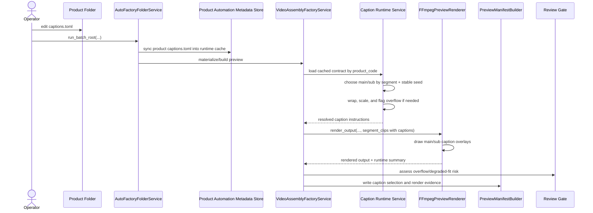

# Caption Runtime Metadata And Render Workflow 2026-06-14

This document is the SSOT for turning product-level `captions.toml` preparation into real preview/final caption rendering in MTClipFactory.

It complements [18_Composition_and_Timeline_Policy.md](/F:/programming/python/MTClipFactory/doc/18_Composition_and_Timeline_Policy.md), [43_Product_Caption_Pool_And_Font_Workflow_2026-06-14.md](/F:/programming/python/MTClipFactory/doc/43_Product_Caption_Pool_And_Font_Workflow_2026-06-14.md), and [45_Folder_Tag_Metadata_Sync_Workflow_2026-06-14.md](/F:/programming/python/MTClipFactory/doc/45_Folder_Tag_Metadata_Sync_Workflow_2026-06-14.md).

## Purpose

- make `captions.toml` operational in real auto-factory preview/final runs
- keep caption behavior truthful across intake, rerun, preview, manifest, and review-gate surfaces
- support operator-authored `main` and `sub` captions without forcing free-typed runtime text entry
- keep the first runtime slice additive to the current product-folder contract and renderer seams

## Problem Statement

Before this slice:

- `captions.toml` existed only as a future-ready template shape
- preview/final renderers had no caption resolution seam
- caption choices were not persisted into runtime-visible evidence
- rerun behavior had no stable place to read product-level caption metadata from

If left unresolved, operators could prepare caption pools but automation would still ignore them at render time.

## Core Decision

Caption runtime support should use three explicit seams:

1. source contract: product-folder `captions.toml`
2. runtime metadata cache: `media_library/products/<product_code>/automation/captions.toml`
3. render-time resolution: deterministic caption selection per recipe segment with manifest evidence

This keeps preview/final reruns independent from the original source folder location while preserving the folder-driven authoring workflow.

## Runtime Metadata Location

When folder-driven automation processes one product folder, it should sync caption metadata into:

```text
media_library/
  products/
    <product_code>/
      automation/
        captions.toml
```

Rules:

1. if source `captions.toml` exists, sync it into the runtime metadata location
2. reruns should overwrite the runtime copy so later operator edits become effective
3. if no source `captions.toml` exists, the runtime caption layer remains optional and should not fail the full intake by itself

## Caption Resolution Decision

Caption selection should be deterministic, not opaque random.

Baseline rule:

- choose caption text from the pool for the current `segment_type`
- resolve `main` and `sub` independently
- use a stable seed derived from the current recipe and segment identity
- preview and final must resolve the same caption choice for the same recipe

Why:

- operator can rerun and inspect results truthfully
- preview and final stay aligned
- manifest evidence can explain which text was chosen

## Render Policy

The first runtime slice should support:

- `main` caption
- `sub` caption
- manual line breaks with `\n`
- simple wrapping when no manual line breaks are supplied
- role-specific font, size, color, stroke, padding, box, and position properties
- workspace `fonts` folder lookup before system-font fallback

The first runtime slice should not silently pretend that unsafe text fit was successful.

## Overflow Truth Rule

If caption text cannot safely fit within current property bounds:

1. the resolver may attempt approved wrap/scale handling first
2. the runtime output may apply a bounded fallback such as truncation when required for render safety
3. the manifest must record that fallback or overflow risk
4. the review gate should be able to route the recipe to review when the caption result is unsafe

## Runtime Roles

### AutoFactoryFolderService

- sync `captions.toml` from product folder into runtime metadata cache

### Caption Runtime Service

- load cached `captions.toml`
- validate contract shape
- resolve deterministic `main` and `sub` caption text per segment
- resolve font file or fallback family
- compute render-ready caption instructions

### Preview Composition Builder

- attach caption instructions to each segment clip
- write caption evidence into the manifest payload

### FFmpeg Renderer

- draw resolved caption layers into segmented preview/final output

### Review Gate

- inspect caption overflow or degraded-fit evidence
- route unsafe caption results to operator review

## Reviewed Workflow

```mermaid
flowchart LR
    A["Operator Edits captions.toml"] --> B["Auto Factory Runs Product Folder"]
    B --> C["Sync captions.toml Into media_library Runtime Cache"]
    C --> D["Materialize Recipe / Build Preview"]
    D --> E["Resolve Segment Captions With Stable Seed"]
    E --> F["Resolve Workspace Font File Or Fallback"]
    F --> G["Render Main/Sub Caption Layers"]
    G --> H["Write Caption Evidence To Manifest"]
    H --> I["Review Gate Sees Overflow Risk If Present"]
```



## Sequence Diagram



## Acceptance Criteria

- folder-driven automation can make `captions.toml` available to preview/final runtime without manual copy steps after the first run
- preview and final can render `main` and `sub` caption layers from product-level pools
- manual `\n` line breaks are preserved
- manifest evidence shows resolved caption text, chosen font path or fallback, and any overflow/degraded-fit behavior
- unsafe caption fit can trigger review instead of silent low-trust automation

## Non-Goals For This Slice

- per-word animation timing
- karaoke-style subtitle sync
- rich typography layout engine
- per-asset caption overrides
- a full caption authoring UI beyond current folder-contract editing

## Delivery Rule

Before implementing this slice:

1. this document must exist as SSOT
2. UML must reflect the new runtime metadata and caption-resolution seam
3. test-plan expectations must cover parser, sync, render, manifest, and review behavior
