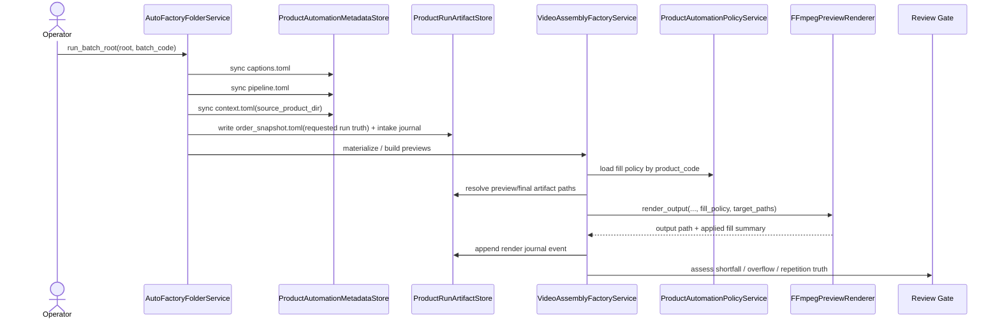

# Product-Local Run Artifacts And Fill Policy Workflow 2026-06-14

This document is the SSOT for product-local automation run artifacts, journal/recovery metadata, and per-asset-type timeline fill policy in MTClipFactory.

It complements [32_Auto_Factory_Batch_Production_Workflow.md](/F:/programming/python/MTClipFactory/doc/32_Auto_Factory_Batch_Production_Workflow.md), [42_New_Product_Auto_Factory_Template_Kit_2026-06-14.md](/F:/programming/python/MTClipFactory/doc/42_New_Product_Auto_Factory_Template_Kit_2026-06-14.md), and [46_Caption_Runtime_Metadata_And_Render_Workflow_2026-06-14.md](/F:/programming/python/MTClipFactory/doc/46_Caption_Runtime_Metadata_And_Render_Workflow_2026-06-14.md).

## Purpose

- keep auto-factory outputs near the product folder that operators prepared
- make repeated runs, review, and recovery traceable without reading the database first
- move timeline shortfall behavior into product-level contract policy instead of hardcoded renderer decisions
- keep preview/final reruns truthful even after intake has already happened once

## Problem Statement

Before this slice:

- auto-mode preview/final outputs mainly lived under shared workspace output roots
- auto-mode had no product-local journal seam for order snapshot, render evidence, or recovery notes
- caption metadata had a runtime cache seam, but `pipeline.toml` policy and source product path were not cached for later reruns
- audio and visual shortfall handling remained partly global and partly hardcoded

If left unresolved, real operators would struggle to answer:

- which run produced this file
- which product-local contract drove the render
- what changed between reruns
- whether a short asset was looped, padded, frozen, or intentionally pushed to review

## Core Decisions

1. Folder-driven automation should sync product runtime context into the media-library automation cache.
2. Auto-mode preview/final artifacts should be written into the source product folder when that source folder is known.
3. Product-local run artifacts should be organized by `batch_code`.
4. If the operator omits `batch_code`, folder-driven automation should generate a unique root-folder-based default instead of reusing the bare root-folder name alone.
5. Timeline fill policy should be declared in `pipeline.toml` per asset type.
6. Unsupported or unsafe shortfall behavior should become review-visible truth, not hidden fallback behavior.

## Runtime Metadata Cache

Folder-driven intake should sync these files under:

```text
media_library/
  products/
    <product_code>/
      automation/
        captions.toml
        pipeline.toml
        context.toml
```

`context.toml` should retain at least:

- `product_code`
- `source_product_dir`
- `last_batch_code`
- `last_synced_at`

This keeps later preview/final reruns independent from the original browse session while still letting the runtime find the operator's source product folder again.

## Product-Local Run Layout

When the source product folder is known and the render job belongs to auto-mode, artifacts should live under:

```text
ProductA/
  product.toml
  pipeline.toml
  captions.toml
  foreground/
  background/
  music/
  voice/
  runs/
    <batch_code>/
      previews/
        videos/
      finals/
        videos/
      manifests/
      logs/
      journal.toml
      order_snapshot.toml
```

Rules:

1. `previews/videos/` stores preview mp4 files for this batch.
2. `finals/videos/` stores final mp4 files for this batch.
3. `manifests/` stores preview/final manifest JSON files for this batch.
4. `logs/` stores lightweight run-visible text logs when runtime messages are recorded.
5. `journal.toml` stores append-only run events for intake, render, review, and recovery visibility.
6. `order_snapshot.toml` stores the operator-requested order/product run snapshot that produced this run, including the requested run mode when that truth is known before persisted production-order execution starts.
7. When the operator leaves `Batch Code` blank, the effective folder name should be auto-generated from the root-folder slug plus a UTC timestamp so repeated runs do not collapse into one ambiguous batch path.

## Journal Rule

`journal.toml` should be append-only by event.

Recommended baseline shape:

```toml
batch_code = "biothentic0001_liveaudit_20260614_b"
product_code = "biothentic0001"

[[events]]
event_type = "intake_completed"
recorded_at = "2026-06-14T10:00:00Z"
status = "succeeded"
detail = "registered=31 skipped=0"

[[events]]
event_type = "preview_rendered"
recorded_at = "2026-06-14T10:03:10Z"
status = "review_required"
recipe_code = "biothentic0001_biothentic0001_liveaudit_20260614_b_001"
output_path = "runs/biothentic0001_liveaudit_20260614_b/previews/videos/..."
manifest_path = "runs/biothentic0001_liveaudit_20260614_b/manifests/..."
```

## Recovery Rule

The first slice should not invent a second full job system inside the product folder.

Instead it should:

1. record enough journal evidence to explain reruns and recovery attempts
2. keep database job truth as the execution-plane source of truth
3. let the product-local run folder act as the operator-visible batch artifact and audit seam

## Fill Policy Contract

`pipeline.toml` should support per-asset-type fill policy tables:

```toml
[fill_policy.voiceover]
loop_enabled = false
shortfall_mode = "silence_tail"

[fill_policy.background_music]
loop_enabled = true
shortfall_mode = "loop_to_timeline"

[fill_policy.background_video]
loop_enabled = true
shortfall_mode = "loop_to_segment"

[fill_policy.foreground_video]
loop_enabled = false
shortfall_mode = "freeze_last_frame"
```

## Supported First-Slice Fill Modes

### Voiceover

Supported shortfall modes:

- `silence_tail`
- `review_if_short`
- `loop_to_timeline`

Rules:

- voice may loop only when the product contract explicitly sets `loop_enabled = true` with `shortfall_mode = "loop_to_timeline"`
- `silence_tail` pads with silence until the timeline target is met
- `review_if_short` leaves the shortfall visible to review logic
- `loop_to_timeline` repeats the selected voice asset until the resolved timeline is met and must remain manifest-visible

### Background Music

Supported shortfall modes:

- `loop_to_timeline`
- `silence_tail`

Rules:

- background music may loop when allowed by policy
- if looping is disabled, the first fallback is `silence_tail`

### Background Video

Supported shortfall modes:

- `loop_to_segment`
- `freeze_last_frame`

Rules:

- background video may loop safely when policy allows
- `freeze_last_frame` is the low-risk non-loop fallback for scenic base-plate media

### Foreground Video

Supported shortfall modes:

- `freeze_last_frame`
- `review_if_short`
- `loop_to_segment`

Rules:

- `freeze_last_frame` is the recommended operator-friendly default
- `review_if_short` is stricter when repeated presenter/product motion should not be synthesized
- `loop_to_segment` stays supported but should be explicit, not accidental

## Review Truth Rule

When fill policy cannot satisfy a segment cleanly, the manifest and review logic should say so explicitly.

The first slice should make these outcomes inspectable:

- loop applied
- silence tail applied
- freeze-last-frame applied
- shortfall left review-visible
- trim applied

## Reviewed Workflow

```mermaid
flowchart LR
    A["Operator Prepares Product Folder"] --> B["Run Auto Factory"]
    B --> C["Sync captions.toml + pipeline.toml + context.toml To Runtime Cache"]
    C --> D["Create Product-Local runs/<batch_code> Layout"]
    D --> E["Write order_snapshot.toml(requested run truth)"]
    E --> F["Resolve Per-Asset-Type Fill Policy"]
    F --> G["Render Preview / Final Into Product-Local Folders"]
    G --> H["Write Manifest + Journal Event"]
    H --> I["Review Gate Reads Shortfall Truth"]
```



## Sequence Diagram



## Acceptance Criteria

- folder-driven automation syncs `pipeline.toml` and runtime context into the media-library automation cache
- auto-mode preview/final artifacts can be written under `runs/<batch_code>/...` inside the source product folder
- `order_snapshot.toml` and `journal.toml` are created for product-local runs
- manifest evidence shows applied per-asset-type fill behavior
- review logic can surface shortfall policy outcomes truthfully
- product template files show the supported fill policy contract

## Non-Goals For This Slice

- full product-local recovery job scheduler
- binary diffing between reruns
- operator UI for editing fill policy beyond TOML
- cross-product batch rollup folder outside the existing product-local layout
