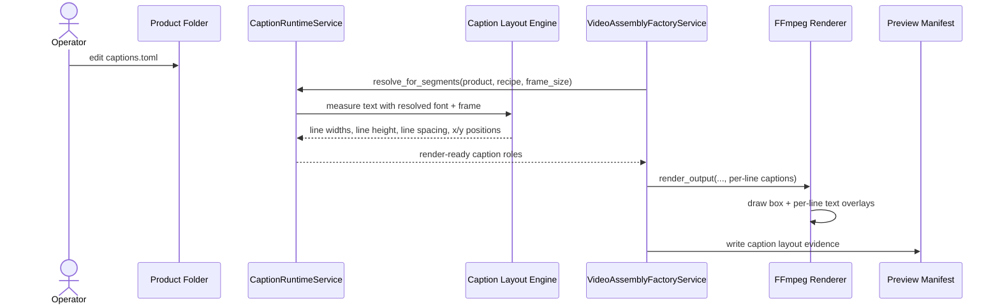

# Pixel-Based Caption Layout And Diversity Workflow 2026-06-14

This document is the SSOT for improving caption layout quality and per-run visual/caption diversity in MTClipFactory.

It complements [43_Product_Caption_Pool_And_Font_Workflow_2026-06-14.md](/F:/programming/python/MTClipFactory/doc/43_Product_Caption_Pool_And_Font_Workflow_2026-06-14.md), [46_Caption_Runtime_Metadata_And_Render_Workflow_2026-06-14.md](/F:/programming/python/MTClipFactory/doc/46_Caption_Runtime_Metadata_And_Render_Workflow_2026-06-14.md), and [47_Product_Local_Run_Artifacts_And_Fill_Policy_Workflow_2026-06-14.md](/F:/programming/python/MTClipFactory/doc/47_Product_Local_Run_Artifacts_And_Fill_Policy_Workflow_2026-06-14.md).

## Purpose

- replace character-count-only caption fitting with pixel-based text measurement
- let operators author `main` and `sub` captions that render more like production graphics and less like debug subtitles
- make `left`, `center`, and `right` alignment truthful for each line, not only for one whole multiline block
- increase per-recipe diversity for caption and visual selection without losing deterministic rerun behavior

## Problem Statement

The first delivered caption baseline was useful but still too approximate for production quality.

Observed issues:

- line breaking still leaned too heavily on `max_chars_per_line`
- multiline `drawtext` placement treated the caption as one block, which made per-line alignment less controllable
- line spacing was derived too simply from padding
- caption fit could still look awkward even when the review gate stayed truthful
- auto-mode visual selection was deterministic but not intentionally varied enough across recipes

## Core Decisions

1. Caption fit must be evaluated in pixels against the actual output frame, not only by character count.
2. Font size may be authored as pixels or points, but runtime rendering must resolve to pixels.
3. `main` and `sub` caption blocks should render one line at a time so alignment can be computed per line.
4. Caption layout should use a safe text region derived from frame width and role `max_width_ratio`.
5. Auto-mode selection should stay seed-aware and deterministic while still varying captions and visual clips across recipes.

## Font Size Truth

Operators may think in `pt`, but FFmpeg `drawtext` ultimately renders by pixel size.

Therefore the runtime should treat:

- `font_size_unit = "px"` as already render-ready
- `font_size_unit = "pt"` as `pixels = points * dpi / 72`

The default desktop DPI assumption for the first slice is `96`.

Example:

- `18pt` at `96 dpi` becomes about `24 px`

## Caption Measurement Rule

Caption measurement should use real font metrics from the resolved font family or file.

The runtime should compute at least:

- effective pixel font size
- line widths in pixels
- line height in pixels
- extra line spacing in pixels
- text-block width and height
- safe maximum text width from `frame_width * max_width_ratio`

## Alignment Rule

Horizontal alignment should be computed inside the safe text region, not against the whole frame edge.

Supported values:

- `left`
- `center`
- `right`

Rules:

- `left`: each line starts at the safe region left edge
- `center`: each line is centered independently inside the safe region
- `right`: each line ends at the safe region right edge

This means one multiline caption block may contain lines with different pixel widths while still looking visually centered or right-aligned line by line.

## Vertical Layout Rule

The role position still uses:

- `top`
- `center`
- `bottom`

But placement should now use the measured block height instead of only FFmpeg `text_h`.

Line spacing should be explicit and proportional to font size through role configuration such as `line_spacing_ratio`.

## Diversity Rule

Caption and visual selection should remain deterministic for reruns, but the seed should vary by recipe context so different recipes in one batch do not feel artificially locked to one repeated choice order.

The first slice should:

- keep caption pool selection seed-aware
- apply seeded variation to foreground and background asset order before recipe assignment or segment selection

## Reviewed Workflow

## Sequence Diagram

## Acceptance Criteria

- caption runtime can measure against frame width in pixels
- `font_size_unit` supports `px` and `pt`
- per-line alignment works for `left`, `center`, and `right`
- line spacing is explicit and proportional instead of implicit padding-only behavior
- manifest evidence shows pixel layout truth that can explain a render
- auto-mode visual selection stays deterministic but yields more varied recipe outputs across a batch

## Non-Goals For This Slice

- a full WYSIWYG caption editor
- animated typography beyond the current simple entry hooks
- kerning-accurate parity with every possible FFmpeg/font backend difference
