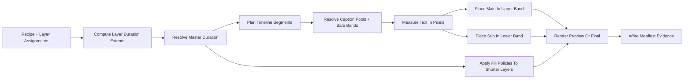
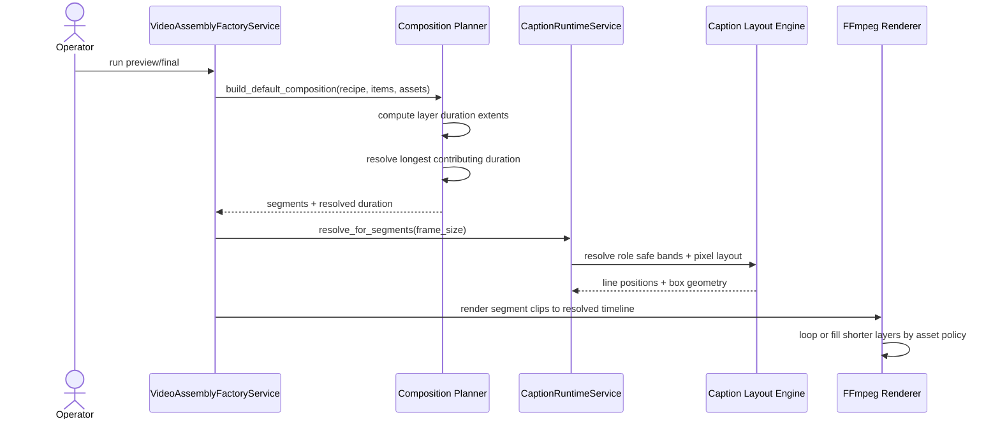

# Caption Safe Bands And Longest Layer Duration Workflow 2026-06-14

This document is the SSOT for the next quality pass on caption placement and master-duration resolution in MTClipFactory.

It complements [46_Caption_Runtime_Metadata_And_Render_Workflow_2026-06-14.md](/F:/programming/python/MTClipFactory/doc/46_Caption_Runtime_Metadata_And_Render_Workflow_2026-06-14.md), [47_Product_Local_Run_Artifacts_And_Fill_Policy_Workflow_2026-06-14.md](/F:/programming/python/MTClipFactory/doc/47_Product_Local_Run_Artifacts_And_Fill_Policy_Workflow_2026-06-14.md), and [49_Pixel_Based_Caption_Layout_And_Diversity_Workflow_2026-06-14.md](/F:/programming/python/MTClipFactory/doc/49_Pixel_Based_Caption_Layout_And_Diversity_Workflow_2026-06-14.md).

## Purpose

- stop default captions from landing in the presenter face or torso area
- make main and sub caption placement feel closer to operator-safe production graphics
- make clip duration resolution follow the longest contributing layer extent instead of a narrower single-source heuristic
- keep all shorter layers on policy-driven fill or loop behavior until the resolved timeline is complete

## Problem Statement

Observed problems from real auto-mode previews:

- default `main` caption placement can still sit too close to the center of the frame and visually fight the presenter subject
- `sub` caption blocks can look disconnected from the intended lower-third area
- current duration resolution still leans on `recipe.duration_sec` or `voiceover_total_duration` too early, which can under-represent longer visual or music source extents

## Core Decisions

1. Caption layout must use role-specific safe vertical bands, not one shared generic center region.
2. Default `main` captions should prefer an upper safe band, while default `sub` captions should prefer a lower safe band.
3. Operators may still override caption position and band ratios in `captions.toml`.
4. Master duration must resolve from the longest contributing layer extent.
5. Shorter layers must continue through existing asset-type fill policy until the resolved timeline ends.

## Caption Safe Band Rule

Each caption role may declare:

- `safe_top_ratio`
- `safe_bottom_ratio`

These ratios define the allowed vertical band for that role.

Placement rules:

- `position = "top"`: place the caption block at the top of the role safe band
- `position = "center"`: center the caption block inside the role safe band
- `position = "bottom"`: place the caption block at the bottom of the role safe band

Default operator-safe bands for the first production slice:

- `main`: upper band
- `sub`: lower band

This means the system default should behave more like a title card plus lower-third pairing than a generic screen-center subtitle.

## Duration Resolution Rule

The master clip duration must resolve from the longest contributing layer extent.

Layer extent rules:

- `primary_voice`: sum sequential voice tracks because they are intended to play in order
- `background_music`: sum sequential music tracks before loop policy is considered
- `background_visual`: use the maximum source duration from the candidate visual assets
- `product_focus_visual`: use the maximum source duration from the candidate visual assets
- other non-timeline-driving layers may contribute `0`

Resolved duration:

- if `recipe.duration_sec` is greater than the longest contributing layer extent, the recipe value may still remain the resolved duration
- otherwise the resolved duration must rise to the longest contributing layer extent

This keeps explicit operator intent valid while preventing the system from cutting off longer contributing media.

## Fill Continuation Rule

After the master duration is resolved:

- shorter visual layers continue by their configured fill policy such as `loop_to_segment`, `freeze_last_frame`, or `review_if_short`
- shorter music layers continue by their configured audio fill policy such as `loop_to_timeline`
- narration must remain non-looping unless the product policy is intentionally changed in a future approved design

## Reviewed Workflow

## Sequence Diagram

## Acceptance Criteria

- default `main` captions no longer land in the generic frame center when role properties are omitted
- default `sub` captions render in a lower-band pattern
- `captions.toml` can override role band ratios when needed
- composition duration reflects the longest contributing layer extent instead of only recipe-or-voice precedence
- shorter layer fill behavior remains manifest-visible and review-visible

