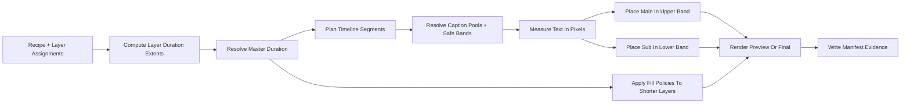
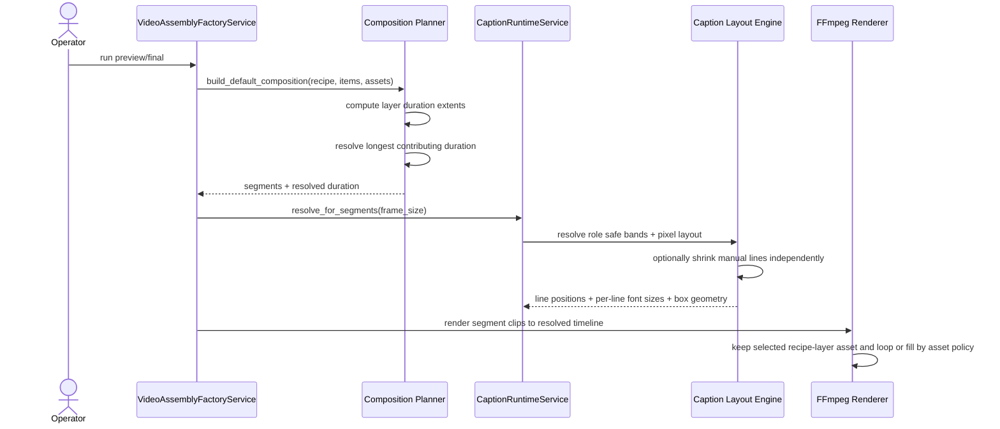

# Caption Safe Bands And Longest Layer Duration Workflow 2026-06-14

This document is the SSOT for the next quality pass on caption placement and master-duration resolution in MTClipFactory.

It complements [46_Caption_Runtime_Metadata_And_Render_Workflow_2026-06-14.md](/F:/programming/python/MTClipFactory/doc/46_Caption_Runtime_Metadata_And_Render_Workflow_2026-06-14.md), [47_Product_Local_Run_Artifacts_And_Fill_Policy_Workflow_2026-06-14.md](/F:/programming/python/MTClipFactory/doc/47_Product_Local_Run_Artifacts_And_Fill_Policy_Workflow_2026-06-14.md), and [49_Pixel_Based_Caption_Layout_And_Diversity_Workflow_2026-06-14.md](/F:/programming/python/MTClipFactory/doc/49_Pixel_Based_Caption_Layout_And_Diversity_Workflow_2026-06-14.md).

## Purpose

- stop default captions from landing in the presenter face or torso area
- make main and sub caption placement feel closer to operator-safe production graphics
- make clip duration resolution follow the longest contributing layer extent instead of a narrower single-source heuristic
- keep all shorter layers on policy-driven fill or loop behavior until the resolved timeline is complete

## Problem Statement

Observed problems from real auto-mode previews:

- default `main` caption placement can still sit too close to the center of the frame and visually fight the presenter subject
- `sub` caption blocks can look disconnected from the intended lower-third area
- current duration resolution still leans on `recipe.duration_sec` or `voiceover_total_duration` too early, which can under-represent longer visual or music source extents

## Core Decisions

1. Caption layout must use role-specific safe vertical bands, not one shared generic center region.
2. Default `main` captions should prefer an upper safe band, while default `sub` captions should prefer a lower safe band.
3. Operators may still override caption position and band ratios in `captions.toml`.
4. Master duration must resolve from the longest contributing layer extent.
5. Shorter layers must continue through existing asset-type fill policy until the resolved timeline ends.
6. One recipe should select one persistent visual asset per visual layer and let fill policy extend that asset through the whole resolved timeline instead of reselecting a different asset for each segment.
7. Manual multi-line captions may shrink font size per line when one line is materially longer than its neighbors.

## Caption Safe Band Rule

Each caption role may declare:

- `safe_top_ratio`
- `safe_bottom_ratio`

These ratios define the allowed vertical band for that role.

Placement rules:

- `position = "top"`: place the caption block at the top of the role safe band
- `position = "center"`: center the caption block inside the role safe band
- `position = "bottom"`: place the caption block at the bottom of the role safe band

Default operator-safe bands for the first production slice:

- `main`: upper band
- `sub`: lower band

This means the system default should behave more like a title card plus lower-third pairing than a generic screen-center subtitle.

## Line Balance Rule

Pixel-accurate measurement alone is not enough for professional-looking captions.

When one wrapped block produces a very short last line while the previous line is still very wide, the runtime should rebalance the wrapped lines when possible.

The first balancing slice should:

- prefer more even line widths for multi-line auto-wrap text
- avoid one-word or one-short-phrase orphan last lines when a balanced alternative exists
- stay width-safe against the role `max_width_ratio`

This especially matters for Thai marketing copy where phrases are often separated by spaces rather than long sentence punctuation.

## Per-Line Font Fit Rule

When the operator intentionally inserts manual `\n` line breaks, the runtime should treat each rendered line as an independent width-fit candidate.

Rules:

- each line starts from the role requested font size
- each line may shrink independently down to the role `min_font_size`
- shorter neighboring lines may remain larger than longer lines
- if one line still cannot fit at `min_font_size`, the role must remain overflow-visible and review-visible

This keeps operator-authored line grouping intact while making mixed-length title cards look more deliberate.

## Duration Resolution Rule

The master clip duration must resolve from the longest contributing layer extent.

Layer extent rules:

- `primary_voice`: sum sequential voice tracks because they are intended to play in order
- `background_music`: sum sequential music tracks before loop policy is considered
- `background_visual`: use the maximum source duration from the candidate visual assets
- `product_focus_visual`: use the maximum source duration from the candidate visual assets
- other non-timeline-driving layers may contribute `0`

Resolved duration:

- if `recipe.duration_sec` is greater than the longest contributing layer extent, the recipe value may still remain the resolved duration
- otherwise the resolved duration must rise to the longest contributing layer extent

This keeps explicit operator intent valid while preventing the system from cutting off longer contributing media.

## Fill Continuation Rule

After the master duration is resolved:

- shorter visual layers continue by their configured fill policy such as `loop_to_segment`, `freeze_last_frame`, or `review_if_short`
- shorter music layers continue by their configured audio fill policy such as `loop_to_timeline`
- narration must remain non-looping unless the product policy is intentionally changed in a future approved design

## Persistent Visual Layer Rule

For one rendered recipe:

- `background_visual` chooses one deterministic asset for the recipe
- `product_focus_visual` chooses one deterministic asset for the recipe
- timeline segments reuse those chosen assets
- segment fill mode determines whether the chosen asset trims, loops, freezes, or raises review

This prevents accidental per-segment asset swapping when the operator expectation is one presenter clip or one background clip extended across the full result timeline.

## Reviewed Workflow

## Sequence Diagram

## Acceptance Criteria

- default `main` captions no longer land in the generic frame center when role properties are omitted
- default `sub` captions render in a lower-band pattern
- `captions.toml` can override role band ratios when needed
- manual `\n` captions may produce different per-line font sizes when line widths differ materially
- composition duration reflects the longest contributing layer extent instead of only recipe-or-voice precedence
- shorter layer fill behavior remains manifest-visible and review-visible
- one recipe keeps the same selected foreground/background visual asset across all segments unless a future design explicitly introduces segment-level reselection
