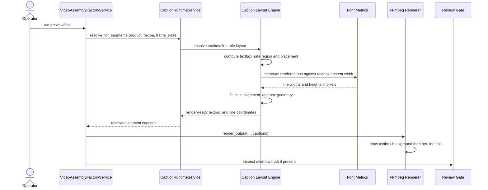

# Textbox Based Caption Layout Workflow 2026-06-15

This document is the SSOT for evolving MTClipFactory caption rendering from text-first placement into textbox-first layout.

It complements [43_Product_Caption_Pool_And_Font_Workflow_2026-06-14.md](/F:/programming/python/MTClipFactory/doc/43_Product_Caption_Pool_And_Font_Workflow_2026-06-14.md), [46_Caption_Runtime_Metadata_And_Render_Workflow_2026-06-14.md](/F:/programming/python/MTClipFactory/doc/46_Caption_Runtime_Metadata_And_Render_Workflow_2026-06-14.md), [49_Pixel_Based_Caption_Layout_And_Diversity_Workflow_2026-06-14.md](/F:/programming/python/MTClipFactory/doc/49_Pixel_Based_Caption_Layout_And_Diversity_Workflow_2026-06-14.md), and [50_Caption_Safe_Bands_And_Longest_Layer_Duration_Workflow_2026-06-14.md](/F:/programming/python/MTClipFactory/doc/50_Caption_Safe_Bands_And_Longest_Layer_Duration_Workflow_2026-06-14.md).

The textbox-first model is now paired with a solver-based fitting stage described in [52_Best_Fit_Caption_Solver_Workflow_2026-06-15.md](/F:/programming/python/MTClipFactory/doc/52_Best_Fit_Caption_Solver_Workflow_2026-06-15.md).

Advertisement-style `one line = one box` behavior is described in [53_Per_Line_Textbox_Caption_Workflow_2026-06-15.md](/F:/programming/python/MTClipFactory/doc/53_Per_Line_Textbox_Caption_Workflow_2026-06-15.md).

## Purpose

- make caption positioning easier to control by resolving a textbox first and text inside it second
- keep font measurement, line fitting, background box sizing, and final FFmpeg placement aligned to one shared geometry model
- reduce future caption rework by separating textbox placement policy from text alignment policy
- support more professional main/sub caption composition without introducing a full WYSIWYG editor

## Problem Statement

The current caption runtime already measures text in pixels, but the mental model still leans too heavily toward placing text directly and then expanding a background box around it.

Observed product risks:

- operators think in terms of one textbox or lower-third region, not only raw text coordinates
- centered text can still feel visually unstable when the background box width changes with every caption line
- textbox placement and text alignment are not yet modeled as first-class independent concerns
- future properties such as fixed lower-third width, left-anchored banners, or boxed CTA cards become harder if the runtime remains text-first

## Core Decisions

1. Caption layout must resolve a textbox geometry before line positions are finalized.
2. Text fitting must use the textbox content width, not only a shrinking text-derived box.
3. Textbox placement and text alignment must remain separate properties.
4. The runtime must measure actual rendered text in pixels from the resolved font face and pixel size.
5. Manual `\n` line breaks remain operator intent and should be preserved before any auto-wrap reshaping.
6. If text cannot fit within textbox constraints even at minimum size, the runtime must remain review-truthful instead of silently degrading output.

## Textbox Model

Each caption role should conceptually resolve:

- textbox left
- textbox top
- textbox width
- textbox height
- content left
- content top
- content width
- content height
- padding
- text alignment inside the textbox
- vertical alignment inside the textbox

The textbox is the renderable caption region. Text is then fitted inside the textbox content region.

## Measurement Rule

The runtime must not estimate width from character count.

It must:

1. resolve the effective font file or font family
2. convert requested size into pixels
3. measure the actual rendered line width and line height with font metrics
4. compare measured width against textbox content width
5. select the largest font size that still fits policy bounds

This is especially important for Thai because combining marks and different glyph widths make character-count estimation unreliable.

## Text Fitting Rule

### Manual Line Mode

When source text includes manual `\n`:

- preserve the authored lines
- attempt fit from requested size downward
- allow each line to shrink independently within policy bounds
- keep shorter lines larger when they can safely remain larger
- if any line still exceeds content width at `min_font_size`, keep overflow visible to the review gate

### Auto Wrap Mode

When source text does not include manual `\n`:

- wrap text to textbox content width
- rebalance lines when a less awkward distribution exists
- reduce block size only when approved by overflow policy
- preserve review visibility when a safe fit still cannot be achieved

## Placement Rule

Textbox placement uses two separate ideas:

### Textbox Alignment In Frame

The textbox itself may be placed:

- `left`
- `center`
- `right`

inside the safe horizontal region for that role.

### Text Alignment Inside Textbox

The text inside the textbox may independently be:

- `left`
- `center`
- `right`

This allows designs such as:

- centered lower-third box with left-aligned text
- full-width top title box with centered text
- right-anchored promo badge with right-aligned text

### Vertical Alignment Inside Textbox

The text block inside the textbox may independently be:

- `top`
- `middle`
- `bottom`

This matters when the textbox height is intentionally larger than the text height, such as:

- centered title cards with breathing room above and below
- lower-third panels where text should sit near the bottom edge
- reusable caption boxes that keep one stable height across multiple caption choices

## Background Box Rule

If background is enabled:

- the renderable background box should use resolved textbox geometry
- the box should not collapse to the measured text width only
- text should render inside the box content area after padding is applied

This gives operators more visually stable caption cards across different line lengths.

## Runtime Contract Rule

The first textbox-based slice should add explicit runtime support for:

- `textbox_width_ratio`
- `textbox_height_ratio`
- `textbox_alignment`
- `vertical_alignment`
- `textbox_mode`

while keeping older contracts backward compatible:

- if `textbox_width_ratio` is missing, the runtime may fall back to `max_width_ratio`
- if `textbox_height_ratio` is missing or `0`, the runtime may use fit-content box height
- if `textbox_height_ratio` is greater than `0`, the runtime should treat it as the target textbox height and let the best-fit solver reduce caption size to fit when possible
- if `textbox_alignment` is missing, default to `center`
- if `vertical_alignment` is missing, default to `top`
- if `textbox_mode` is missing, default to `grouped`

## Reviewed Workflow

## Sequence Diagram

## Acceptance Criteria

- caption layout resolves a textbox before final line placement
- background box width can remain stable even when line widths vary
- textbox placement and text alignment are independent
- text fitting uses real pixel measurement against textbox content width
- manual `\n` captions preserve line grouping while fitting each line safely
- manifest evidence can explain textbox geometry and per-line fit decisions

## Non-Goals For This Slice

- full drag-and-drop caption editing
- animation timeline authoring
- multi-box caption choreography in one role
- rich vector layout primitives beyond the current FFmpeg text and box path
