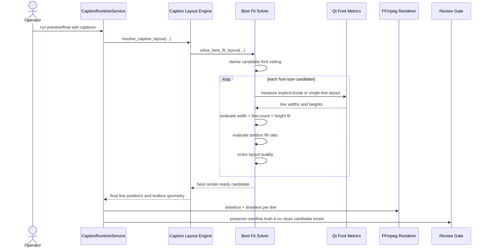

# Best Fit Caption Solver Workflow 2026-06-15

This document is the SSOT for the solver-based caption fitting model introduced after the textbox-first caption layout slice.

It complements [43_Product_Caption_Pool_And_Font_Workflow_2026-06-14.md](/F:/programming/python/MTClipFactory/doc/43_Product_Caption_Pool_And_Font_Workflow_2026-06-14.md), [49_Pixel_Based_Caption_Layout_And_Diversity_Workflow_2026-06-14.md](/F:/programming/python/MTClipFactory/doc/49_Pixel_Based_Caption_Layout_And_Diversity_Workflow_2026-06-14.md), [50_Caption_Safe_Bands_And_Longest_Layer_Duration_Workflow_2026-06-14.md](/F:/programming/python/MTClipFactory/doc/50_Caption_Safe_Bands_And_Longest_Layer_Duration_Workflow_2026-06-14.md), and [51_Textbox_Based_Caption_Layout_Workflow_2026-06-15.md](/F:/programming/python/MTClipFactory/doc/51_Textbox_Based_Caption_Layout_Workflow_2026-06-15.md).

## Purpose

- replace heuristic caption shrink behavior with a candidate-based best-fit solver
- make font-size selection consider textbox width, textbox height, line count, and line balance together
- let the solver grow captions above the requested font size when that is needed to achieve a stronger textbox fill ratio without overflow
- improve professional quality for main/sub captions without forcing operators into manual pixel editing
- preserve review truth when the text still cannot fit safely

## Problem Statement

The prior caption runtime already measured text in pixels, but it still behaved mainly like:

1. choose one font size
2. wrap the text
3. shrink only if obvious overflow happens

That model was not strong enough for production quality because it could still:

- accept weak line breaks that technically fit but look awkward
- miss textbox-height pressure when a fixed-height textbox is used
- keep too much empty space in some candidates even though a larger safe font size exists
- make manual line-break captions look uneven without scoring the whole block

## Core Decisions

1. Caption fitting must evaluate multiple font-size candidates, not only one live attempt.
2. The solver must score candidates using both hard-fit rules and soft layout quality signals.
3. Hard-fit validation must include width overflow, line-count overflow, and height overflow inside the textbox content area.
4. Manual `\n` remains operator intent, and only explicit breaks may create multiple rendered lines.
5. Requested font size is a preferred starting point, not a hard ceiling.
6. When no explicit break exists, the solver must keep a single rendered line and search for the strongest safe textbox fill instead of auto-wrapping.
7. The selected candidate should maximize safe textbox occupancy, then prefer the most balanced layout among near-equivalent candidates.

## Solver Inputs

The best-fit solver must consider:

- source text
- resolved font file or family
- requested font size
- candidate font ceiling derived from textbox width and safe content height
- minimum font size
- textbox content width
- textbox height policy
- padding
- line spacing ratio
- safe-band height limits
- max lines
- overflow policy
- explicit-break mode versus single-line best-fit mode

## Hard-Fit Rules

A candidate is not considered clean when any of these are true:

- authored line count exceeds `max_lines`
- any rendered line still exceeds textbox content width
- text block height exceeds textbox content height
- runtime truncation was required

When a candidate is not clean, the review gate must still see that truth.

## Soft Scoring Rules

Among candidates that are clean, the solver should prefer:

1. stronger width occupancy inside the textbox
2. better multi-line balance
3. lower unnecessary whitespace
4. lower per-line font variance unless the variance was needed to fit authored manual lines
5. less unnecessary distance from the requested operator size when visual quality is otherwise similar

## Solver Workflow

## Sequence Diagram

## Acceptance Criteria

- the runtime chooses from multiple candidate font sizes instead of one-pass shrink logic
- the runtime may grow above the requested font size when the textbox would otherwise be visibly underfilled
- fixed-height textboxes can trigger height-aware downscaling
- manual line-break captions may keep different font sizes per line when needed to fit
- captions without `\n` stay single-line and use best-fit sizing instead of automatic wrapping
- the chosen layout improves width occupancy and balance over naive fit-only behavior
- pytest coverage verifies both width-fit and height-fit behavior

## Non-Goals For This Slice

- full design-template authoring
- animated text collision avoidance
- kerning customization per glyph
- semantic rewriting of caption copy
