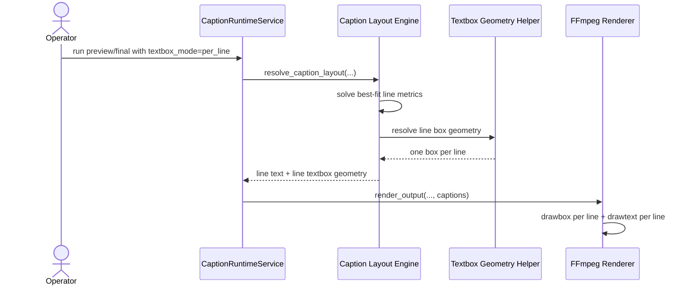

# Per Line Textbox Caption Workflow 2026-06-15

This document is the SSOT for advertisement-style captions that render each authored line inside its own textbox.

It complements [43_Product_Caption_Pool_And_Font_Workflow_2026-06-14.md](/F:/programming/python/MTClipFactory/doc/43_Product_Caption_Pool_And_Font_Workflow_2026-06-14.md), [51_Textbox_Based_Caption_Layout_Workflow_2026-06-15.md](/F:/programming/python/MTClipFactory/doc/51_Textbox_Based_Caption_Layout_Workflow_2026-06-15.md), and [52_Best_Fit_Caption_Solver_Workflow_2026-06-15.md](/F:/programming/python/MTClipFactory/doc/52_Best_Fit_Caption_Solver_Workflow_2026-06-15.md).

## Purpose

- let operators produce more interesting, ad-like captions without manual pixel editing
- support one authored line per textbox for stronger rhythm, emphasis, and visual hierarchy
- keep this mode deterministic, testable, and auditable in manifests
- preserve backward compatibility with grouped textbox captions

## Problem Statement

Grouped textboxes are stable and useful, but they do not always create the most persuasive ad composition.

For short hook-driven captions, operators often want:

- one short phrase per box
- tighter visual focus around each phrase
- a more premium lower-third or mid-frame card treatment
- stronger perceived emphasis from line to line

## Core Decisions

1. Caption contracts must support both `grouped` and `per_line` textbox modes.
2. `grouped` remains the backward-compatible default.
3. `per_line` means each rendered line receives its own background box.
4. Line text should still use the resolved font metrics and best-fit solver before box geometry is finalized.
5. The renderer must emit one `drawbox` per line in `per_line` mode and one shared `drawbox` in `grouped` mode.

## Contract Rule

Each caption role may now declare:

- `textbox_mode = "grouped"`
- `textbox_mode = "per_line"`

Recommended use:

- `main` caption: often `per_line`
- `sub` caption: often `grouped`

## Layout Rule

When `textbox_mode = "per_line"`:

1. the role still resolves one outer textbox region for placement, safe band, and vertical alignment
2. line positions are resolved inside that region
3. each line then receives its own textbox using:
   - `line_box_left = line_left - padding`
   - `line_box_top = line_top - padding`
   - `line_box_width = line_width + padding * 2`
   - `line_box_height = line_height + padding * 2`

This creates tighter emphasis around each phrase while keeping the whole caption block aligned and readable.

## Advertising UX Rationale

Per-line textboxes are useful for:

- hooks
- benefit stacks
- CTA phrasing
- short product claims

They help the output feel more like a designed ad and less like plain subtitles.

## Workflow

## Sequence Diagram

## Acceptance Criteria

- caption contracts can choose `grouped` or `per_line`
- per-line mode returns one textbox geometry record per rendered line
- FFmpeg render path emits one `drawbox` per line in per-line mode
- grouped mode behavior stays unchanged
- pytest covers runtime geometry and renderer command generation for per-line mode
