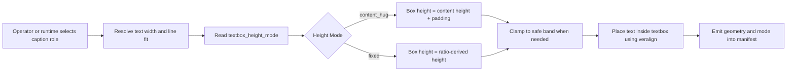
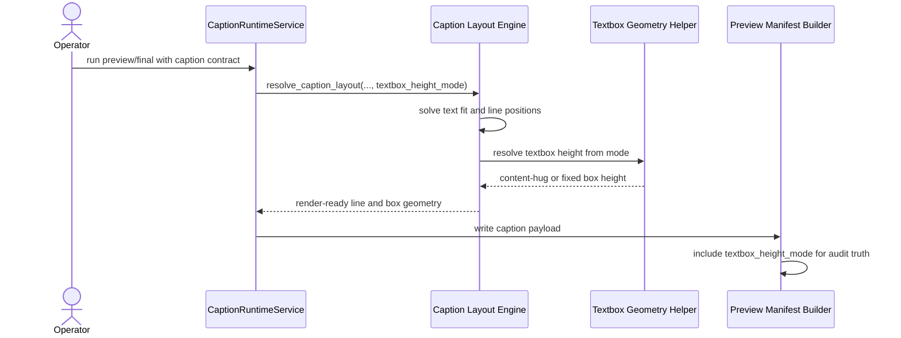

# Textbox Height Mode And Promo Card Workflow 2026-06-15

This document is the SSOT for caption textbox height policy after the best-fit width solver exposed a remaining UX gap: text could fill width well but the background card could still look unprofessional because its height was either too tall or too rigid.

It complements [51_Textbox_Based_Caption_Layout_Workflow_2026-06-15.md](/F:/programming/python/MTClipFactory/doc/51_Textbox_Based_Caption_Layout_Workflow_2026-06-15.md), [52_Best_Fit_Caption_Solver_Workflow_2026-06-15.md](/F:/programming/python/MTClipFactory/doc/52_Best_Fit_Caption_Solver_Workflow_2026-06-15.md), and [53_Per_Line_Textbox_Caption_Workflow_2026-06-15.md](/F:/programming/python/MTClipFactory/doc/53_Per_Line_Textbox_Caption_Workflow_2026-06-15.md).

## Purpose

- let grouped caption cards feel more like ad graphics and less like oversized subtitle panels
- separate `text fit` from `box height policy` so operators and automation can reason about them independently
- preserve the ability to intentionally request tall design cards when needed
- keep the runtime behavior deterministic, testable, and visible in manifests

## Problem Statement

The prior textbox runtime had a hidden coupling:

1. operators chose `textbox_height_ratio`
2. runtime treated that ratio as the literal textbox height
3. text then fit inside whatever height was left

That caused a real UX problem:

- width fit could be good while the card still looked too tall
- short one-line `main` or `sub` captions often sat inside boxes with excessive empty vertical space
- operators had to keep adjusting `padding`, `vertical_alignment`, and `textbox_height_ratio` together just to get one visually acceptable result
- the system had no explicit policy seam for `hug content` versus `reserve design space`

## Core Decisions

1. Caption contracts must now support `textbox_height_mode`.
2. Allowed values are:
   - `content_hug`
   - `fixed`
3. `content_hug` becomes the default because promo-style captions usually look better when the card wraps the content height closely.
4. `fixed` preserves the older explicit-height behavior for deliberate tall-card layouts.
5. When `textbox_height_mode = "content_hug"`, textbox height is resolved from text block height plus padding and is not forced to the configured ratio.
6. When `textbox_height_mode = "fixed"`, `textbox_height_ratio` remains the controlling height contract and overflow truth must still be preserved.
7. Manifest payloads must include `textbox_height_mode` so post-run audit can explain why a card looked compact or tall.

## Contract Rule

Each caption role may now declare:

- `textbox_height_mode = "content_hug"`
- `textbox_height_mode = "fixed"`

Recommended use:

- `main` short hook cards: usually `content_hug`
- `sub` CTA cards: usually `content_hug`
- title areas that intentionally reserve visual space: `fixed`

## Layout Rule

When `textbox_height_mode = "content_hug"`:

1. resolve the text layout first
2. compute `text_block_height_px`
3. resolve `box_height_px = text_block_height_px + padding * 2`
4. clamp only to safe-band availability when necessary

When `textbox_height_mode = "fixed"`:

1. resolve the configured `textbox_height_ratio`
2. convert it to pixels
3. clamp to the safe band
4. let content overflow truth surface through review signals if the text cannot fit

## UX Rationale

`content_hug` is the better default for ad-like output because it:

- reduces wasted vertical space
- increases perceived intentionality
- makes main/sub hierarchy cleaner
- avoids the look of a generic subtitle slab

`fixed` remains necessary when designers or operators intentionally want:

- a consistent lower-third block height
- a tall center card
- a branded text area that must visually match a template

## Workflow

## Sequence Diagram

## Acceptance Criteria

- grouped captions default to `content_hug`
- fixed-height behavior remains available via `textbox_height_mode = "fixed"`
- manifest payloads expose `textbox_height_mode`
- pytest locks both compact-card and fixed-height behaviors
- operators no longer need to misuse padding or vertical alignment just to make a short card look compact

## Non-Goals For This Slice

- full design-template theming
- animated textbox reveals
- automatic brand-style selection
- semantic rewriting of caption text
