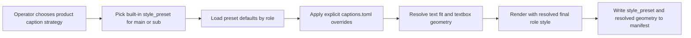
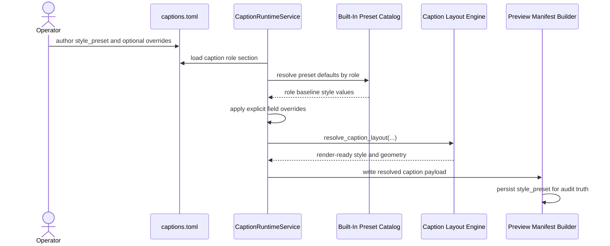

# Caption Style Preset Workflow 2026-06-15

This document is the SSOT for operator-friendly caption style presets in MTClipFactory.

It complements [43_Product_Caption_Pool_And_Font_Workflow_2026-06-14.md](/F:/programming/python/MTClipFactory/doc/43_Product_Caption_Pool_And_Font_Workflow_2026-06-14.md), [52_Best_Fit_Caption_Solver_Workflow_2026-06-15.md](/F:/programming/python/MTClipFactory/doc/52_Best_Fit_Caption_Solver_Workflow_2026-06-15.md), [53_Per_Line_Textbox_Caption_Workflow_2026-06-15.md](/F:/programming/python/MTClipFactory/doc/53_Per_Line_Textbox_Caption_Workflow_2026-06-15.md), and [54_Textbox_Height_Mode_And_Promo_Card_Workflow_2026-06-15.md](/F:/programming/python/MTClipFactory/doc/54_Textbox_Height_Mode_And_Promo_Card_Workflow_2026-06-15.md).

## Purpose

- reduce operator effort when choosing caption styling for common ad patterns
- avoid repeated manual tuning of the same role properties for every new product
- keep caption styling deterministic, auditable, and easy to override
- create a first reusable style catalog for automation-oriented promo output

## Problem Statement

The caption runtime already supports many style fields, but asking operators to tune them all product by product creates friction:

1. choose caption copy
2. choose font
3. choose textbox mode
4. choose width and height policy
5. choose color and emphasis settings
6. test and retune again

That is too much manual design work for routine automation. It also leads to inconsistent output quality across products.

## Core Decisions

1. Caption contracts must support a built-in `style_preset` field inside each role style block.
2. Presets are runtime-known named bundles of role-specific defaults.
3. A preset may define different defaults for `main` and `sub`.
4. Explicit role fields in `captions.toml` always override preset defaults.
5. Presets are only convenience defaults, not locked templates.
6. Manifest payloads must expose the resolved `style_preset` so the output can be audited later.
7. Presets may also carry textbox border defaults so ad-card emphasis stays consistent without per-product retuning.
8. Presets may also carry `preferred_line_count` so promo headlines can prefer `2 lines` before growing into a taller stack.

## Contract Rule

Each role may now declare:

- `style_preset = "sale_blast"`
- `style_preset = "clean_cta"`
- `style_preset = "benefit_stack"`

Example:

```toml
[caption_properties.main]
style_preset = "sale_blast"
font_family = "TH Baijam"

[caption_properties.sub]
style_preset = "sale_blast"
position = "bottom"
```

In that model:

- the preset fills in the baseline style defaults
- explicit fields still win when the operator needs product-specific adjustment

## Built-In Preset Catalog

### `sale_blast`

Use when the clip needs aggressive promotion energy.

Recommended feel:

- bold sale hook
- compact high-contrast promo card
- strong main headline
- short urgent supporting sub line

### `clean_cta`

Use when the clip needs a cleaner CTA feel with less visual aggression.

Recommended feel:

- simpler grouped cards
- balanced spacing
- readable, lower-drama contrast
- better fit for educational or premium product messaging

### `benefit_stack`

Use when the clip needs stacked benefit phrasing rather than one explosive hook.

Recommended feel:

- `main` often benefits from `per_line`
- supporting `sub` remains grouped
- stronger support for multi-line benefit rhythm

## Override Rule

Explicit values in `[caption_properties.<role>]` must override preset defaults field by field.

That means the operator can do:

```toml
[caption_properties.main]
style_preset = "sale_blast"
textbox_mode = "grouped"
padding = 24
```

and the runtime must:

1. load `sale_blast`
2. apply its defaults
3. replace only the fields explicitly authored in the role section

## Workflow



## Sequence Diagram



## Acceptance Criteria

- each caption role can opt into a named built-in preset
- explicit role fields override preset defaults
- invalid preset names fail truthfully during caption contract validation
- manifest payloads expose the chosen `style_preset`
- pytest locks preset application and override behavior

## Non-Goals For This Slice

- user-authored custom preset files
- visual theme editor UI
- animated preset timelines
- brand-pack inheritance
