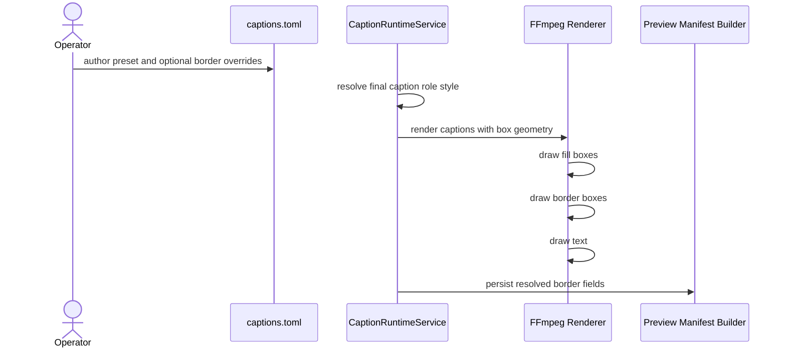

# Caption Box Border Workflow 2026-06-15

This document is the SSOT for caption box border styling in MTClipFactory.

It complements [54_Textbox_Height_Mode_And_Promo_Card_Workflow_2026-06-15.md](/F:/programming/python/MTClipFactory/doc/54_Textbox_Height_Mode_And_Promo_Card_Workflow_2026-06-15.md) and [55_Caption_Style_Preset_Workflow_2026-06-15.md](/F:/programming/python/MTClipFactory/doc/55_Caption_Style_Preset_Workflow_2026-06-15.md).

## Purpose

- make caption cards look more deliberate and ad-like
- support high-contrast promo cards without custom one-off renderer hacks
- let presets express stronger visual hierarchy through border treatment
- keep border styling deterministic, auditable, and overrideable

## Problem Statement

The runtime already supported text color, stroke, fill color, and fill opacity, but that still left a design gap:

1. caption cards could have good text fit
2. caption cards could have compact height
3. but the card itself could still look flat or unfinished

In ad-style output, border treatment often carries a lot of the perceived emphasis.

## Core Decisions

1. Caption role styles must support:
   - `box_border_color`
   - `box_border_opacity`
   - `box_border_width`
2. Border styling applies to both `grouped` and `per_line` textbox modes.
3. Border rendering must be independent from fill rendering so border-only cards remain possible.
4. Explicit role fields still override preset-provided border defaults.
5. Manifest payloads must expose the resolved border styling for audit truth.

## Contract Rule

Each caption role may now declare:

```toml
box_border_color = "#FFD447"
box_border_opacity = 0.96
box_border_width = 4
```

Recommended meanings:

- `box_border_color`: visual accent color for the card edge
- `box_border_opacity`: alpha for the border only
- `box_border_width`: FFmpeg `drawbox` thickness in pixels

## Rendering Rule

When a caption box is rendered:

1. render fill first when `background_color` and `background_opacity` are active
2. render border second when `box_border_color`, `box_border_opacity`, and `box_border_width` are active
3. for `per_line` mode, apply that same sequence to each line box individually

This preserves predictable layering and avoids the border being hidden by the fill.

## Workflow


## Sequence Diagram



## Acceptance Criteria

- grouped caption cards can render visible borders
- per-line caption cards can render visible borders
- border-only styling works without requiring a filled background
- preset defaults can carry border styling
- manifest payloads expose resolved border values
- pytest locks grouped and per-line border command generation

## Non-Goals For This Slice

- angled borders
- shadow rendering around the box
- gradient borders
- decorative stickers or accent stripes
