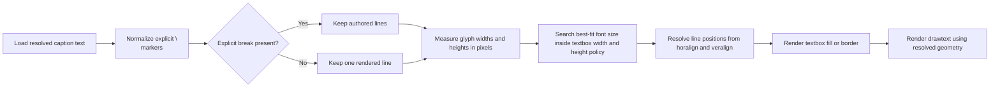
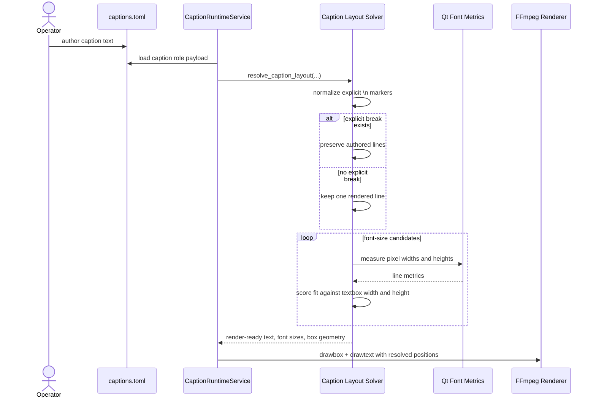

# Explicit Line Break And Box Aware Caption Composition Workflow 2026-06-15

This document is the SSOT for the explicit line-break caption policy and box-aware best-fit composition model in MTClipFactory.

It complements [43_Product_Caption_Pool_And_Font_Workflow_2026-06-14.md](/F:/programming/python/MTClipFactory/doc/43_Product_Caption_Pool_And_Font_Workflow_2026-06-14.md), [52_Best_Fit_Caption_Solver_Workflow_2026-06-15.md](/F:/programming/python/MTClipFactory/doc/52_Best_Fit_Caption_Solver_Workflow_2026-06-15.md), and [56_Caption_Box_Border_Workflow_2026-06-15.md](/F:/programming/python/MTClipFactory/doc/56_Caption_Box_Border_Workflow_2026-06-15.md).

## Purpose

- stop the runtime from making awkward automatic line breaks
- keep operator authorship simple and explicit
- make caption cards fill their textbox more professionally through pixel-based font fitting
- preserve deterministic, auditable caption layout decisions for preview and final render

## Core Decisions

1. The runtime must only render multiple caption lines when the source text contains explicit `\n`.
2. If no explicit `\n` exists, the runtime must keep one rendered line and solve the best fitting font size inside the textbox.
3. Caption fit must use real pixel metrics from the resolved font face and chosen font size.
4. Horizontal alignment controls text placement inside the textbox, not whether the runtime invents extra lines.
5. Manual multi-line captions may still use different font sizes per line when needed to fit safely.
6. If a caption cannot fit inside the allowed width and height at minimum size, the render must stay reviewable instead of silently reauthoring the text.

## Composition Rule

The composition engine should now treat caption text like this:

1. normalize escaped `\n` into real line breaks
2. if at least one explicit break exists, keep those authored lines
3. if no explicit break exists, keep one rendered line
4. measure the line or lines in pixels with the resolved font
5. search for the largest safe font size that fits the textbox width and height policy
6. place the resulting text inside the textbox using `alignment` and `vertical_alignment`

## Why This Policy Exists

Auto-wrap can make ad captions look indecisive:

- one orphan word may fall onto its own line
- the main hook may lose emphasis because the runtime guessed a weak break point
- a box may look underfilled even though a larger single-line font would have worked

Explicit breaks preserve creative intent, while single-line best fit keeps short and medium hooks visually strong.

## Workflow

## Sequence Diagram

## Acceptance Criteria

- captions without `\n` stay single-line in runtime output
- captions with explicit `\n` preserve authored line boundaries
- single-line captions grow or shrink to improve textbox occupancy without overflowing
- manual multi-line captions may use per-line font sizes when that is needed to fit width safely
- manifest-visible line-break and fit-strategy fields remain truthful
- pytest locks explicit-break and single-line best-fit behavior

## Non-Goals For This Slice

- semantic rewriting of weak marketing copy
- automatic headline/subheadline generation
- language-aware phrase splitting without operator-authored `\n`
- animated per-word typography
