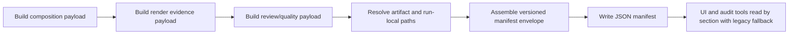
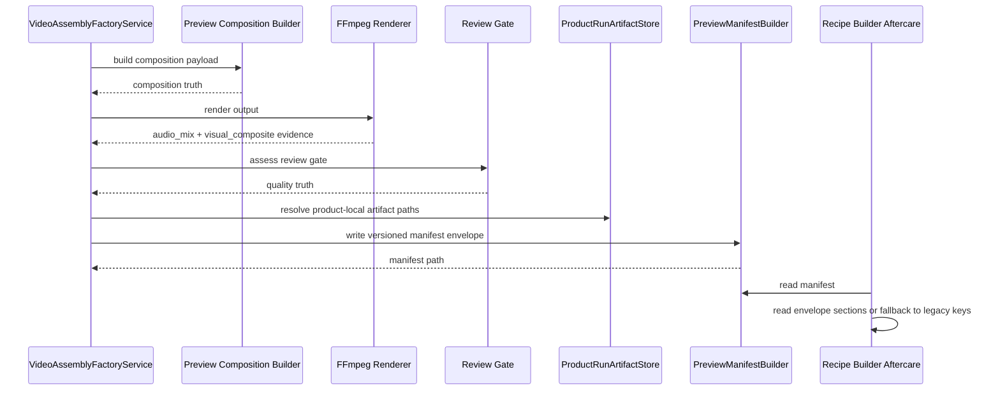

# Versioned Manifest Envelope Workflow 2026-06-15

This document is the SSOT for the versioned manifest envelope architecture in MTClipFactory.

It complements [47_Product_Local_Run_Artifacts_And_Fill_Policy_Workflow_2026-06-14.md](/F:/programming/python/MTClipFactory/doc/47_Product_Local_Run_Artifacts_And_Fill_Policy_Workflow_2026-06-14.md), [46_Caption_Runtime_Metadata_And_Render_Workflow_2026-06-14.md](/F:/programming/python/MTClipFactory/doc/46_Caption_Runtime_Metadata_And_Render_Workflow_2026-06-14.md), and [35_Production_Order_And_Orchestration_Workflow_2026-06-13.md](/F:/programming/python/MTClipFactory/doc/35_Production_Order_And_Orchestration_Workflow_2026-06-13.md).

## Purpose

- stop the manifest format from growing as one large untyped payload blob
- make preview and final manifests structurally predictable for operators, tests, and future tools
- preserve backward-safe reading while allowing the project to evolve new evidence sections without breaking consumers
- align product-local run artifacts, render evidence, and quality/review truth under one versioned contract

## Problem Statement

The current manifest shape works, but it has design debt:

1. feature sections were appended directly at the top level over time
2. there is no explicit schema version or manifest kind field
3. UI readers and future tooling have to infer structure from ad hoc keys
4. run-local artifacts, render outputs, and quality evidence are related but not grouped clearly

This makes expansion risky, especially now that captions, visual compositing, run journals, review gates, and automation traces all matter.

## Core Decisions

1. Every newly written manifest must carry an explicit schema envelope.
2. The envelope must expose `schema_name`, `schema_version`, and `manifest_kind`.
3. Manifest content must be organized by stable top-level sections:
   - `manifest_meta`
   - `artifact`
   - `run`
   - `composition`
   - `render`
   - `quality`
4. Existing UI readers must remain backward-safe by reading either the new envelope or the older flat payload shape.
5. The first manifest-envelope slice may retain selected legacy top-level aliases for operational safety, but the new sectioned contract becomes SSOT for all future additions.

## Target Top-Level Shape

```json
{
  "manifest_meta": {
    "schema_name": "mtclipfactory_manifest",
    "schema_version": "2.0",
    "manifest_kind": "preview_render",
    "generated_at_utc": "2026-06-15T10:00:00Z"
  },
  "artifact": {
    "product_code": "biothentic0001",
    "recipe_code": "biothentic0001_batch_001",
    "stage_name": "preview",
    "target_platform": "tiktok",
    "target_ratio": "9:16",
    "output_path": ".../previews/videos/....mp4",
    "manifest_path": ".../manifests/....json"
  },
  "run": {
    "batch_code": "biothentic0001_live_preview_20260615_1",
    "product_local": true,
    "run_root": ".../runs/biothentic0001_live_preview_20260615_1",
    "journal_path": ".../journal.toml",
    "order_snapshot_path": ".../order_snapshot.toml"
  },
  "composition": {
    "plan": {},
    "segments": [],
    "segment_inventory": {},
    "items": [],
    "fill_policy": {},
    "captions": {}
  },
  "render": {
    "audio_mix": {},
    "visual_composite": {}
  },
  "quality": {
    "review_gate": {}
  }
}
```

## Section Responsibilities

### `manifest_meta`

Holds contract identity:

- schema name
- schema version
- manifest kind such as `preview_render` or `final_render`
- generation timestamp

### `artifact`

Holds output identity:

- product code
- recipe code
- stage name
- output path
- manifest path
- target platform and ratio

### `run`

Holds batch-local execution context:

- batch code
- whether the artifact is product-local
- product-local run root
- journal path
- order snapshot path

### `composition`

Holds input and planning truth:

- composition plan summary
- recipe items used
- segment selection results
- segment-inventory summary and segment-formula evidence
- fill-policy evidence
- resolved caption evidence

### `render`

Holds render-engine evidence:

- audio-mix truth
- visual-composite truth

### `quality`

Holds review and quality signals:

- review gate summary
- duplicate risk
- quality score
- review signals and metrics

## Workflow



## Sequence Diagram



## Acceptance Criteria

- newly written preview and final manifests include `manifest_meta.schema_version`
- newly written manifests expose stable section names for artifact, run, composition, render, and quality evidence
- existing UI readers can still read older manifests without the new envelope
- pytest locks the new envelope shape and backward-safe reads
- product-local run artifacts can explain output path, manifest path, journal path, and snapshot path from the manifest alone

## Non-Goals For This Slice

- external JSON schema publishing
- manifest database normalization
- replacing `journal.toml` with JSON
- historical backfill rewrite of every old manifest on disk
