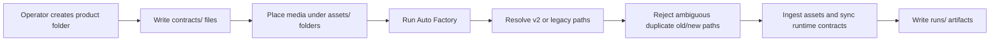
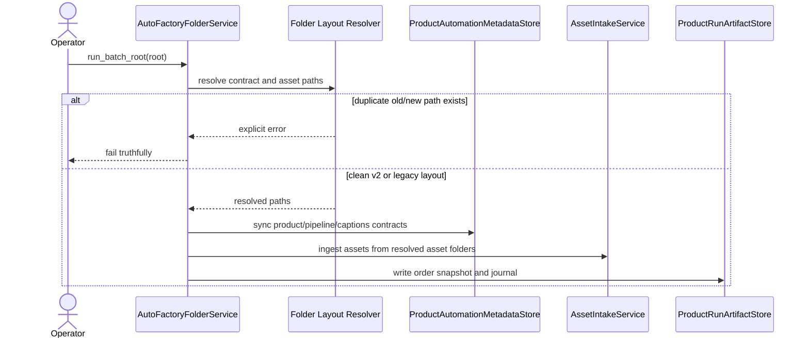

# Product Folder V2 Backward Compatible Layout Workflow 2026-06-15

This document is the SSOT for the recommended product-folder v2 layout and its backward-compatible ingestion behavior in MTClipFactory.

It complements [42_New_Product_Auto_Factory_Template_Kit_2026-06-14.md](/F:/programming/python/MTClipFactory/doc/42_New_Product_Auto_Factory_Template_Kit_2026-06-14.md), [47_Product_Local_Run_Artifacts_And_Fill_Policy_Workflow_2026-06-14.md](/F:/programming/python/MTClipFactory/doc/47_Product_Local_Run_Artifacts_And_Fill_Policy_Workflow_2026-06-14.md), and [58_Versioned_Manifest_Envelope_Workflow_2026-06-15.md](/F:/programming/python/MTClipFactory/doc/58_Versioned_Manifest_Envelope_Workflow_2026-06-15.md).

## Purpose

- give operators a cleaner and more scalable product-folder structure
- separate source contracts from source assets and from runtime-generated artifacts
- preserve support for older product folders so live products do not need a disruptive migration
- fail truthfully when a product folder mixes duplicate old and new paths that would create ambiguity

## Core Decisions

1. The recommended product-folder layout now uses `contracts/` and `assets/`.
2. The runtime must remain backward-compatible with the legacy root-level layout.
3. A product folder may use either old paths or new paths for a given contract or asset-type folder.
4. If both old and new paths exist for the same logical location, the runtime must fail truthfully instead of guessing.
5. `runs/` remains the runtime-owned output area and must stay outside `contracts/` and `assets/`.

## Recommended V2 Layout

```text
ProductA/
  contracts/
    product.toml
    pipeline.toml
    captions.toml
    prod_detail.txt
  assets/
    foreground/
      tags.toml
      *.mp4
    background/
      tags.toml
      *.mp4
    music/
      tags.toml
      *.mp3
    voice/
      tags.toml
      *.mp3
  refs/
    brief.md
    notes.md
  runs/
    <batch_code>/
      previews/
      finals/
      manifests/
      logs/
      journal.toml
      order_snapshot.toml
```

## Legacy Layout Still Supported

The runtime must still accept:

```text
ProductA/
  product.toml
  pipeline.toml
  captions.toml
  foreground/
  background/
  music/
  voice/
  runs/
```

## Resolution Rules

### Contract Resolution

Logical contract files:

- `product.toml`
- `pipeline.toml`
- `captions.toml`

Resolution order:

1. `contracts/<name>`
2. legacy root `<name>`

Safety rule:

- if both `contracts/<name>` and root `<name>` exist for the same contract, fail with an explicit folder-contract error

### Asset Folder Resolution

Logical asset folders:

- `foreground`
- `background`
- `music`
- `voice`

Resolution order:

1. `assets/<folder_name>/`
2. legacy root `<folder_name>/`

Safety rule:

- if both `assets/<folder_name>/` and root `<folder_name>/` exist, fail with an explicit folder-contract error

## Why This Layout Is Better

- operators can immediately distinguish editable source contracts from media payloads
- future contract growth such as `taxonomy.toml`, `caption_styles.toml`, or product-specific audit notes has a natural home under `contracts/`
- assets remain grouped by automation role but no longer crowd the same root as every contract file
- runtime outputs stay clearly separate inside `runs/`

## Workflow



## Sequence Diagram



## Acceptance Criteria

- the runtime can discover product folders using either v2 or legacy layout
- `contracts/` and `assets/` become the documented recommended structure
- duplicate old/new path pairs fail explicitly instead of being guessed
- template files reflect the new v2 layout
- pytest locks both v2 ingestion and ambiguity rejection behavior

## Non-Goals For This Slice

- automatic migration of every existing product folder
- rewriting old live product folders on disk
- changing asset-type semantics
- moving runtime-generated `runs/` outside the product folder
