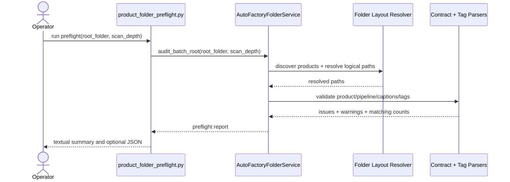

# Product Folder Preflight Audit Workflow 2026-06-15

This document is the SSOT for product-folder preflight and audit behavior in MTClipFactory.

It complements [59_Product_Folder_V2_Backward_Compatible_Layout_Workflow_2026-06-15.md](/F:/programming/python/MTClipFactory/doc/59_Product_Folder_V2_Backward_Compatible_Layout_Workflow_2026-06-15.md), [42_New_Product_Auto_Factory_Template_Kit_2026-06-14.md](/F:/programming/python/MTClipFactory/doc/42_New_Product_Auto_Factory_Template_Kit_2026-06-14.md), and [44_Biothentic0001_Auto_Factory_Test_And_Audit_Plan_2026-06-14.md](/F:/programming/python/MTClipFactory/doc/44_Biothentic0001_Auto_Factory_Test_And_Audit_Plan_2026-06-14.md).

## Purpose

- detect product-folder problems before a real automation run starts
- preserve SSOT discipline by checking `contracts/`, `assets/`, and `runs/` responsibilities explicitly
- give operators actionable error and warning feedback instead of discovering issues only after intake or preview work begins
- make batch-root validation repeatable from a scriptable command-line seam

## Core Decisions

1. Preflight must be read-only. It validates folder state without creating products, assets, recipes, or outputs.
2. Preflight must understand both legacy root-level layout and the preferred `contracts/` plus `assets/` layout.
3. Preflight must fail truthfully on ambiguous old/new duplicate paths for the same logical location.
4. Preflight must distinguish `error` from `warning` so operators know what blocks automation versus what should be cleaned up.
5. Preflight must inspect both structure and automation semantics, including `selection_tags` viability against the tagged source files currently present in the folder.

## What Preflight Checks

### Contracts

- required `product.toml`
- required `pipeline.toml`
- recommended `captions.toml`
- recommended `prod_detail.txt`
- parse validity for TOML contracts
- empty `prod_detail.txt` warning

### Assets

- `foreground`, `background`, `music`, and `voice` folder resolution
- ingestible media file count per asset role
- `tags.toml` presence
- invalid tag-label contract detection
- stale `[file_tags]` entries that refer to files no longer present
- matching file count for `pipeline.toml [selection_tags]`

### Layout

- legacy versus `v2` path resolution
- hybrid-but-unambiguous layouts are allowed
- ambiguous duplicate old/new paths are errors

## Output Shape

The preflight report must provide:

- root folder and scan depth
- discovered product directories
- overall status: `ready`, `warning`, or `error`
- overall error and warning counts
- per-product:
  - layout mode: `legacy`, `v2`, `hybrid`, or `unknown`
  - resolved contract paths
  - resolved asset-folder paths
  - ingestible asset count
  - `selection_tags` matching counts
  - actionable issues with `severity`, `code`, `message`, and `location`

## Operator CLI

The baseline operator-facing command is:

```powershell
. .\.venv\Scripts\Activate.ps1
python scripts/product_folder_preflight.py "G:\My Drive\tee\clip\products\Biothentic0001" --scan-depth 0
```

Optional JSON export:

```powershell
. .\.venv\Scripts\Activate.ps1
python scripts/product_folder_preflight.py "G:\My Drive\tee\clip\products\Biothentic0001" --scan-depth 0 --json-out preflight_report.json
```

## Workflow

```mermaid
flowchart LR
    A["Operator prepares product folder"] --> B["Run product_folder_preflight.py"]
    B --> C["Discover product dirs"]
    C --> D["Resolve legacy or v2 paths"]
    D --> E["Validate contracts and tags"]
    E --> F["Check selection_tags against current files"]
    F --> G["Return ready / warning / error report"]
    G --> H["Operator fixes folder before real automation run"]
```



## Sequence Diagram



## Acceptance Criteria

- operators can run preflight without opening the desktop UI
- preflight remains read-only
- preflight reports at least one actionable issue when required contracts are missing, invalid, or ambiguous
- preflight reports whether `selection_tags` currently match any ingestible files
- pytest locks one `ready`, one `warning`, and one `error` preflight case

## Non-Goals For This Slice

- auto-repairing product folders
- auto-generating missing tags or contracts during preflight
- replacing full preview/final UAT with static validation only
