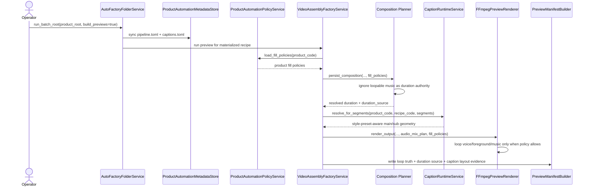

# Product-Policy-Driven Loop Authority And Promo Caption Workflow

## Purpose

Lock the real auto-mode behavior after live `Biothentic0001` preview feedback exposed two practical gaps:

- long background music was stretching short-form previews because music duration was treated as a master-duration authority even when music was configured to loop
- product contracts needed a cleaner way to opt into repeated voice/foreground playback and stronger promo-style caption presentation

## Decisions

### Duration Authority Rule

- `recipe.duration_sec` remains the first target when it exists
- the master timeline may rise above that target only when a non-loop filler layer contributes a longer authoritative extent
- loop-enabled `background_music` is a filler layer, not a master-duration authority
- non-loop `background_music` may still remain duration-authoritative when explicitly configured

### Voice Loop Rule

- voiceover remains non-looping by default
- a product may opt into repeated voice playback only through `pipeline.toml`
- the allowed opt-in pair is:

```toml
[fill_policy.voiceover]
loop_enabled = true
shortfall_mode = "loop_to_timeline"
```

- the renderer and manifest must report both the request and the applied voice-loop truth from this product contract

### Foreground Loop Rule

- `foreground_video` may stay frozen by default for lower-risk operator output
- a product may opt into repeated presenter/product motion with:

```toml
[fill_policy.foreground_video]
loop_enabled = true
shortfall_mode = "loop_to_segment"
```

## Promo Caption Composition Rule

- caption styling remains product-local through `captions.toml`
- `main` and `sub` roles should prefer box-aware promo-card composition over subtitle-like defaults when the goal is ad-style persuasion
- `style_preset` provides the fast starting point
- product contracts may still override width, safe-band, font-size, or border values per role

Recommended direction for live ad products:

- `main`: bold top-band promo card with stronger contrast and bigger best-fit headlining
- `sub`: readable lower-third support card with larger minimum font size and wider textbox

## Sequence



## Expected Operator Outcome

- short-form ad previews no longer accidentally inherit a long music-track runtime
- repeated voice or foreground playback is intentional and product-visible, not accidental or hidden
- captions read more like promotional creative and less like small fallback subtitles
