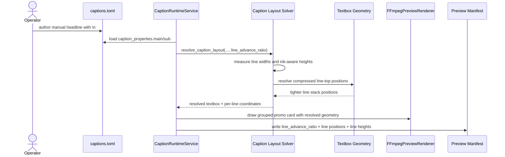

# Promo Headline Compression Workflow 2026-06-16

## Purpose

Lock the operator-facing rule for multi-line promo headlines after live `Biothentic0001` previews showed that correct best-fit width alone is not enough for ad-style caption cards.

This workflow adds one more deterministic control:

- `line_advance_ratio`

The goal is to let grouped, manually broken `main` headlines sit tighter vertically without faking line breaks, while keeping manifest evidence and review safety intact.

## Problem

Live feedback showed a repeated issue:

- the runtime could already solve width in pixels
- the runtime could already fit text inside a textbox
- Thai promo headlines still looked too loose because the vertical advance between lines remained too close to raw font-box height

That produced caption cards that were technically valid but visually weak for ad creative.

## Decision

### Compression Rule

- `line_advance_ratio` is a product-local caption property in `captions.toml`
- it applies only to grouped manual-break stacks where the operator intentionally authored `\n`
- it does not change the measured ink width of each line
- it does not bypass overflow protection
- it compresses the vertical cursor advance between lines when the layout solver stacks the lines

### Value Range

- allowed range: `0.5` to `1.2`
- default: `1.0`
- lower than `1.0` means tighter stacking
- `1.0` means normal stacked line advance
- values above `1.0` remain available for deliberate airy layouts but are not the recommended promo default

### Safe Usage Guidance

Recommended starting point:

- `main` promo headline: `0.78` to `0.86`
- `sub` support card: `0.90` to `0.96`

## Contract Example

```toml
[caption_properties.main]
style_preset = "sale_blast"
font_family = "TH Baijam"
textbox_mode = "grouped"
line_spacing_ratio = 0.03
line_advance_ratio = 0.82

[caption_properties.sub]
style_preset = "clean_cta"
font_family = "TH Baijam"
textbox_mode = "grouped"
line_spacing_ratio = 0.06
line_advance_ratio = 0.92
```

## Runtime Behavior



## Engineering Notes

- width fit remains pixel-based and font-aware
- line heights continue to prefer ink-aware measurement over raw font-box height
- grouped manual-break captions may still use per-line font-size adjustment when needed
- compressed line advance is separate from `line_spacing_ratio`
- `line_spacing_ratio` controls extra gap
- `line_advance_ratio` controls how much of each line height advances the stack

## Review Expectations

The runtime should mark review attention when:

- text still cannot fit within width or height even after best-fit solving
- the caption must truncate for runtime safety
- a product contract pushes visual style into unreadable territory

## Acceptance Criteria

- grouped manual-break promo headlines can become visibly tighter without changing operator-authored line content
- the solver remains deterministic for the same product, recipe, and seed inputs
- manifests expose the resolved `line_advance_ratio` and final line geometry
- the product contract remains local to the product folder and rerun-safe
