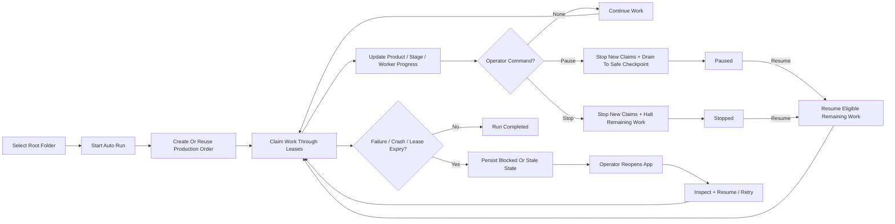
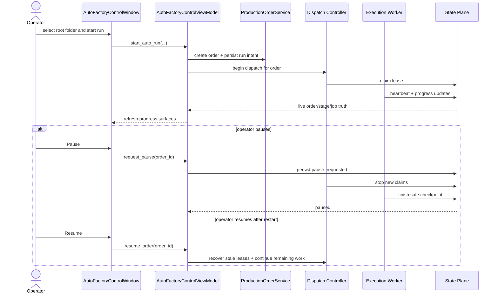

# Auto Factory Operations Control Requirements 2026-06-19

This document is the SSOT requirements slice for the next-generation operator control surface of Auto Factory.

It extends [35_Production_Order_And_Orchestration_Workflow_2026-06-13.md](/F:/programming/python/MTClipFactory/doc/35_Production_Order_And_Orchestration_Workflow_2026-06-13.md), [37_Auto_Factory_Control_Surface_Workflow_2026-06-13.md](/F:/programming/python/MTClipFactory/doc/37_Auto_Factory_Control_Surface_Workflow_2026-06-13.md), and [34_Enterprise_Factory_Architecture_Blueprint_2026-06-13.md](/F:/programming/python/MTClipFactory/doc/34_Enterprise_Factory_Architecture_Blueprint_2026-06-13.md).

## Purpose

- let one operator launch Auto Factory from one selected product-root or batch-root folder
- make progress truthful enough that the operator does not have to guess whether work is active, paused, blocked, or finished
- define safe multi-worker behavior before parallel execution is expanded
- define pause, stop, resume, and restart-recovery semantics before implementation begins

## Problem Statement

The current desktop `Auto Factory` screen can start work and show historical order truth, but it does not yet answer the next operator-grade questions clearly enough:

1. How far has this run progressed right now?
2. Which product, stage, or worker is active?
3. Can I run more than one worker safely?
4. Can I pause or stop without corrupting the run?
5. If the app or worker dies, can I reopen the app and continue?

Those questions must be locked in SSOT before `IR-20` expands execution semantics.

## Core Decisions

### 1. Auto Mode Stays Root-Folder Driven

- the primary operator entry point remains `select root folder -> choose run profile -> start`
- the UI should not ask the operator to hand-create hidden worker jobs or raw queue items
- the system must convert one operator request into one persisted `Production Order` plus its child work

### 2. Progress Must Be Visible At Four Levels

The operations screen must expose progress at:

1. run level
2. product level
3. stage level
4. active job or worker level

Minimum truthful progress evidence:

- current run status
- current stage
- completed versus total product count
- completed versus total recipe count
- active worker count
- last successful event
- last failure or blocking reason

### 3. Multi-Worker Is Allowed Only Through Lease-Based Control

- yes, operators should be able to run with multiple workers
- no, the UI must not implement unsafe ad hoc parallel loops
- multi-worker execution must depend on persisted lease ownership, heartbeat, and retry rules
- concurrency should be bounded by configurable worker caps, not by unlimited button clicks

### 4. Pause, Stop, And Resume Are Persisted Operator Intents

The system should persist operator commands, not rely on transient in-memory flags.

Required meanings:

- `Pause Requested`: stop claiming new work and drain active work to the next safe checkpoint
- `Paused`: no active leased work remains for that order and new claims stay blocked
- `Stop Requested`: stop claiming new work and cancel or abandon remaining unstarted work truthfully
- `Stopped`: the order is intentionally halted and requires an explicit operator resume or rerun decision
- `Resume Requested`: continue eligible remaining work from persisted state without duplicating completed work

### 5. Reopen-And-Continue Must Be A Normal Workflow

- yes, the operator should be able to reopen the app and continue a previously interrupted run
- recovery must come from persisted order, stage, job, lease, and artifact truth
- completed outputs must not be rerendered unless the operator explicitly retries or invalidates them
- stale leases must become detectable and recoverable without manual database editing

## Functional Requirements

## FR-01 Run Setup

The operations UI must allow:

- root-folder selection with `Browse...`
- recent-root reuse
- optional batch-code override
- run profile selection
- explicit concurrency selection or profile-based worker caps
- explicit `Start` action

## FR-02 Live Progress Surface

The operations UI must show:

- one run summary card
- one per-product table
- one selected-product contract/runtime detail panel
- one action row for product-folder navigation or summary handoff
- one per-stage summary
- one active-worker panel
- one append-only event or journal view

Recommended visible fields:

- order code
- root folder
- start time
- elapsed time
- run mode
- active stage
- product counts
- recipe counts
- preview or final counts
- review-required counts
- current blocking issue
- resolved pipeline duration rule
- active selection tags by asset type
- caption preset/font intent when a product caption contract exists

## FR-03 Multi-Worker Control

The system must support:

- configurable maximum worker count
- separate caps for light stages and heavy render stages when implementation reaches that depth
- truthful active-versus-idle worker visibility
- prevention of duplicate claims on the same unit of work

## FR-04 Pause Control

The operator must be able to request pause on an active run.

Pause behavior must:

- allow active work to finish at a safe checkpoint when immediate cancellation is unsafe
- prevent new work claims after the pause request is accepted
- expose whether the run is `pause_requested` or fully `paused`

## FR-05 Stop Control

The operator must be able to request stop on an active or paused run.

Stop behavior must:

- prevent new work claims
- mark remaining unstarted work truthfully
- preserve already completed artifacts and journal evidence
- surface any stage that could not stop immediately

## FR-06 Resume Control

The operator must be able to resume a paused or stopped run.

Resume behavior must:

- continue only remaining eligible work
- reuse persisted successful outputs and completed stages
- skip idempotent already-finished work
- keep a visible recovery trail in the journal

## FR-07 Restart Recovery

When the desktop app is reopened, the operator must be able to:

- list unfinished or interrupted orders
- inspect last-known run status
- detect stale or expired work claims
- choose `Resume`, `Retry Stale Work`, or `Inspect And Fix`

## FR-08 Blocked-Run Diagnosis

If the run cannot progress, the UI must show:

- blocking scope
- failure class
- affected product or job
- last retry time
- suggested operator action

## FR-09 Journal And Audit

Every major operations action must be journaled:

- run started
- stage started
- stage completed
- pause requested
- paused
- stop requested
- stopped
- resumed
- stale lease detected
- retry issued
- run completed
- run blocked

## Non-Functional Requirements

### NFR-01 Truthfulness

- progress must reflect persisted state, not optimistic UI assumptions

### NFR-02 Restart Safety

- closing the app must not silently erase operational truth

### NFR-03 Idempotent Resume

- resuming a run must not duplicate already committed work when persisted evidence says it already succeeded

### NFR-04 Bounded Parallelism

- worker concurrency must remain explicitly capped

### NFR-05 Operator Clarity

- operators should understand the difference between `running`, `pause_requested`, `paused`, `stop_requested`, `stopped`, `blocked`, and `completed`

## Use Cases

### UC-01 Start One Batch Run

An operator selects one root folder, chooses a run mode, and starts Auto Factory.

Success result:

- one persisted order is created
- the UI shows live progress immediately

### UC-02 Watch Progress Without Guessing

An operator watches the screen and can tell:

- what stage is active
- how many products are done
- whether a worker is still busy

### UC-03 Increase Throughput With Multiple Workers

An operator raises worker concurrency for a larger batch.

Success result:

- the system claims work safely through leases
- no duplicate recipe or render work is executed

### UC-04 Pause Before Leaving The Desk

An operator pauses a run before leaving.

Success result:

- active safe-checkpoint work drains
- the run becomes fully paused
- no new work starts

### UC-05 Stop A Wrong Or Risky Run

An operator notices the wrong root folder, policy, or media and stops the run.

Success result:

- no hidden work continues
- completed evidence is preserved
- the operator can inspect what already happened

### UC-06 Resume After Fixing Inputs

An operator fixes contracts, media, or settings and resumes the stopped run.

Success result:

- previously completed safe work is reused
- only remaining work continues

### UC-07 Recover After App Restart

The app is reopened after a crash, close, or machine restart.

Success result:

- unfinished runs remain visible
- stale work can be resumed or retried without database surgery

### UC-08 Investigate A Blocked Run

An operator sees a blocked run and inspects the reason.

Success result:

- the system points to the failing product, stage, or job
- the operator can choose a next action confidently

## Recommended UI Shape

The next operations-capable `Auto Factory` screen should include:

1. run setup panel
2. live run summary strip
3. per-product progress table
4. per-stage pipeline table
5. active workers table
6. event or journal log
7. recovery actions panel

## Reviewed Workflow

## Sequence Diagram

## Delivery Recommendation

To avoid another rework loop, implementation should proceed in this order:

1. persist richer run, stage, and worker progress truth
2. implement lease and heartbeat semantics
3. add restart-safe recovery actions
4. add pause and resume
5. add stop semantics after pause and lease behavior are stable

## Acceptance Criteria For The Next Implementation Slice

- operators can see current run progress without inspecting raw logs
- multi-worker execution uses explicit lease ownership
- pause, stop, and resume are persisted operator intents
- interrupted runs remain recoverable after app restart
- SSOT, UML, roadmap, Kanban, and tests stay aligned
