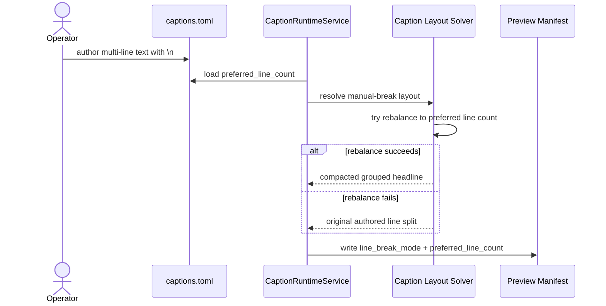

# Manual Break Compaction And Face-Safe Headline Workflow 2026-06-19

This document is the SSOT for compacting operator-authored multi-line promo headlines into a safer headline stack when the style contract prefers fewer lines.

It complements [62_Promo_Headline_Compression_Workflow_2026-06-16.md](/F:/programming/python/MTClipFactory/doc/62_Promo_Headline_Compression_Workflow_2026-06-16.md) and [55_Caption_Style_Preset_Workflow_2026-06-15.md](/F:/programming/python/MTClipFactory/doc/55_Caption_Style_Preset_Workflow_2026-06-15.md).

## Purpose

- reduce headline boxes that grow too tall and cover the presenter face
- keep operator-authored `\n` as a signal that the caption is intentionally multi-line
- allow style-driven compaction from `3 lines` toward `2 lines` when the text can be rebalanced safely

## Core Decision

- `preferred_line_count` is now a caption-role contract field
- compaction is opt-in through that field and does not activate implicitly for ordinary manual-break captions
- it does not remove the operator's multi-line intent
- it tells the runtime how many lines the role should prefer when manual-break text can be rebalanced safely
- if safe compaction fails, the runtime falls back to the authored line split

## Contract Example

```toml
[caption_properties.main]
style_preset = "sale_blast"
preferred_line_count = 2
max_lines = 3
line_advance_ratio = 0.80
```

## Runtime Rule

When all of these are true:

1. the caption source contains `\n`
2. the authored line count exceeds `preferred_line_count`
3. the role uses grouped textbox mode
4. the text can be rebalanced into the preferred grouped line count

the runtime may compact the grouped headline stack to the preferred count.

## Operator Outcome

- a 3-line promo hook can become a tighter 2-line headline
- the box height drops
- the top-band card is more likely to stay face-safe
- deterministic selection and layout evidence remain intact

## Sequence



## Acceptance Criteria

- grouped manual-break headlines can compact from 3 lines to 2 when width allows
- unsafe compaction does not silently destroy the authored structure
- manifest payload exposes the chosen line-break mode and preferred line count
